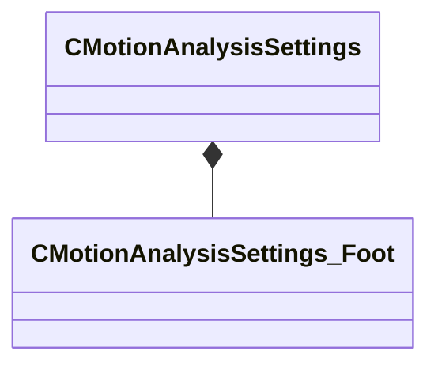
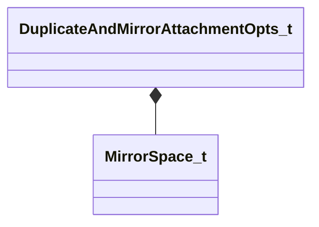

# Module: modeldoc_editor

[📊 View UML Diagram](../diagrams/modeldoc_editor.md)

| Name | Kind | Bases | Fields |
|------|------|-------|--------|
| [CMotionAnalysisSettings](#cmotionanalysissettings) | class |  | 6 |
| [CMotionAnalysisSettings_Foot](#cmotionanalysissettings_foot) | class |  | 5 |
| [DuplicateAndMirrorAttachmentOpts_t](#duplicateandmirrorattachmentopts_t) | class |  | 6 |
| [MirrorSpace_t](#mirrorspace_t) | enum |  | 2 |

---

### CMotionAnalysisSettings

**Metadata:** `MGetKV3ClassDefaults {
	"m_Description": "",
	"m_flLinearThresholdSlow": 60.000000,
	"m_flLinearThresholdStopped": 25.000000,
	"m_flAngularThresholdSlow": 90.000000,
	"m_flAngularThresholdStopped": 15.000000,
	"m_Feet":
	{
	}
}`, `MVDataRoot`

**Relationships:**

**Fields:**

| Name | Type | Annotations |
|------|------|-------------|
| `m_Description` | CUtlString | `MPropertyAttributeEditor "TextBlock()"` |
| `m_flLinearThresholdSlow` | float32 | `MPropertyDescription "Threshold for 'nearly stopped' linear velocity (inches/second)"` `MPropertyAttributeRange "0 100"` |
| `m_flLinearThresholdStopped` | float32 | `MPropertyDescription "Threshold for 'fully stopped' linear velocity (inches/second)"` `MPropertyAttributeRange "0 100"` |
| `m_flAngularThresholdSlow` | float32 | `MPropertyDescription "Threshold for 'nearly stopped' angular velocity (degrees/second)"` `MPropertyAttributeRange "0 180"` |
| `m_flAngularThresholdStopped` | float32 | `MPropertyDescription "Threshold for 'fully stopped' angular velocity (degrees/second)"` `MPropertyAttributeRange "0 180"` |
| `m_Feet` | CUtlStringMap<[CMotionAnalysisSettings_Foot](../schemas/modeldoc_editor.md#cmotionanalysissettings_foot)> | `MPropertyAutoExpandSelf` |

### CMotionAnalysisSettings_Foot

**Metadata:** `MGetKV3ClassDefaults {
	"m_AnkleBoneNames":
	[
	],
	"m_AttachmentNames":
	[
	],
	"m_DebugColor":
	[
		255,
		255,
		255
	],
	"m_CreatedEventType": "AE_FOOTSTEP",
	"m_CreatedEventFootValue": ""
}`

**Fields:**

| Name | Type | Annotations |
|------|------|-------------|
| `m_AnkleBoneNames` | CUtlVector<CGlobalSymbol> | `MPropertyAutoExpandSelf` `MPropertyDescription "Bone name(s) that represent the 'ankle' for this foot. Used for motion analysis. If multiple specified, use the first one found in the skeleton."` |
| `m_AttachmentNames` | CUtlVector<CGlobalSymbol> | `MPropertyAutoExpandSelf` `MPropertyDescription "Attachment point(s) generated footstep events should have their 'attachment' key set. If multiple specified, use the first one found in the model."` |
| `m_DebugColor` | Color |  |
| `m_CreatedEventType` | CUtlString | `MPropertyDescription "Type of anim event"` |
| `m_CreatedEventFootValue` | CUtlString | `MPropertyDescription "Value to set the 'foot' key (if nonempty)"` |

### DuplicateAndMirrorAttachmentOpts_t

**Metadata:** `MPropertyElementNameFn`, `MGetKV3ClassDefaults {
	"m_Name": "Duplicate And Mirror Attachment Options",
	"m_eMirrorSpace": "MIRROR_SPACE_MODEL_RELATIVE",
	"m_bSwapLeftRightParentBones": false,
	"m_bMirrorX": false,
	"m_bMirrorY": true,
	"m_bMirrorZ": false
}`, `MPropertyDescription "Options for duplicating and mirroring attachments."`

**Relationships:**

**Fields:**

| Name | Type | Annotations |
|------|------|-------------|
| `m_Name` | CUtlString | `MPropertyFlattenIntoParentRow` `MPropertyReadOnly` |
| `m_eMirrorSpace` | [MirrorSpace_t](../schemas/modeldoc_editor.md#mirrorspace_t) | `MPropertyFriendlyName "Mirror Space"` `MPropertyDescription "Whether to mirror relative to the parent bone or to the model."` |
| `m_bSwapLeftRightParentBones` | bool | `MPropertyFriendlyName "Swap Left/Right Parent Bones"` `MPropertyDescription "Swap parent bones if a bone ends in a known left/right suffix, i.e. _L, _left, etc... and there's a correspondingly named bones.  Works best for bone relative mirroring in Y, i.e. across the XZ plane, left/right."` |
| `m_bMirrorX` | bool | `MPropertyFriendlyName "Mirror X Axis / YZ Plane"` `MPropertyDescription "Mirror X Axis / Across YZ Plane / Front/Back"` |
| `m_bMirrorY` | bool | `MPropertyFriendlyName "Mirror Y Axis / XZ Plane"` `MPropertyDescription "Mirror Y Axis / Across XZ Plane / Left/Right"` |
| `m_bMirrorZ` | bool | `MPropertyFriendlyName "Mirror Z Axis / XY Plane"` `MPropertyDescription "Mirror Z Axis / Across XY Plane / Up/Down"` |

### MirrorSpace_t

**Values:**

| Name | Value | Description |
|------|-------|-------------|
| `MIRROR_SPACE_BONE_RELATIVE` | 0 | Bone Relative — Mirror Relative To The Bone |
| `MIRROR_SPACE_MODEL_RELATIVE` | 1 | Model Relative — Mirror Relative To The Model |
