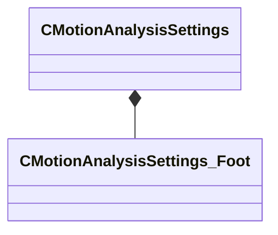
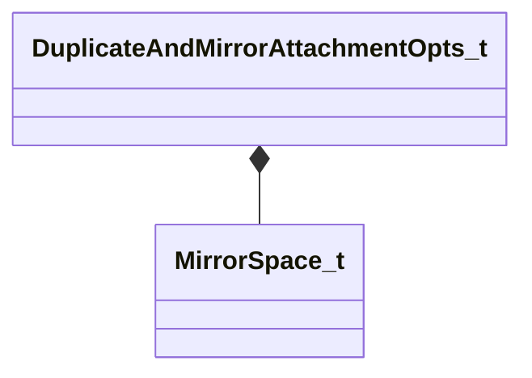

# Module: modeldoc_editor

[📊 View UML Diagram](../diagrams/modeldoc_editor.md)

| Name | Kind | Bases | Fields |
|------|------|-------|--------|
| [CMotionAnalysisSettings](#cmotionanalysissettings) | class |  | 6 |
| [CMotionAnalysisSettings_Foot](#cmotionanalysissettings_foot) | class |  | 5 |
| [DuplicateAndMirrorAttachmentOpts_t](#duplicateandmirrorattachmentopts_t) | class |  | 6 |

---

### CMotionAnalysisSettings

**Metadata:** `MGetKV3ClassDefaults`, `MVDataRoot`

**Relationships:**

```mermaid
classDiagram
    CMotionAnalysisSettings *-- CMotionAnalysisSettings_Foot
```

**Fields:**

| Name | Type | Annotations |
|------|------|-------------|
| `m_Description` | CUtlString | `MPropertyAttributeEditor TextBlock()` |
| `m_flLinearThresholdSlow` | float32 | `MPropertyAttributeRange 0 100` `MPropertyDescription Threshold for 'nearly stopped' linear velocity (inches/second)` |
| `m_flLinearThresholdStopped` | float32 | `MPropertyAttributeRange 0 100` `MPropertyDescription Threshold for 'fully stopped' linear velocity (inches/second)` |
| `m_flAngularThresholdSlow` | float32 | `MPropertyAttributeRange 0 180` `MPropertyDescription Threshold for 'nearly stopped' angular velocity (degrees/second)` |
| `m_flAngularThresholdStopped` | float32 | `MPropertyAttributeRange 0 180` `MPropertyDescription Threshold for 'fully stopped' angular velocity (degrees/second)` |
| `m_Feet` | CUtlStringMap< [CMotionAnalysisSettings_Foot](../schemas/modeldoc_editor.md#cmotionanalysissettings_foot) > | `MPropertyAutoExpandSelf` |

### CMotionAnalysisSettings_Foot

**Metadata:** `MGetKV3ClassDefaults`

**Fields:**

| Name | Type | Annotations |
|------|------|-------------|
| `m_AnkleBoneNames` | CUtlVector< CGlobalSymbol > | `MPropertyAutoExpandSelf` `MPropertyDescription Bone name(s) that represent the 'ankle' for this foot. Used for motion analysis. If multiple specified, use the first one found in the skeleton.` |
| `m_AttachmentNames` | CUtlVector< CGlobalSymbol > | `MPropertyAutoExpandSelf` `MPropertyDescription Attachment point(s) generated footstep events should have their 'attachment' key set. If multiple specified, use the first one found in the model.` |
| `m_DebugColor` | Color |  |
| `m_CreatedEventType` | CUtlString | `MPropertyDescription Type of anim event` |
| `m_CreatedEventFootValue` | CUtlString | `MPropertyDescription Value to set the 'foot' key (if nonempty)` |

### DuplicateAndMirrorAttachmentOpts_t

**Metadata:** `MGetKV3ClassDefaults`, `MPropertyDescription Options for duplicating and mirroring attachments.`, `MPropertyElementNameFn`

**Relationships:**

```mermaid
classDiagram
    DuplicateAndMirrorAttachmentOpts_t *-- MirrorSpace_t
```

**Fields:**

| Name | Type | Annotations |
|------|------|-------------|
| `m_Name` | CUtlString | `MPropertyFlattenIntoParentRow` `MPropertyReadOnly` |
| `m_eMirrorSpace` | [MirrorSpace_t](../schemas/!GlobalTypes.md#mirrorspace_t) | `MPropertyDescription Whether to mirror relative to the parent bone or to the model.` `MPropertyFriendlyName Mirror Space` |
| `m_bSwapLeftRightParentBones` | bool | `MPropertyDescription Swap parent bones if a bone ends in a known left/right suffix, i.e. _L, _left, etc... and there's a correspondingly named bones.  Works best for bone relative mirroring in Y, i.e. across the XZ plane, left/right.` `MPropertyFriendlyName Swap Left/Right Parent Bones` |
| `m_bMirrorX` | bool | `MPropertyDescription Mirror X Axis / Across YZ Plane / Front/Back` `MPropertyFriendlyName Mirror X Axis / YZ Plane` |
| `m_bMirrorY` | bool | `MPropertyDescription Mirror Y Axis / Across XZ Plane / Left/Right` `MPropertyFriendlyName Mirror Y Axis / XZ Plane` |
| `m_bMirrorZ` | bool | `MPropertyDescription Mirror Z Axis / Across XY Plane / Up/Down` `MPropertyFriendlyName Mirror Z Axis / XY Plane` |
