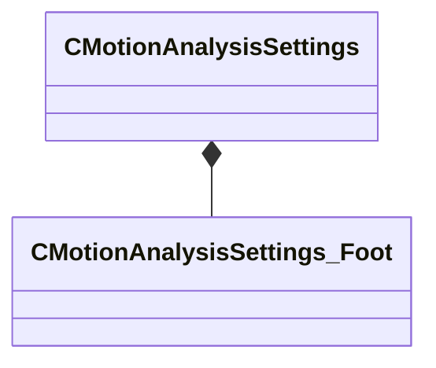

[Schemas](../../schemas.md) / [modeldoc_editor](../modeldoc_editor.md) / CMotionAnalysisSettings

# CMotionAnalysisSettings

> Source: **Build 25000182** · 2026-08-28 · `windows-x86_64` · schema `0.10.0`

**Kind:** class · **Size:** 144 bytes (`0x90`) · **Align:** 8 · **Module:** modeldoc_editor

**Metadata:** `MVDataRoot`

**Relationships:**

## Memory layout

6 fields (6 declared here, 0 inherited). Offsets are absolute from the object base.

| Offset | Field | Type | From | Annotations |
|--------|-------|------|------|-------------|
| `0x0` | `m_Description` | CUtlString |  | `MPropertyAttributeEditor TextBlock()` |
| `0x8` | `m_flLinearThresholdSlow` | float32 |  | `MPropertyAttributeRange 0 100` `MPropertyDescription Threshold for 'nearly stopped' linear velocity (inches/second)` |
| `0xc` | `m_flLinearThresholdStopped` | float32 |  | `MPropertyAttributeRange 0 100` `MPropertyDescription Threshold for 'fully stopped' linear velocity (inches/second)` |
| `0x10` | `m_flAngularThresholdSlow` | float32 |  | `MPropertyAttributeRange 0 180` `MPropertyDescription Threshold for 'nearly stopped' angular velocity (degrees/second)` |
| `0x14` | `m_flAngularThresholdStopped` | float32 |  | `MPropertyAttributeRange 0 180` `MPropertyDescription Threshold for 'fully stopped' angular velocity (degrees/second)` |
| `0x18` | `m_Feet` | CUtlStringMap< [CMotionAnalysisSettings_Foot](../modeldoc_editor/CMotionAnalysisSettings_Foot.md) > |  | `MPropertyAutoExpandSelf` |

KV3 class defaults

<pre>{
	&quot;m_Description&quot;: &quot;&quot;,
	&quot;m_flLinearThresholdSlow&quot;: 60.000000,
	&quot;m_flLinearThresholdStopped&quot;: 25.000000,
	&quot;m_flAngularThresholdSlow&quot;: 90.000000,
	&quot;m_flAngularThresholdStopped&quot;: 15.000000,
	&quot;m_Feet&quot;:
	{
	}
}</pre>

