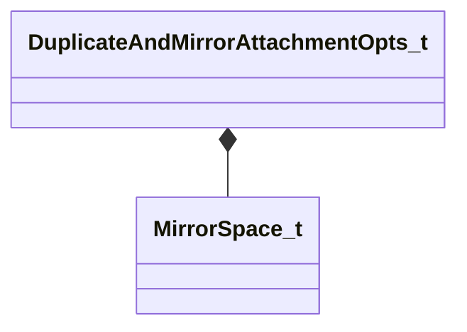

[Schemas](../../schemas.md) / [modeldoc_editor](../modeldoc_editor.md) / DuplicateAndMirrorAttachmentOpts_t

# DuplicateAndMirrorAttachmentOpts_t

> Source: **Build 25000182** · 2026-08-28 · `windows-x86_64` · schema `0.10.0`

**Kind:** class · **Size:** 16 bytes (`0x10`) · **Align:** 8 · **Module:** modeldoc_editor

**Metadata:** `MPropertyDescription Options for duplicating and mirroring attachments.`, `MPropertyElementNameFn`

**Relationships:**

## Memory layout

6 fields (6 declared here, 0 inherited). Offsets are absolute from the object base.

| Offset | Field | Type | From | Annotations |
|--------|-------|------|------|-------------|
| `0x0` | `m_Name` | CUtlString |  | `MPropertyFlattenIntoParentRow` `MPropertyReadOnly` |
| `0x8` | `m_eMirrorSpace` | [MirrorSpace_t](../modeldoc_editor/MirrorSpace_t.md) |  | `MPropertyDescription Whether to mirror relative to the parent bone or to the model.` `MPropertyFriendlyName Mirror Space` |
| `0xc` | `m_bSwapLeftRightParentBones` | bool |  | `MPropertyDescription Swap parent bones if a bone ends in a known left/right suffix, i.e. _L, _left, etc... and there's a correspondingly named bones.  Works best for bone relative mirroring in Y, i.e. across the XZ plane, left/right.` `MPropertyFriendlyName Swap Left/Right Parent Bones` |
| `0xd` | `m_bMirrorX` | bool |  | `MPropertyDescription Mirror X Axis / Across YZ Plane / Front/Back` `MPropertyFriendlyName Mirror X Axis / YZ Plane` |
| `0xe` | `m_bMirrorY` | bool |  | `MPropertyDescription Mirror Y Axis / Across XZ Plane / Left/Right` `MPropertyFriendlyName Mirror Y Axis / XZ Plane` |
| `0xf` | `m_bMirrorZ` | bool |  | `MPropertyDescription Mirror Z Axis / Across XY Plane / Up/Down` `MPropertyFriendlyName Mirror Z Axis / XY Plane` |

KV3 class defaults

<pre>{
	&quot;m_Name&quot;: &quot;Duplicate And Mirror Attachment Options&quot;,
	&quot;m_eMirrorSpace&quot;: &quot;MIRROR_SPACE_MODEL_RELATIVE&quot;,
	&quot;m_bSwapLeftRightParentBones&quot;: false,
	&quot;m_bMirrorX&quot;: false,
	&quot;m_bMirrorY&quot;: true,
	&quot;m_bMirrorZ&quot;: false
}</pre>

