# Module: modellib

[📊 View UML Diagram](../diagrams/modellib.md)

| Name | Kind | Bases | Fields |
|------|------|-------|--------|
| [AnimComponentID](#animcomponentid) | class |  | 1 |
| [AnimNodeID](#animnodeid) | class |  | 1 |
| [AnimNodeOutputID](#animnodeoutputid) | class |  | 1 |
| [AnimParamID](#animparamid) | class |  | 1 |
| [AnimScriptHandle](#animscripthandle) | class |  | 1 |
| [AnimStateID](#animstateid) | class |  | 1 |
| [AnimTagID](#animtagid) | class |  | 1 |
| [AttachmentHandle_t](#attachmenthandle_t) | class |  | 1 |
| [CAimConstraint](#caimconstraint) | class | CBaseConstraint | 2 |
| [CAnimAttachment](#canimattachment) | class |  | 5 |
| [CAnimCycle](#canimcycle) | class | CCycleBase | 0 |
| [CAnimFoot](#canimfoot) | class |  | 5 |
| [CAnimSkeleton](#canimskeleton) | class |  | 8 |
| [CAttachment](#cattachment) | class |  | 8 |
| [CBaseConstraint](#cbaseconstraint) | class | CBoneConstraintBase | 4 |
| [CBoneConstraintBase](#cboneconstraintbase) | class |  | 0 |
| [CBoneConstraintDotToMorph](#cboneconstraintdottomorph) | class | CBoneConstraintBase | 4 |
| [CBoneConstraintPoseSpaceBone](#cboneconstraintposespacebone) | class | CBaseConstraint | 1 |
| [CBoneConstraintPoseSpaceBone::Input_t](#cboneconstraintposespaceboneinput_t) | class |  | 2 |
| [CBoneConstraintPoseSpaceMorph](#cboneconstraintposespacemorph) | class | CBoneConstraintBase | 5 |
| [CBoneConstraintPoseSpaceMorph::Input_t](#cboneconstraintposespacemorphinput_t) | class |  | 2 |
| [CBoneConstraintRbf](#cboneconstraintrbf) | class | CBoneConstraintBase | 2 |
| [CConstraintSlave](#cconstraintslave) | class |  | 5 |
| [CConstraintTarget](#cconstrainttarget) | class |  | 6 |
| [CCycleBase](#ccyclebase) | class |  | 1 |
| [CDrawCullingData](#cdrawcullingdata) | class |  | 2 |
| [CFlexController](#cflexcontroller) | class |  | 4 |
| [CFlexDesc](#cflexdesc) | class |  | 1 |
| [CFlexOp](#cflexop) | class |  | 2 |
| [CFlexRule](#cflexrule) | class |  | 2 |
| [CFootCycle](#cfootcycle) | class | CCycleBase | 0 |
| [CFootCycleDefinition](#cfootcycledefinition) | class |  | 9 |
| [CFootDefinition](#cfootdefinition) | class |  | 9 |
| [CFootMotion](#cfootmotion) | class |  | 3 |
| [CFootStride](#cfootstride) | class |  | 2 |
| [CFootTrajectories](#cfoottrajectories) | class |  | 1 |
| [CFootTrajectory](#cfoottrajectory) | class |  | 3 |
| [CHitBox](#chitbox) | class |  | 13 |
| [CHitBoxSet](#chitboxset) | class |  | 4 |
| [CHitBoxSetList](#chitboxsetlist) | class |  | 1 |
| [CMaterialDrawDescriptor](#cmaterialdrawdescriptor) | class |  | 17 |
| [CMaterialDrawDescriptor::RigidMeshPart_t](#cmaterialdrawdescriptorrigidmeshpart_t) | class |  | 4 |
| [CMeshletDescriptor](#cmeshletdescriptor) | class |  | 6 |
| [CModelConfig](#cmodelconfig) | class |  | 4 |
| [CModelConfigElement](#cmodelconfigelement) | class |  | 2 |
| [CModelConfigElement_AttachedModel](#cmodelconfigelement_attachedmodel) | class | CModelConfigElement | 13 |
| [CModelConfigElement_Command](#cmodelconfigelement_command) | class | CModelConfigElement | 2 |
| [CModelConfigElement_RandomColor](#cmodelconfigelement_randomcolor) | class | CModelConfigElement | 1 |
| [CModelConfigElement_RandomPick](#cmodelconfigelement_randompick) | class | CModelConfigElement | 2 |
| [CModelConfigElement_SetBodygroup](#cmodelconfigelement_setbodygroup) | class | CModelConfigElement | 2 |
| [CModelConfigElement_SetBodygroupOnAttachedModels](#cmodelconfigelement_setbodygrouponattachedmodels) | class | CModelConfigElement | 2 |
| [CModelConfigElement_SetMaterialGroup](#cmodelconfigelement_setmaterialgroup) | class | CModelConfigElement | 1 |
| [CModelConfigElement_SetMaterialGroupOnAttachedModels](#cmodelconfigelement_setmaterialgrouponattachedmodels) | class | CModelConfigElement | 1 |
| [CModelConfigElement_SetRenderColor](#cmodelconfigelement_setrendercolor) | class | CModelConfigElement | 1 |
| [CModelConfigElement_UserPick](#cmodelconfigelement_userpick) | class | CModelConfigElement | 1 |
| [CModelConfigList](#cmodelconfiglist) | class |  | 3 |
| [CMorphBundleData](#cmorphbundledata) | class |  | 4 |
| [CMorphConstraint](#cmorphconstraint) | class | CBaseConstraint | 4 |
| [CMorphData](#cmorphdata) | class |  | 2 |
| [CMorphRectData](#cmorphrectdata) | class |  | 5 |
| [CMorphSetData](#cmorphsetdata) | class |  | 8 |
| [CNPCPhysicsHull](#cnpcphysicshull) | class |  | 8 |
| [COrientConstraint](#corientconstraint) | class | CBaseConstraint | 0 |
| [CParentConstraint](#cparentconstraint) | class | CBaseConstraint | 0 |
| [CPhysSurfaceProperties](#cphyssurfaceproperties) | class |  | 9 |
| [CPhysSurfacePropertiesAudio](#cphyssurfacepropertiesaudio) | class |  | 8 |
| [CPhysSurfacePropertiesPhysics](#cphyssurfacepropertiesphysics) | class |  | 6 |
| [CPhysSurfacePropertiesSoundNames](#cphyssurfacepropertiessoundnames) | class |  | 12 |
| [CPhysSurfacePropertiesVehicle](#cphyssurfacepropertiesvehicle) | class |  | 2 |
| [CPointConstraint](#cpointconstraint) | class | CBaseConstraint | 0 |
| [CRenderBufferBinding](#crenderbufferbinding) | class |  | 2 |
| [CRenderGroom](#crendergroom) | class |  | 14 |
| [CRenderMesh](#crendermesh) | class |  | 7 |
| [CRenderSkeleton](#crenderskeleton) | class |  | 3 |
| [CSceneObjectData](#csceneobjectdata) | class |  | 7 |
| [CSceneObjectData::RTProxyDrawDescriptor_t](#csceneobjectdatartproxydrawdescriptor_t) | class |  | 6 |
| [CTiltTwistConstraint](#ctilttwistconstraint) | class | CBaseConstraint | 2 |
| [CTwistConstraint](#ctwistconstraint) | class | CBaseConstraint | 3 |
| [CVPhysXSurfacePropertiesList](#cvphysxsurfacepropertieslist) | class |  | 1 |
| [DynamicMeshDeformParams_t](#dynamicmeshdeformparams_t) | class |  | 6 |
| [FlexOpCode_t](#flexopcode_t) | enum |  | 26 |
| [InputLayoutVariation_t](#inputlayoutvariation_t) | enum |  | 4 |
| [MaterialGroup_t](#materialgroup_t) | class |  | 2 |
| [MeshDrawPrimitiveFlags_t](#meshdrawprimitiveflags_t) | enum |  | 8 |
| [ModelAnimGraph2Ref_t](#modelanimgraph2ref_t) | class |  | 2 |
| [ModelBoneFlexComponent_t](#modelboneflexcomponent_t) | enum |  | 4 |
| [ModelBoneFlexDriverControl_t](#modelboneflexdrivercontrol_t) | class |  | 5 |
| [ModelBoneFlexDriver_t](#modelboneflexdriver_t) | class |  | 3 |
| [ModelConfigAttachmentType_t](#modelconfigattachmenttype_t) | enum |  | 5 |
| [ModelEmbeddedMesh_t](#modelembeddedmesh_t) | class |  | 9 |
| [ModelMeshBufferData_t](#modelmeshbufferdata_t) | class |  | 13 |
| [ModelMeshBufferUsage_t](#modelmeshbufferusage_t) | enum |  | 7 |
| [ModelSkeletonData_t](#modelskeletondata_t) | class |  | 7 |
| [ModelSkeletonData_t::BoneFlags_t](#modelskeletondata_tboneflags_t) | enum |  | 22 |
| [MorphBundleType_t](#morphbundletype_t) | enum |  | 4 |
| [MorphFlexControllerRemapType_t](#morphflexcontrollerremaptype_t) | enum |  | 4 |
| [MovementCapability_t](#movementcapability_t) | enum |  | 10 |
| [NPCPhysicsHullType_t](#npcphysicshulltype_t) | enum |  | 5 |
| [PermModelDataAnimatedMaterialAttribute_t](#permmodeldataanimatedmaterialattribute_t) | class |  | 2 |
| [PermModelData_t](#permmodeldata_t) | class |  | 25 |
| [PermModelExtPart_t](#permmodelextpart_t) | class |  | 4 |
| [PermModelInfo_t](#permmodelinfo_t) | class |  | 10 |
| [PermModelInfo_t::FlagEnum](#permmodelinfo_tflagenum) | enum |  | 15 |
| [PhysShapeMarkup_t](#physshapemarkup_t) | class |  | 3 |
| [PhysSoftbodyDesc_t](#physsoftbodydesc_t) | class |  | 6 |
| [RenderBufferFlags_t](#renderbufferflags_t) | enum |  | 13 |
| [RenderHairStrandInfo_t](#renderhairstrandinfo_t) | class |  | 7 |
| [RenderInputLayoutField_t](#renderinputlayoutfield_t) | class |  | 6 |
| [RenderMeshSlotType_t](#rendermeshslottype_t) | enum |  | 3 |
| [RenderMultisampleType_t](#rendermultisampletype_t) | enum |  | 8 |
| [RenderPrimitiveType_t](#renderprimitivetype_t) | enum |  | 14 |
| [RenderSkeletonBone_t](#renderskeletonbone_t) | class |  | 5 |
| [RenderSlotType_t](#renderslottype_t) | enum |  | 3 |
| [ScriptedHeldWeaponBehavior_t](#scriptedheldweaponbehavior_t) | enum |  | 4 |
| [ScriptedMoveTo_t](#scriptedmoveto_t) | enum |  | 6 |
| [SharedMovementGait_t](#sharedmovementgait_t) | enum |  | 6 |
| [SheetSequenceIntegerId_t](#sheetsequenceintegerid_t) | class |  | 1 |
| [SkeletonAnimCapture_t](#skeletonanimcapture_t) | class |  | 10 |
| [SkeletonAnimCapture_t::Bone_t](#skeletonanimcapture_tbone_t) | class |  | 3 |
| [SkeletonAnimCapture_t::Camera_t](#skeletonanimcapture_tcamera_t) | class |  | 2 |
| [SkeletonAnimCapture_t::FrameStamp_t](#skeletonanimcapture_tframestamp_t) | class |  | 8 |
| [SkeletonAnimCapture_t::Frame_t](#skeletonanimcapture_tframe_t) | class |  | 9 |
| [SkeletonBoneBounds_t](#skeletonbonebounds_t) | class |  | 2 |
| [SkeletonDemoDb_t](#skeletondemodb_t) | class |  | 3 |
| [VPhysXAggregateData_t](#vphysxaggregatedata_t) | class |  | 17 |
| [VPhysXAggregateData_t::VPhysXFlagEnum_t](#vphysxaggregatedata_tvphysxflagenum_t) | enum |  | 3 |
| [VPhysXBodyPart_t](#vphysxbodypart_t) | class |  | 12 |
| [VPhysXBodyPart_t::VPhysXFlagEnum_t](#vphysxbodypart_tvphysxflagenum_t) | enum |  | 6 |
| [VPhysXCollisionAttributes_t](#vphysxcollisionattributes_t) | class |  | 11 |
| [VPhysXConstraint2_t](#vphysxconstraint2_t) | class |  | 4 |
| [VPhysXConstraintParams_t](#vphysxconstraintparams_t) | class |  | 46 |
| [VPhysXConstraintParams_t::EnumFlags0_t](#vphysxconstraintparams_tenumflags0_t) | enum |  | 4 |
| [VPhysXJoint_t](#vphysxjoint_t) | class |  | 30 |
| [VPhysXJoint_t::Flags_t](#vphysxjoint_tflags_t) | enum |  | 3 |
| [VPhysXRange_t](#vphysxrange_t) | class |  | 2 |
| [VPhysics2ShapeDef_t](#vphysics2shapedef_t) | class |  | 5 |
| [VertexAlbedoFormat_t](#vertexalbedoformat_t) | enum |  | 3 |
| [VsInputSignatureElement_t](#vsinputsignatureelement_t) | class |  | 4 |
| [VsInputSignature_t](#vsinputsignature_t) | class |  | 2 |

---

### AnimComponentID

**Metadata:** `MGetKV3ClassDefaults {
	"m_id": <HIDDEN FOR DIFF>,
}`

**Fields:**

| Name | Type | Annotations |
|------|------|-------------|
| `m_id` | uint32 |  |

### AnimNodeID

**Metadata:** `MGetKV3ClassDefaults {
	"m_id": <HIDDEN FOR DIFF>,
}`

**Fields:**

| Name | Type | Annotations |
|------|------|-------------|
| `m_id` | uint32 |  |

### AnimNodeOutputID

**Metadata:** `MGetKV3ClassDefaults {
	"m_id": <HIDDEN FOR DIFF>,
}`

**Fields:**

| Name | Type | Annotations |
|------|------|-------------|
| `m_id` | uint32 |  |

### AnimParamID

**Metadata:** `MGetKV3ClassDefaults {
	"m_id": <HIDDEN FOR DIFF>,
}`

**Fields:**

| Name | Type | Annotations |
|------|------|-------------|
| `m_id` | uint32 |  |

### AnimScriptHandle

**Metadata:** `MGetKV3ClassDefaults {
	"m_id": <HIDDEN FOR DIFF>,
}`

**Fields:**

| Name | Type | Annotations |
|------|------|-------------|
| `m_id` | uint32 |  |

### AnimStateID

**Metadata:** `MGetKV3ClassDefaults {
	"m_id": <HIDDEN FOR DIFF>,
}`

**Fields:**

| Name | Type | Annotations |
|------|------|-------------|
| `m_id` | uint32 |  |

### AnimTagID

**Metadata:** `MGetKV3ClassDefaults {
	"m_id": <HIDDEN FOR DIFF>,
}`

**Fields:**

| Name | Type | Annotations |
|------|------|-------------|
| `m_id` | uint32 |  |

### AttachmentHandle_t

**Metadata:** `MIsBoxedIntegerType`

**Fields:**

| Name | Type | Annotations |
|------|------|-------------|
| `m_Value` | uint8 |  |

### CAimConstraint

**Inherits from:** [CBaseConstraint](modellib.md#cbaseconstraint)

**Metadata:** `MGetKV3ClassDefaults {
	"_class": "CAimConstraint",
	"m_name": "",
	"m_vUpVector":
	[
		0.000000,
		0.000000,
		0.000000
	],
	"m_slaves":
	[
	],
	"m_targets":
	[
	],
	"m_qAimOffset":
	[
		0.000000,
		0.000000,
		0.000000,
		1.000000
	],
	"m_nUpType": 0
}`

**Relationships:**

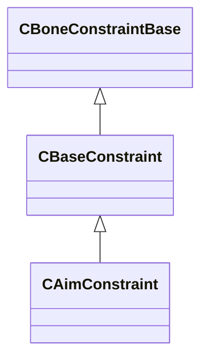

**Fields:**

| Name | Type | Annotations |
|------|------|-------------|
| `m_qAimOffset` | Quaternion |  |
| `m_nUpType` | uint32 |  |

### CAnimAttachment

**Metadata:** `MGetKV3ClassDefaults Could not parse KV3 Defaults`

**Fields:**

| Name | Type | Annotations |
|------|------|-------------|
| `m_influenceRotations` | Quaternion[3] |  |
| `m_influenceOffsets` | VectorAligned[3] |  |
| `m_influenceIndices` | int32[3] |  |
| `m_influenceWeights` | float32[3] |  |
| `m_numInfluences` | uint8 |  |

### CAnimCycle

**Inherits from:** [CCycleBase](modellib.md#ccyclebase)

**Metadata:** `MGetKV3ClassDefaults {
	"m_flCycle": 0.000000
}`

**Relationships:**

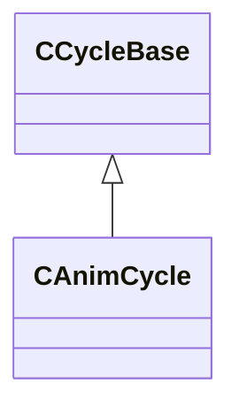

### CAnimFoot

**Metadata:** `MGetKV3ClassDefaults {
	"m_name": "",
	"m_vBallOffset":
	[
		0.000000,
		0.000000,
		0.000000
	],
	"m_vHeelOffset":
	[
		0.000000,
		0.000000,
		0.000000
	],
	"m_ankleBoneIndex": -1,
	"m_toeBoneIndex": -1
}`

**Fields:**

| Name | Type | Annotations |
|------|------|-------------|
| `m_name` | CUtlString |  |
| `m_vBallOffset` | Vector |  |
| `m_vHeelOffset` | Vector |  |
| `m_ankleBoneIndex` | int32 |  |
| `m_toeBoneIndex` | int32 |  |

### CAnimSkeleton

**Metadata:** `MGetKV3ClassDefaults {
	"_class": "CAnimSkeleton",
	"m_localSpaceTransforms":
	[
	],
	"m_modelSpaceTransforms":
	[
	],
	"m_boneNames":
	[
	],
	"m_children":
	[
	],
	"m_parents":
	[
	],
	"m_feet":
	[
	],
	"m_morphNames":
	[
	],
	"m_lodBoneCounts":
	[
	]
}`

**Relationships:**

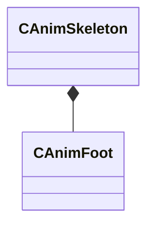

**Fields:**

| Name | Type | Annotations |
|------|------|-------------|
| `m_localSpaceTransforms` | CUtlVector<CTransform> |  |
| `m_modelSpaceTransforms` | CUtlVector<CTransform> |  |
| `m_boneNames` | CUtlVector<CUtlString> |  |
| `m_children` | CUtlVector<CUtlVector<int32>> |  |
| `m_parents` | CUtlVector<int32> |  |
| `m_feet` | CUtlVector<[CAnimFoot](../schemas/modellib.md#canimfoot)> |  |
| `m_morphNames` | CUtlVector<CUtlString> |  |
| `m_lodBoneCounts` | CUtlVector<int32> |  |

### CAttachment

**Metadata:** `MGetKV3ClassDefaults {
	"m_name": "",
	"m_influenceNames":
	[
		"",
		"",
		""
	],
	"m_vInfluenceRotations":
	[
		[
			0.000000,
			0.000000,
			0.000000,
			1.000000
		],
		[
			0.000000,
			0.000000,
			0.000000,
			1.000000
		],
		[
			0.000000,
			0.000000,
			0.000000,
			1.000000
		]
	],
	"m_vInfluenceOffsets":
	[
		[
			0.000000,
			0.000000,
			0.000000
		],
		[
			0.000000,
			0.000000,
			0.000000
		],
		[
			0.000000,
			0.000000,
			0.000000
		]
	],
	"m_influenceWeights":
	[
		0.000000,
		0.000000,
		0.000000
	],
	"m_bInfluenceRootTransform":
	[
		false,
		false,
		false
	],
	"m_nInfluences": 0,
	"m_bIgnoreRotation": false
}`

**Fields:**

| Name | Type | Annotations |
|------|------|-------------|
| `m_name` | CUtlString |  |
| `m_influenceNames` | CUtlString[3] |  |
| `m_vInfluenceRotations` | Quaternion[3] |  |
| `m_vInfluenceOffsets` | Vector[3] |  |
| `m_influenceWeights` | float32[3] |  |
| `m_bInfluenceRootTransform` | bool[3] |  |
| `m_nInfluences` | uint8 |  |
| `m_bIgnoreRotation` | bool |  |

### CBaseConstraint

**Inherits from:** [CBoneConstraintBase](modellib.md#cboneconstraintbase)

**Derived by:** [CAimConstraint](modellib.md#caimconstraint), [CBoneConstraintPoseSpaceBone](modellib.md#cboneconstraintposespacebone), [CMorphConstraint](modellib.md#cmorphconstraint), [COrientConstraint](modellib.md#corientconstraint), [CParentConstraint](modellib.md#cparentconstraint), [CPointConstraint](modellib.md#cpointconstraint), [CTiltTwistConstraint](modellib.md#ctilttwistconstraint), [CTwistConstraint](modellib.md#ctwistconstraint)

**Metadata:** `MGetKV3ClassDefaults Could not parse KV3 Defaults`

**Relationships:**

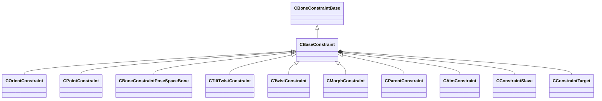

**Fields:**

| Name | Type | Annotations |
|------|------|-------------|
| `m_name` | CUtlString |  |
| `m_vUpVector` | Vector |  |
| `m_slaves` | CUtlLeanVector<[CConstraintSlave](../schemas/modellib.md#cconstraintslave)> |  |
| `m_targets` | CUtlVector<[CConstraintTarget](../schemas/modellib.md#cconstrainttarget)> |  |

### CBoneConstraintBase

**Derived by:** [CBaseConstraint](modellib.md#cbaseconstraint), [CBoneConstraintDotToMorph](modellib.md#cboneconstraintdottomorph), [CBoneConstraintPoseSpaceMorph](modellib.md#cboneconstraintposespacemorph), [CBoneConstraintRbf](modellib.md#cboneconstraintrbf)

**Metadata:** `MGetKV3ClassDefaults Could not parse KV3 Defaults`

**Relationships:**

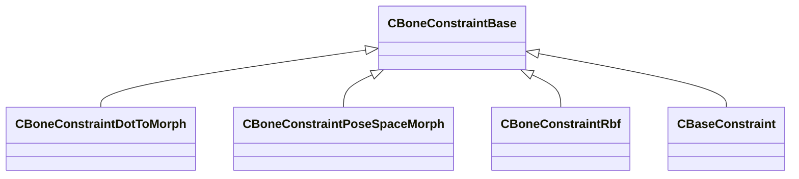

### CBoneConstraintDotToMorph

**Inherits from:** [CBoneConstraintBase](modellib.md#cboneconstraintbase)

**Metadata:** `MGetKV3ClassDefaults {
	"_class": "CBoneConstraintDotToMorph",
	"m_sBoneName": "",
	"m_sTargetBoneName": "",
	"m_sMorphChannelName": "",
	"m_flRemap":
	[
		0.000000,
		180.000000,
		0.000000,
		1.000000
	]
}`

**Relationships:**

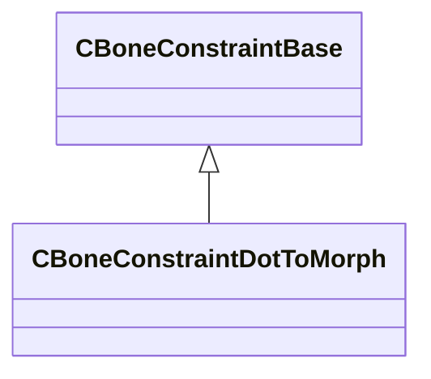

**Fields:**

| Name | Type | Annotations |
|------|------|-------------|
| `m_sBoneName` | CUtlString |  |
| `m_sTargetBoneName` | CUtlString |  |
| `m_sMorphChannelName` | CUtlString |  |
| `m_flRemap` | float32[4] |  |

### CBoneConstraintPoseSpaceBone

**Inherits from:** [CBaseConstraint](modellib.md#cbaseconstraint)

**Metadata:** `MGetKV3ClassDefaults {
	"_class": "CBoneConstraintPoseSpaceBone",
	"m_name": "",
	"m_vUpVector":
	[
		0.000000,
		0.000000,
		0.000000
	],
	"m_slaves":
	[
	],
	"m_targets":
	[
	],
	"m_inputList":
	[
	],
	"m_eRbfType": 0,
	"m_flFalloff": 1.000000
}`

**Relationships:**

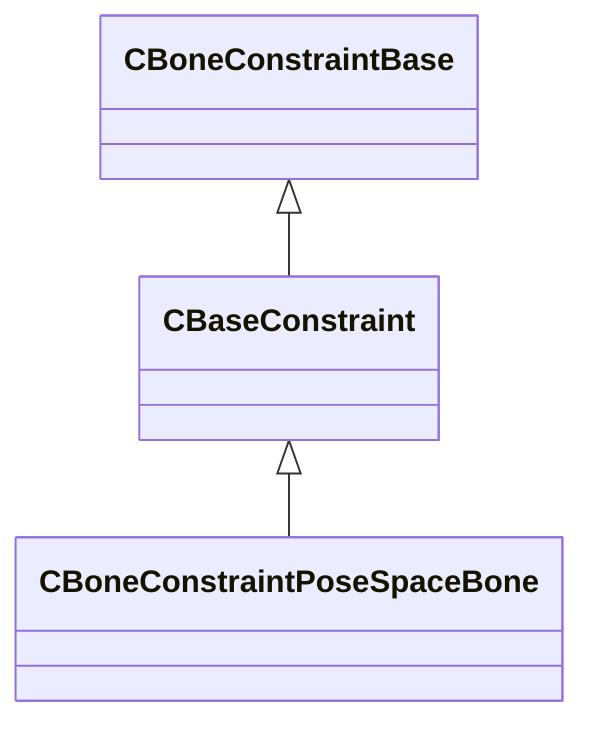

**Fields:**

| Name | Type | Annotations |
|------|------|-------------|
| `m_inputList` | CUtlVector<[CBoneConstraintPoseSpaceBone](../schemas/modellib.md#cboneconstraintposespacebone)::Input_t> |  |

### CBoneConstraintPoseSpaceBone::Input_t

**Fields:**

| Name | Type | Annotations |
|------|------|-------------|
| `m_inputValue` | Vector |  |
| `m_outputTransformList` | CUtlVector<CTransform> |  |

### CBoneConstraintPoseSpaceMorph

**Inherits from:** [CBoneConstraintBase](modellib.md#cboneconstraintbase)

**Metadata:** `MGetKV3ClassDefaults {
	"_class": "CBoneConstraintPoseSpaceMorph",
	"m_sBoneName": "",
	"m_sAttachmentName": "",
	"m_outputMorph":
	[
	],
	"m_inputList":
	[
	],
	"m_bClamp": false,
	"m_eRbfType": 0,
	"m_flFalloff": 1.000000
}`

**Relationships:**

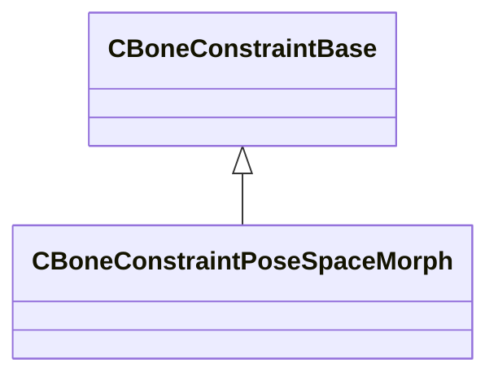

**Fields:**

| Name | Type | Annotations |
|------|------|-------------|
| `m_sBoneName` | CUtlString |  |
| `m_sAttachmentName` | CUtlString |  |
| `m_outputMorph` | CUtlVector<CUtlString> |  |
| `m_inputList` | CUtlVector<[CBoneConstraintPoseSpaceMorph](../schemas/modellib.md#cboneconstraintposespacemorph)::Input_t> |  |
| `m_bClamp` | bool |  |

### CBoneConstraintPoseSpaceMorph::Input_t

**Fields:**

| Name | Type | Annotations |
|------|------|-------------|
| `m_inputValue` | Vector |  |
| `m_outputWeightList` | CUtlVector<float32> |  |

### CBoneConstraintRbf

**Inherits from:** [CBoneConstraintBase](modellib.md#cboneconstraintbase)

**Metadata:** `MGetKV3ClassDefaults {
	"_class": "CBoneConstraintRbf",
	"m_inputBones":
	[
	],
	"m_outputBones":
	[
	],
	"m_rbfParameters": "[BINARY BLOB]"
}`

**Relationships:**

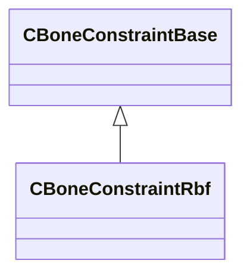

**Fields:**

| Name | Type | Annotations |
|------|------|-------------|
| `m_inputBones` | CUtlVector<std::pair<CUtlString,uint32>> |  |
| `m_outputBones` | CUtlVector<std::pair<CUtlString,uint32>> |  |

### CConstraintSlave

**Metadata:** `MGetKV3ClassDefaults {
	"m_qBaseOrientation":
	[
		0.000000,
		0.000000,
		0.000000,
		1.000000
	],
	"m_vBasePosition":
	[
		0.000000,
		0.000000,
		0.000000
	],
	"m_nBoneHash": 0,
	"m_flWeight": 0.000000,
	"m_sName": ""
}`

**Fields:**

| Name | Type | Annotations |
|------|------|-------------|
| `m_qBaseOrientation` | Quaternion |  |
| `m_vBasePosition` | Vector |  |
| `m_nBoneHash` | uint32 |  |
| `m_flWeight` | float32 |  |
| `m_sName` | CUtlString |  |

### CConstraintTarget

**Metadata:** `MGetKV3ClassDefaults {
	"m_qOffset":
	[
		0.000000,
		0.000000,
		0.000000,
		1.000000
	],
	"m_vOffset":
	[
		0.000000,
		0.000000,
		0.000000
	],
	"m_nBoneHash": 0,
	"m_sName": "",
	"m_flWeight": 0.000000,
	"m_bIsAttachment": false
}`

**Fields:**

| Name | Type | Annotations |
|------|------|-------------|
| `m_qOffset` | Quaternion |  |
| `m_vOffset` | Vector |  |
| `m_nBoneHash` | uint32 |  |
| `m_sName` | CUtlString |  |
| `m_flWeight` | float32 |  |
| `m_bIsAttachment` | bool |  |

### CCycleBase

**Derived by:** [CAnimCycle](modellib.md#canimcycle), [CFootCycle](modellib.md#cfootcycle)

**Metadata:** `MGetKV3ClassDefaults {
	"m_flCycle": 0.000000
}`

**Relationships:**

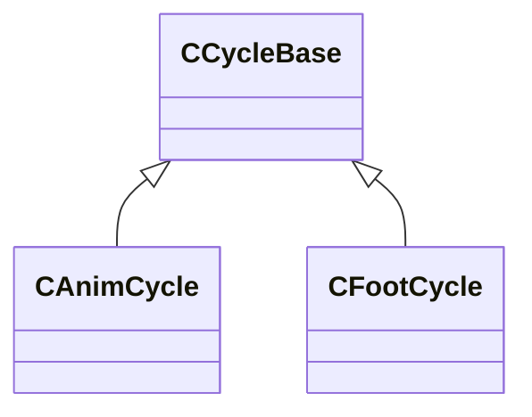

**Fields:**

| Name | Type | Annotations |
|------|------|-------------|
| `m_flCycle` | float32 |  |

### CDrawCullingData

**Metadata:** `MGetKV3ClassDefaults {
	"m_ConeAxis":
	[
		0,
		0,
		0
	],
	"m_ConeCutoff": 0
}`

**Fields:**

| Name | Type | Annotations |
|------|------|-------------|
| `m_ConeAxis` | int8[3] |  |
| `m_ConeCutoff` | int8 |  |

### CFlexController

**Metadata:** `MGetKV3ClassDefaults {
	"m_szName": "",
	"m_szType": "",
	"min": 0.000000,
	"max": 0.000000
}`

**Fields:**

| Name | Type | Annotations |
|------|------|-------------|
| `m_szName` | CUtlString |  |
| `m_szType` | CUtlString |  |
| `min` | float32 |  |
| `max` | float32 |  |

### CFlexDesc

**Metadata:** `MGetKV3ClassDefaults {
	"m_szFacs": ""
}`

**Fields:**

| Name | Type | Annotations |
|------|------|-------------|
| `m_szFacs` | CUtlString |  |

### CFlexOp

**Metadata:** `MGetKV3ClassDefaults {
	"m_OpCode": 0,
	"m_Data": 0
}`

**Relationships:**

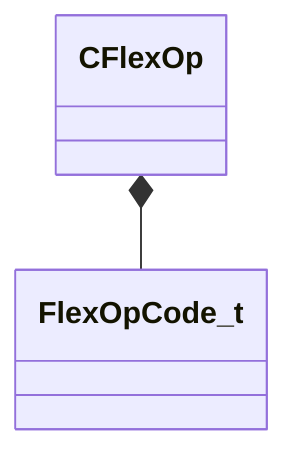

**Fields:**

| Name | Type | Annotations |
|------|------|-------------|
| `m_OpCode` | [FlexOpCode_t](../schemas/modellib.md#flexopcode_t) |  |
| `m_Data` | int32 |  |

### CFlexRule

**Metadata:** `MGetKV3ClassDefaults {
	"m_nFlex": 0,
	"m_FlexOps":
	[
	]
}`

**Relationships:**

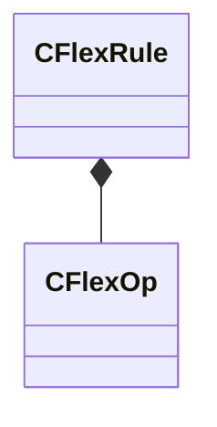

**Fields:**

| Name | Type | Annotations |
|------|------|-------------|
| `m_nFlex` | int32 |  |
| `m_FlexOps` | CUtlVector<[CFlexOp](../schemas/modellib.md#cflexop)> |  |

### CFootCycle

**Inherits from:** [CCycleBase](modellib.md#ccyclebase)

**Metadata:** `MGetKV3ClassDefaults {
	"m_flCycle": 0.000000
}`

**Relationships:**

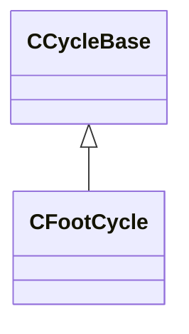

### CFootCycleDefinition

**Metadata:** `MGetKV3ClassDefaults {
	"m_vStancePositionMS":
	[
		0.000000,
		0.000000,
		0.000000
	],
	"m_vMidpointPositionMS":
	[
		0.000000,
		0.000000,
		0.000000
	],
	"m_flStanceDirectionMS": 0.000000,
	"m_vToStrideStartPos":
	[
		0.000000,
		0.000000,
		0.000000
	],
	"m_stanceCycle":
	{
		"m_flCycle": 0.000000
	},
	"m_footLiftCycle":
	{
		"m_flCycle": 0.000000
	},
	"m_footOffCycle":
	{
		"m_flCycle": 0.000000
	},
	"m_footStrikeCycle":
	{
		"m_flCycle": 0.000000
	},
	"m_footLandCycle":
	{
		"m_flCycle": 0.000000
	}
}`

**Relationships:**

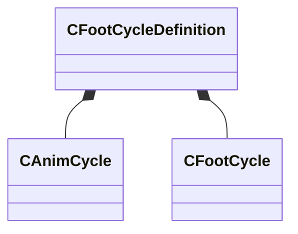

**Fields:**

| Name | Type | Annotations |
|------|------|-------------|
| `m_vStancePositionMS` | Vector |  |
| `m_vMidpointPositionMS` | Vector |  |
| `m_flStanceDirectionMS` | float32 |  |
| `m_vToStrideStartPos` | Vector |  |
| `m_stanceCycle` | [CAnimCycle](../schemas/modellib.md#canimcycle) |  |
| `m_footLiftCycle` | [CFootCycle](../schemas/modellib.md#cfootcycle) |  |
| `m_footOffCycle` | [CFootCycle](../schemas/modellib.md#cfootcycle) |  |
| `m_footStrikeCycle` | [CFootCycle](../schemas/modellib.md#cfootcycle) |  |
| `m_footLandCycle` | [CFootCycle](../schemas/modellib.md#cfootcycle) |  |

### CFootDefinition

**Metadata:** `MGetKV3ClassDefaults {
	"m_name": "",
	"m_ankleBoneName": "",
	"m_toeBoneName": "",
	"m_vBallOffset":
	[
		0.000000,
		0.000000,
		0.000000
	],
	"m_vHeelOffset":
	[
		0.000000,
		0.000000,
		0.000000
	],
	"m_flFootLength": -1.000000,
	"m_flBindPoseDirectionMS": 0.000000,
	"m_flTraceHeight": -1.000000,
	"m_flTraceRadius": -1.000000
}`

**Fields:**

| Name | Type | Annotations |
|------|------|-------------|
| `m_name` | CUtlString |  |
| `m_ankleBoneName` | CUtlString |  |
| `m_toeBoneName` | CUtlString |  |
| `m_vBallOffset` | Vector |  |
| `m_vHeelOffset` | Vector |  |
| `m_flFootLength` | float32 |  |
| `m_flBindPoseDirectionMS` | float32 |  |
| `m_flTraceHeight` | float32 |  |
| `m_flTraceRadius` | float32 |  |

### CFootMotion

**Metadata:** `MGetKV3ClassDefaults {
	"m_strides":
	[
	],
	"m_name": "",
	"m_bAdditive": false
}`

**Relationships:**

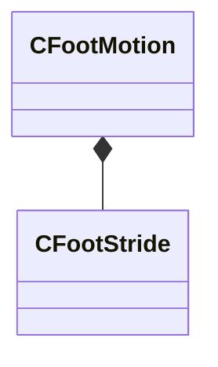

**Fields:**

| Name | Type | Annotations |
|------|------|-------------|
| `m_strides` | CUtlVector<[CFootStride](../schemas/modellib.md#cfootstride)> |  |
| `m_name` | CUtlString |  |
| `m_bAdditive` | bool |  |

### CFootStride

**Metadata:** `MGetKV3ClassDefaults {
	"m_definition":
	{
		"m_vStancePositionMS":
		[
			0.000000,
			0.000000,
			0.000000
		],
		"m_vMidpointPositionMS":
		[
			0.000000,
			0.000000,
			0.000000
		],
		"m_flStanceDirectionMS": 0.000000,
		"m_vToStrideStartPos":
		[
			0.000000,
			0.000000,
			0.000000
		],
		"m_stanceCycle":
		{
			"m_flCycle": 0.000000
		},
		"m_footLiftCycle":
		{
			"m_flCycle": 0.000000
		},
		"m_footOffCycle":
		{
			"m_flCycle": 0.000000
		},
		"m_footStrikeCycle":
		{
			"m_flCycle": 0.000000
		},
		"m_footLandCycle":
		{
			"m_flCycle": 0.000000
		}
	},
	"m_trajectories":
	{
		"m_trajectories":
		[
		]
	}
}`

**Relationships:**

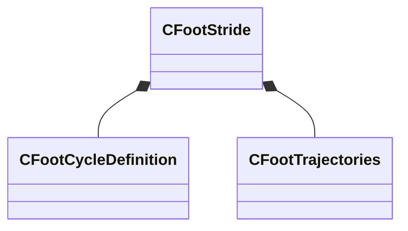

**Fields:**

| Name | Type | Annotations |
|------|------|-------------|
| `m_definition` | [CFootCycleDefinition](../schemas/modellib.md#cfootcycledefinition) |  |
| `m_trajectories` | [CFootTrajectories](../schemas/modellib.md#cfoottrajectories) |  |

### CFootTrajectories

**Metadata:** `MGetKV3ClassDefaults {
	"m_trajectories":
	[
	]
}`

**Relationships:**

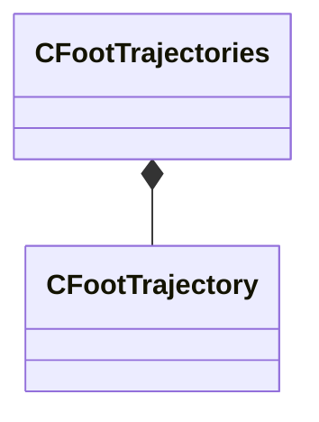

**Fields:**

| Name | Type | Annotations |
|------|------|-------------|
| `m_trajectories` | CUtlVector<[CFootTrajectory](../schemas/modellib.md#cfoottrajectory)> |  |

### CFootTrajectory

**Metadata:** `MGetKV3ClassDefaults {
	"m_vOffset":
	[
		0.000000,
		0.000000,
		0.000000
	],
	"m_flRotationOffset": 0.000000,
	"m_flProgression": 0.000000
}`

**Fields:**

| Name | Type | Annotations |
|------|------|-------------|
| `m_vOffset` | Vector |  |
| `m_flRotationOffset` | float32 |  |
| `m_flProgression` | float32 |  |

### CHitBox

**Metadata:** `MGetKV3ClassDefaults {
	"m_name": "",
	"m_sSurfaceProperty": "",
	"m_sBoneName": "",
	"m_vMinBounds":
	[
		0.000000,
		0.000000,
		0.000000
	],
	"m_vMaxBounds":
	[
		0.000000,
		0.000000,
		0.000000
	],
	"m_flShapeRadius": 0.000000,
	"m_nBoneNameHash": 0,
	"m_nGroupId": 0,
	"m_nShapeType": 0,
	"m_bTranslationOnly": false,
	"m_CRC": 0,
	"m_cRenderColor":
	[
		255,
		255,
		255
	],
	"m_nHitBoxIndex": 0
}`

**Fields:**

| Name | Type | Annotations |
|------|------|-------------|
| `m_name` | CUtlString |  |
| `m_sSurfaceProperty` | CUtlString |  |
| `m_sBoneName` | CUtlString |  |
| `m_vMinBounds` | Vector |  |
| `m_vMaxBounds` | Vector |  |
| `m_flShapeRadius` | float32 |  |
| `m_nBoneNameHash` | uint32 |  |
| `m_nGroupId` | int32 |  |
| `m_nShapeType` | uint8 |  |
| `m_bTranslationOnly` | bool |  |
| `m_CRC` | uint32 |  |
| `m_cRenderColor` | Color |  |
| `m_nHitBoxIndex` | uint16 |  |

### CHitBoxSet

**Metadata:** `MGetKV3ClassDefaults {
	"m_name": "",
	"m_nNameHash": 0,
	"m_HitBoxes":
	[
	],
	"m_SourceFilename": ""
}`

**Relationships:**

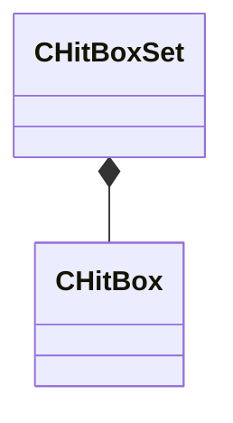

**Fields:**

| Name | Type | Annotations |
|------|------|-------------|
| `m_name` | CUtlString |  |
| `m_nNameHash` | uint32 |  |
| `m_HitBoxes` | CUtlVector<[CHitBox](../schemas/modellib.md#chitbox)> |  |
| `m_SourceFilename` | CUtlString |  |

### CHitBoxSetList

**Metadata:** `MGetKV3ClassDefaults {
	"m_HitBoxSets":
	[
	]
}`

**Relationships:**

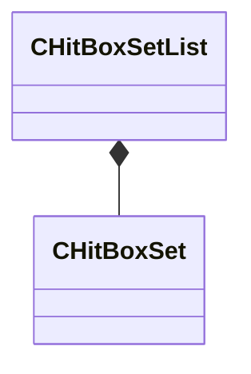

**Fields:**

| Name | Type | Annotations |
|------|------|-------------|
| `m_HitBoxSets` | CUtlVector<[CHitBoxSet](../schemas/modellib.md#chitboxset)> |  |

### CMaterialDrawDescriptor

**Metadata:** `MGetKV3ClassDefaults {
	"m_flUvDensity": 0.000000,
	"m_vTintColor":
	[
		1.000000,
		1.000000,
		1.000000
	],
	"m_flAlpha": 1.000000,
	"m_nNumMeshlets": 0,
	"m_nFirstMeshlet": 0,
	"m_nAppliedIndexOffset": 0,
	"m_nDepthVertexBufferIndex": 255,
	"m_nMeshletPackedIVBIndex": 255,
	"m_rigidMeshParts":
	[
	],
	"m_nPrimitiveType": "RENDER_PRIM_TRIANGLES",
	"m_nBaseVertex": 0,
	"m_nVertexCount": 0,
	"m_nStartIndex": 0,
	"m_nIndexCount": 0,
	"m_indexBuffer":
	{
		"m_hBuffer": 0,
		"m_nBindOffsetBytes": 0
	},
	"m_meshletPackedIVB":
	{
		"m_hBuffer": 0,
		"m_nBindOffsetBytes": 0
	},
	"m_material": "",
	"m_vertexBuffers":
	[
	]
}`

**Relationships:**

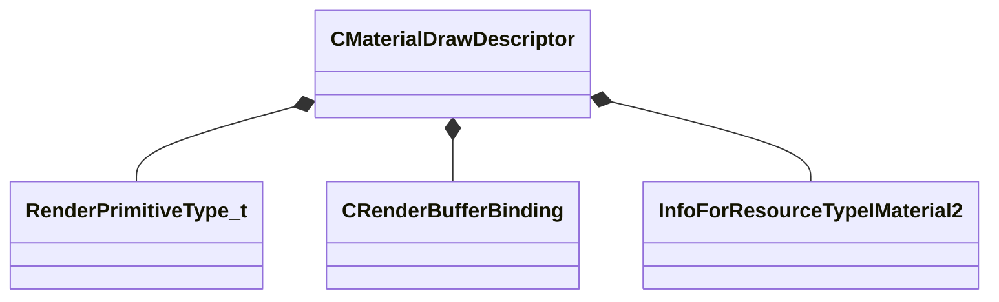

**Fields:**

| Name | Type | Annotations |
|------|------|-------------|
| `m_flUvDensity` | float32 |  |
| `m_vTintColor` | Vector |  |
| `m_flAlpha` | float32 |  |
| `m_nNumMeshlets` | uint16 |  |
| `m_nFirstMeshlet` | uint32 |  |
| `m_nAppliedIndexOffset` | uint32 |  |
| `m_nDepthVertexBufferIndex` | uint8 |  |
| `m_nMeshletPackedIVBIndex` | uint8 |  |
| `m_rigidMeshParts` | CUtlLeanVector<[CMaterialDrawDescriptor](../schemas/modellib.md#cmaterialdrawdescriptor)::RigidMeshPart_t> |  |
| `m_nPrimitiveType` | [RenderPrimitiveType_t](../schemas/modellib.md#renderprimitivetype_t) |  |
| `m_nBaseVertex` | int32 |  |
| `m_nVertexCount` | int32 |  |
| `m_nStartIndex` | int32 |  |
| `m_nIndexCount` | int32 |  |
| `m_indexBuffer` | [CRenderBufferBinding](../schemas/modellib.md#crenderbufferbinding) |  |
| `m_meshletPackedIVB` | [CRenderBufferBinding](../schemas/modellib.md#crenderbufferbinding) |  |
| `m_material` | CStrongHandle<[InfoForResourceTypeIMaterial2](../schemas/resourcesystem.md#infoforresourcetypeimaterial2)> |  |

### CMaterialDrawDescriptor::RigidMeshPart_t

**Metadata:** `MGetKV3ClassDefaults {
	"m_nRigidBLASIndex": 0,
	"m_nBoneIndex": -1,
	"m_nStartIndexOffset": 0,
	"m_nPrimitiveCount": 0
}`

**Fields:**

| Name | Type | Annotations |
|------|------|-------------|
| `m_nRigidBLASIndex` | uint16 |  |
| `m_nBoneIndex` | int16 |  |
| `m_nStartIndexOffset` | uint32 |  |
| `m_nPrimitiveCount` | uint32 |  |

### CMeshletDescriptor

**Metadata:** `MGetKV3ClassDefaults {
	"m_PackedAABB":
	{
		"m_nMin": 0,
		"m_nMax": 0
	},
	"m_CullingData":
	{
		"m_ConeAxis":
		[
			0,
			0,
			0
		],
		"m_ConeCutoff": 0
	},
	"m_nVertexOffset": 0,
	"m_nTriangleOffset": 0,
	"m_nVertexCount": 0,
	"m_nTriangleCount": 0
}`

**Relationships:**

```mermaid
classDiagram
    CMeshletDescriptor *-- PackedAABB_t
    CMeshletDescriptor *-- CDrawCullingData
```

**Fields:**

| Name | Type | Annotations |
|------|------|-------------|
| `m_PackedAABB` | [PackedAABB_t](../schemas/mathlib_extended.md#packedaabb_t) |  |
| `m_CullingData` | [CDrawCullingData](../schemas/modellib.md#cdrawcullingdata) |  |
| `m_nVertexOffset` | uint32 |  |
| `m_nTriangleOffset` | uint32 |  |
| `m_nVertexCount` | uint8 |  |
| `m_nTriangleCount` | uint8 |  |

### CModelConfig

**Metadata:** `MGetKV3ClassDefaults {
	"m_ConfigName": "",
	"m_Elements":
	[
	],
	"m_bTopLevel": false,
	"m_bActiveInEditorByDefault": false
}`

**Relationships:**

```mermaid
classDiagram
    CModelConfig --> CModelConfigElement
```

**Fields:**

| Name | Type | Annotations |
|------|------|-------------|
| `m_ConfigName` | CUtlString |  |
| `m_Elements` | CUtlVector<[CModelConfigElement](../schemas/modellib.md#cmodelconfigelement)*> |  |
| `m_bTopLevel` | bool |  |
| `m_bActiveInEditorByDefault` | bool |  |

### CModelConfigElement

**Derived by:** [CModelConfigElement_AttachedModel](modellib.md#cmodelconfigelement_attachedmodel), [CModelConfigElement_Command](modellib.md#cmodelconfigelement_command), [CModelConfigElement_RandomColor](modellib.md#cmodelconfigelement_randomcolor), [CModelConfigElement_RandomPick](modellib.md#cmodelconfigelement_randompick), [CModelConfigElement_SetBodygroup](modellib.md#cmodelconfigelement_setbodygroup), [CModelConfigElement_SetBodygroupOnAttachedModels](modellib.md#cmodelconfigelement_setbodygrouponattachedmodels), [CModelConfigElement_SetMaterialGroup](modellib.md#cmodelconfigelement_setmaterialgroup), [CModelConfigElement_SetMaterialGroupOnAttachedModels](modellib.md#cmodelconfigelement_setmaterialgrouponattachedmodels), [CModelConfigElement_SetRenderColor](modellib.md#cmodelconfigelement_setrendercolor), [CModelConfigElement_UserPick](modellib.md#cmodelconfigelement_userpick)

**Metadata:** `MGetKV3ClassDefaults Could not parse KV3 Defaults`

**Relationships:**

```mermaid
classDiagram
    CModelConfigElement <|-- CModelConfigElement_AttachedModel
    CModelConfigElement <|-- CModelConfigElement_SetRenderColor
    CModelConfigElement <|-- CModelConfigElement_SetMaterialGroup
    CModelConfigElement <|-- CModelConfigElement_SetBodygroupOnAttachedModels
    CModelConfigElement <|-- CModelConfigElement_Command
    CModelConfigElement <|-- CModelConfigElement_RandomColor
    CModelConfigElement <|-- CModelConfigElement_SetBodygroup
    CModelConfigElement <|-- CModelConfigElement_RandomPick
    CModelConfigElement <|-- CModelConfigElement_UserPick
    CModelConfigElement <|-- CModelConfigElement_SetMaterialGroupOnAttachedModels
```

**Fields:**

| Name | Type | Annotations |
|------|------|-------------|
| `m_ElementName` | CUtlString |  |
| `m_NestedElements` | CUtlVector<[CModelConfigElement](../schemas/modellib.md#cmodelconfigelement)*> |  |

### CModelConfigElement_AttachedModel

**Inherits from:** [CModelConfigElement](modellib.md#cmodelconfigelement)

**Metadata:** `MGetKV3ClassDefaults {
	"_class": "CModelConfigElement_AttachedModel",
	"m_ElementName": "",
	"m_NestedElements":
	[
	],
	"m_InstanceName": "",
	"m_EntityClass": "",
	"m_hModel": "",
	"m_vOffset":
	[
		0.000000,
		0.000000,
		0.000000
	],
	"m_aAngOffset":
	[
		0.000000,
		0.000000,
		0.000000
	],
	"m_AttachmentName": "",
	"m_LocalAttachmentOffsetName": "",
	"m_AttachmentType": "MODEL_CONFIG_ATTACHMENT_ROOT_RELATIVE",
	"m_bBoneMergeFlex": false,
	"m_bUserSpecifiedColor": false,
	"m_bUserSpecifiedMaterialGroup": false,
	"m_BodygroupOnOtherModels": "",
	"m_MaterialGroupOnOtherModels": ""
}`

**Relationships:**

```mermaid
classDiagram
    CModelConfigElement <|-- CModelConfigElement_AttachedModel
    CModelConfigElement_AttachedModel *-- InfoForResourceTypeCModel
    CModelConfigElement_AttachedModel *-- ModelConfigAttachmentType_t
```

**Fields:**

| Name | Type | Annotations |
|------|------|-------------|
| `m_InstanceName` | CUtlString |  |
| `m_EntityClass` | CUtlString |  |
| `m_hModel` | CStrongHandle<[InfoForResourceTypeCModel](../schemas/resourcesystem.md#infoforresourcetypecmodel)> |  |
| `m_vOffset` | Vector |  |
| `m_aAngOffset` | QAngle |  |
| `m_AttachmentName` | CUtlString |  |
| `m_LocalAttachmentOffsetName` | CUtlString |  |
| `m_AttachmentType` | [ModelConfigAttachmentType_t](../schemas/modellib.md#modelconfigattachmenttype_t) |  |
| `m_bBoneMergeFlex` | bool |  |
| `m_bUserSpecifiedColor` | bool |  |
| `m_bUserSpecifiedMaterialGroup` | bool |  |
| `m_BodygroupOnOtherModels` | CUtlString |  |
| `m_MaterialGroupOnOtherModels` | CUtlString |  |

### CModelConfigElement_Command

**Inherits from:** [CModelConfigElement](modellib.md#cmodelconfigelement)

**Metadata:** `MGetKV3ClassDefaults {
	"_class": "CModelConfigElement_Command",
	"m_ElementName": "",
	"m_NestedElements":
	[
	],
	"m_Command": "",
	"m_Args": null
}`

**Relationships:**

```mermaid
classDiagram
    CModelConfigElement <|-- CModelConfigElement_Command
```

**Fields:**

| Name | Type | Annotations |
|------|------|-------------|
| `m_Command` | CUtlString |  |
| `m_Args` | KeyValues3 |  |

### CModelConfigElement_RandomColor

**Inherits from:** [CModelConfigElement](modellib.md#cmodelconfigelement)

**Metadata:** `MGetKV3ClassDefaults {
	"_class": "CModelConfigElement_RandomColor",
	"m_ElementName": "",
	"m_NestedElements":
	[
	],
	"m_Gradient":
	{
		"m_Stops":
		[
		]
	}
}`

**Relationships:**

```mermaid
classDiagram
    CModelConfigElement <|-- CModelConfigElement_RandomColor
```

**Fields:**

| Name | Type | Annotations |
|------|------|-------------|
| `m_Gradient` | CColorGradient |  |

### CModelConfigElement_RandomPick

**Inherits from:** [CModelConfigElement](modellib.md#cmodelconfigelement)

**Metadata:** `MGetKV3ClassDefaults {
	"_class": "CModelConfigElement_RandomPick",
	"m_ElementName": "",
	"m_NestedElements":
	[
	],
	"m_Choices":
	[
	],
	"m_ChoiceWeights":
	[
	]
}`

**Relationships:**

```mermaid
classDiagram
    CModelConfigElement <|-- CModelConfigElement_RandomPick
```

**Fields:**

| Name | Type | Annotations |
|------|------|-------------|
| `m_Choices` | CUtlVector<CUtlString> |  |
| `m_ChoiceWeights` | CUtlVector<float32> |  |

### CModelConfigElement_SetBodygroup

**Inherits from:** [CModelConfigElement](modellib.md#cmodelconfigelement)

**Metadata:** `MGetKV3ClassDefaults {
	"_class": "CModelConfigElement_SetBodygroup",
	"m_ElementName": "",
	"m_NestedElements":
	[
	],
	"m_GroupName": "",
	"m_nChoice": 0
}`

**Relationships:**

```mermaid
classDiagram
    CModelConfigElement <|-- CModelConfigElement_SetBodygroup
```

**Fields:**

| Name | Type | Annotations |
|------|------|-------------|
| `m_GroupName` | CGlobalSymbol |  |
| `m_nChoice` | int32 |  |

### CModelConfigElement_SetBodygroupOnAttachedModels

**Inherits from:** [CModelConfigElement](modellib.md#cmodelconfigelement)

**Metadata:** `MGetKV3ClassDefaults {
	"_class": "CModelConfigElement_SetBodygroupOnAttachedModels",
	"m_ElementName": "",
	"m_NestedElements":
	[
	],
	"m_GroupName": "",
	"m_nChoice": 0
}`

**Relationships:**

```mermaid
classDiagram
    CModelConfigElement <|-- CModelConfigElement_SetBodygroupOnAttachedModels
```

**Fields:**

| Name | Type | Annotations |
|------|------|-------------|
| `m_GroupName` | CUtlString |  |
| `m_nChoice` | int32 |  |

### CModelConfigElement_SetMaterialGroup

**Inherits from:** [CModelConfigElement](modellib.md#cmodelconfigelement)

**Metadata:** `MGetKV3ClassDefaults {
	"_class": "CModelConfigElement_SetMaterialGroup",
	"m_ElementName": "",
	"m_NestedElements":
	[
	],
	"m_MaterialGroupName": ""
}`

**Relationships:**

```mermaid
classDiagram
    CModelConfigElement <|-- CModelConfigElement_SetMaterialGroup
```

**Fields:**

| Name | Type | Annotations |
|------|------|-------------|
| `m_MaterialGroupName` | CUtlString |  |

### CModelConfigElement_SetMaterialGroupOnAttachedModels

**Inherits from:** [CModelConfigElement](modellib.md#cmodelconfigelement)

**Metadata:** `MGetKV3ClassDefaults {
	"_class": "CModelConfigElement_SetMaterialGroupOnAttachedModels",
	"m_ElementName": "",
	"m_NestedElements":
	[
	],
	"m_MaterialGroupName": ""
}`

**Relationships:**

```mermaid
classDiagram
    CModelConfigElement <|-- CModelConfigElement_SetMaterialGroupOnAttachedModels
```

**Fields:**

| Name | Type | Annotations |
|------|------|-------------|
| `m_MaterialGroupName` | CUtlString |  |

### CModelConfigElement_SetRenderColor

**Inherits from:** [CModelConfigElement](modellib.md#cmodelconfigelement)

**Metadata:** `MGetKV3ClassDefaults {
	"_class": "CModelConfigElement_SetRenderColor",
	"m_ElementName": "",
	"m_NestedElements":
	[
	],
	"m_Color":
	[
		255,
		255,
		255
	]
}`

**Relationships:**

```mermaid
classDiagram
    CModelConfigElement <|-- CModelConfigElement_SetRenderColor
```

**Fields:**

| Name | Type | Annotations |
|------|------|-------------|
| `m_Color` | Color |  |

### CModelConfigElement_UserPick

**Inherits from:** [CModelConfigElement](modellib.md#cmodelconfigelement)

**Metadata:** `MGetKV3ClassDefaults {
	"_class": "CModelConfigElement_UserPick",
	"m_ElementName": "",
	"m_NestedElements":
	[
	],
	"m_Choices":
	[
	]
}`

**Relationships:**

```mermaid
classDiagram
    CModelConfigElement <|-- CModelConfigElement_UserPick
```

**Fields:**

| Name | Type | Annotations |
|------|------|-------------|
| `m_Choices` | CUtlVector<CUtlString> |  |

### CModelConfigList

**Metadata:** `MGetKV3ClassDefaults {
	"m_bHideMaterialGroupInTools": false,
	"m_bHideRenderColorInTools": false,
	"m_Configs":
	[
	]
}`

**Relationships:**

```mermaid
classDiagram
    CModelConfigList --> CModelConfig
```

**Fields:**

| Name | Type | Annotations |
|------|------|-------------|
| `m_bHideMaterialGroupInTools` | bool |  |
| `m_bHideRenderColorInTools` | bool |  |
| `m_Configs` | CUtlVector<[CModelConfig](../schemas/modellib.md#cmodelconfig)*> |  |

### CMorphBundleData

**Metadata:** `MGetKV3ClassDefaults {
	"m_flULeftSrc": 0.000000,
	"m_flVTopSrc": 0.000000,
	"m_offsets":
	[
	],
	"m_ranges":
	[
	]
}`

**Fields:**

| Name | Type | Annotations |
|------|------|-------------|
| `m_flULeftSrc` | float32 |  |
| `m_flVTopSrc` | float32 |  |
| `m_offsets` | CUtlVector<float32> |  |
| `m_ranges` | CUtlVector<float32> |  |

### CMorphConstraint

**Inherits from:** [CBaseConstraint](modellib.md#cbaseconstraint)

**Metadata:** `MGetKV3ClassDefaults {
	"_class": "CMorphConstraint",
	"m_name": "",
	"m_vUpVector":
	[
		0.000000,
		0.000000,
		0.000000
	],
	"m_slaves":
	[
	],
	"m_targets":
	[
	],
	"m_sTargetMorph": "",
	"m_nSlaveChannel": 0,
	"m_flMin": 0.000000,
	"m_flMax": 1.000000
}`

**Relationships:**

```mermaid
classDiagram
    CBaseConstraint <|-- CMorphConstraint
    CBoneConstraintBase <|-- CBaseConstraint
```

**Fields:**

| Name | Type | Annotations |
|------|------|-------------|
| `m_sTargetMorph` | CUtlString |  |
| `m_nSlaveChannel` | int32 |  |
| `m_flMin` | float32 |  |
| `m_flMax` | float32 |  |

### CMorphData

**Metadata:** `MGetKV3ClassDefaults {
	"m_name": "",
	"m_morphRectDatas":
	[
	]
}`

**Relationships:**

```mermaid
classDiagram
    CMorphData *-- CMorphRectData
```

**Fields:**

| Name | Type | Annotations |
|------|------|-------------|
| `m_name` | CUtlString |  |
| `m_morphRectDatas` | CUtlVector<[CMorphRectData](../schemas/modellib.md#cmorphrectdata)> |  |

### CMorphRectData

**Metadata:** `MGetKV3ClassDefaults {
	"m_nXLeftDst": 0,
	"m_nYTopDst": 0,
	"m_flUWidthSrc": 0.000000,
	"m_flVHeightSrc": 0.000000,
	"m_bundleDatas":
	[
	]
}`

**Relationships:**

```mermaid
classDiagram
    CMorphRectData *-- CMorphBundleData
```

**Fields:**

| Name | Type | Annotations |
|------|------|-------------|
| `m_nXLeftDst` | int16 |  |
| `m_nYTopDst` | int16 |  |
| `m_flUWidthSrc` | float32 |  |
| `m_flVHeightSrc` | float32 |  |
| `m_bundleDatas` | CUtlVector<[CMorphBundleData](../schemas/modellib.md#cmorphbundledata)> |  |

### CMorphSetData

**Metadata:** `MGetKV3ClassDefaults {
	"m_nWidth": 0,
	"m_nHeight": 0,
	"m_bundleTypes":
	[
	],
	"m_morphDatas":
	[
	],
	"m_pTextureAtlas": "",
	"m_FlexDesc":
	[
	],
	"m_FlexControllers":
	[
	],
	"m_FlexRules":
	[
	]
}`

**Relationships:**

```mermaid
classDiagram
    CMorphSetData *-- MorphBundleType_t
    CMorphSetData *-- CMorphData
    CMorphSetData *-- InfoForResourceTypeCTextureBase
    CMorphSetData *-- CFlexDesc
    CMorphSetData *-- CFlexController
    CMorphSetData *-- CFlexRule
```

**Fields:**

| Name | Type | Annotations |
|------|------|-------------|
| `m_nWidth` | int32 |  |
| `m_nHeight` | int32 |  |
| `m_bundleTypes` | CUtlVector<[MorphBundleType_t](../schemas/modellib.md#morphbundletype_t)> |  |
| `m_morphDatas` | CUtlVector<[CMorphData](../schemas/modellib.md#cmorphdata)> |  |
| `m_pTextureAtlas` | CStrongHandle<[InfoForResourceTypeCTextureBase](../schemas/resourcesystem.md#infoforresourcetypectexturebase)> |  |
| `m_FlexDesc` | CUtlVector<[CFlexDesc](../schemas/modellib.md#cflexdesc)> |  |
| `m_FlexControllers` | CUtlVector<[CFlexController](../schemas/modellib.md#cflexcontroller)> |  |
| `m_FlexRules` | CUtlVector<[CFlexRule](../schemas/modellib.md#cflexrule)> |  |

### CNPCPhysicsHull

**Metadata:** `MGetKV3ClassDefaults {
	"m_sName": "",
	"m_eType": "eInvalid",
	"m_flCapsuleHeight": 50.000000,
	"m_flCapsuleRadius": 11.000000,
	"m_vCapsuleCenter1":
	[
		0.000000,
		0.000000,
		11.000000
	],
	"m_vCapsuleCenter2":
	[
		0.000000,
		0.000000,
		61.000000
	],
	"m_flGroundBoxHeight": 50.000000,
	"m_flGroundBoxWidth": 11.000000
}`, `MModelGameData`, `MFgdHelper "game_data_list{ key = 'CNPCPhysicsHull' }"`, `MFgdHelper "npcphysicshull{}"`

**Relationships:**

```mermaid
classDiagram
    CNPCPhysicsHull *-- NPCPhysicsHullType_t
```

**Fields:**

| Name | Type | Annotations |
|------|------|-------------|
| `m_sName` | CGlobalSymbol | `MPropertyFriendlyName "Name"` `MPropertySuppressField` |
| `m_eType` | [NPCPhysicsHullType_t](../schemas/modellib.md#npcphysicshulltype_t) | `MPropertyFriendlyName "Type"` |
| `m_flCapsuleHeight` | float32 | `MPropertySuppressExpr "m_eType != eGroundCapsule && m_eType != eCenteredCapsule"` `MPropertyFriendlyName "Height"` |
| `m_flCapsuleRadius` | float32 | `MPropertySuppressExpr "m_eType != eGroundCapsule && m_eType != eGenericCapsule && m_eType != eCenteredCapsule"` `MPropertyFriendlyName "Radius"` |
| `m_vCapsuleCenter1` | Vector | `MPropertySuppressExpr "m_eType != eGenericCapsule"` `MPropertyFriendlyName "Center 1"` |
| `m_vCapsuleCenter2` | Vector | `MPropertySuppressExpr "m_eType != eGenericCapsule"` `MPropertyFriendlyName "Center 2"` |
| `m_flGroundBoxHeight` | float32 | `MPropertySuppressExpr "m_eType != eGroundBox"` `MPropertyFriendlyName "Height"` |
| `m_flGroundBoxWidth` | float32 | `MPropertySuppressExpr "m_eType != eGroundBox"` `MPropertyFriendlyName "Width"` |

### COrientConstraint

**Inherits from:** [CBaseConstraint](modellib.md#cbaseconstraint)

**Metadata:** `MGetKV3ClassDefaults {
	"_class": "COrientConstraint",
	"m_name": "",
	"m_vUpVector":
	[
		0.000000,
		0.000000,
		0.000000
	],
	"m_slaves":
	[
	],
	"m_targets":
	[
	]
}`

**Relationships:**

```mermaid
classDiagram
    CBaseConstraint <|-- COrientConstraint
    CBoneConstraintBase <|-- CBaseConstraint
```

### CParentConstraint

**Inherits from:** [CBaseConstraint](modellib.md#cbaseconstraint)

**Metadata:** `MGetKV3ClassDefaults {
	"_class": "CParentConstraint",
	"m_name": "",
	"m_vUpVector":
	[
		0.000000,
		0.000000,
		0.000000
	],
	"m_slaves":
	[
	],
	"m_targets":
	[
	]
}`

**Relationships:**

```mermaid
classDiagram
    CBaseConstraint <|-- CParentConstraint
    CBoneConstraintBase <|-- CBaseConstraint
```

### CPhysSurfaceProperties

**Metadata:** `MGetKV3ClassDefaults {
	"surfacePropertyName": "",
	"m_nameHash": 0,
	"m_baseNameHash": 0,
	"hidden": false,
	"description": "",
	"physics":
	{
		"friction": 0.000000,
		"elasticity": 0.000000,
		"density": 0.000000,
		"thickness": 0.100000,
		"softcontactfrequency": 0.000000,
		"softcontactdampingratio": 0.000000
	},
	"vehicleparams":
	{
		"wheeldrag": 0.000000,
		"wheelfrictionscale": 1.000000
	},
	"audiosounds":
	{
		"impactsoft": "",
		"impacthard": "",
		"scrapesmooth": "",
		"scraperough": "",
		"bulletimpact": "",
		"rolling": "",
		"break": "",
		"strain": "",
		"meleeimpact": "",
		"pushoff": "",
		"skidstop": "",
		"resonant": ""
	},
	"audioparams":
	{
		"audioreflectivity": 0.000000,
		"audiohardnessfactor": 0.000000,
		"audioroughnessfactor": 0.000000,
		"scrapeRoughThreshold": 0.000000,
		"impactHardThreshold": 0.000000,
		"audioHardMinVelocity": 0.000000,
		"staticImpactVolume": 0.000000,
		"occlusionFactor": 0.000000
	}
}`

**Relationships:**

```mermaid
classDiagram
    CPhysSurfaceProperties *-- CPhysSurfacePropertiesPhysics
    CPhysSurfaceProperties *-- CPhysSurfacePropertiesVehicle
    CPhysSurfaceProperties *-- CPhysSurfacePropertiesSoundNames
    CPhysSurfaceProperties *-- CPhysSurfacePropertiesAudio
```

**Fields:**

| Name | Type | Annotations |
|------|------|-------------|
| `m_name` | CUtlString | `MKV3TransferName "surfacePropertyName"` |
| `m_nameHash` | uint32 |  |
| `m_baseNameHash` | uint32 |  |
| `m_bHidden` | bool | `MKV3TransferName "hidden"` |
| `m_description` | CUtlString | `MKV3TransferName "description"` |
| `m_physics` | [CPhysSurfacePropertiesPhysics](../schemas/modellib.md#cphyssurfacepropertiesphysics) | `MKV3TransferName "physics"` |
| `m_vehicleParams` | [CPhysSurfacePropertiesVehicle](../schemas/modellib.md#cphyssurfacepropertiesvehicle) | `MKV3TransferName "vehicleparams"` |
| `m_audioSounds` | [CPhysSurfacePropertiesSoundNames](../schemas/modellib.md#cphyssurfacepropertiessoundnames) | `MKV3TransferName "audiosounds"` |
| `m_audioParams` | [CPhysSurfacePropertiesAudio](../schemas/modellib.md#cphyssurfacepropertiesaudio) | `MKV3TransferName "audioparams"` |

### CPhysSurfacePropertiesAudio

**Metadata:** `MGetKV3ClassDefaults {
	"audioreflectivity": 0.000000,
	"audiohardnessfactor": 0.000000,
	"audioroughnessfactor": 0.000000,
	"scrapeRoughThreshold": 0.000000,
	"impactHardThreshold": 0.000000,
	"audioHardMinVelocity": 0.000000,
	"staticImpactVolume": 0.000000,
	"occlusionFactor": 0.000000
}`

**Fields:**

| Name | Type | Annotations |
|------|------|-------------|
| `m_reflectivity` | float32 | `MKV3TransferName "audioreflectivity"` |
| `m_hardnessFactor` | float32 | `MKV3TransferName "audiohardnessfactor"` |
| `m_roughnessFactor` | float32 | `MKV3TransferName "audioroughnessfactor"` |
| `m_roughThreshold` | float32 | `MKV3TransferName "scrapeRoughThreshold"` |
| `m_hardThreshold` | float32 | `MKV3TransferName "impactHardThreshold"` |
| `m_hardVelocityThreshold` | float32 | `MKV3TransferName "audioHardMinVelocity"` |
| `m_flStaticImpactVolume` | float32 | `MKV3TransferName "staticImpactVolume"` |
| `m_flOcclusionFactor` | float32 | `MKV3TransferName "occlusionFactor"` |

### CPhysSurfacePropertiesPhysics

**Metadata:** `MGetKV3ClassDefaults {
	"friction": 0.000000,
	"elasticity": 0.000000,
	"density": 0.000000,
	"thickness": 0.100000,
	"softcontactfrequency": 0.000000,
	"softcontactdampingratio": 0.000000
}`

**Fields:**

| Name | Type | Annotations |
|------|------|-------------|
| `m_friction` | float32 | `MKV3TransferName "friction"` |
| `m_elasticity` | float32 | `MKV3TransferName "elasticity"` |
| `m_density` | float32 | `MKV3TransferName "density"` |
| `m_thickness` | float32 | `MKV3TransferName "thickness"` |
| `m_softContactFrequency` | float32 | `MKV3TransferName "softcontactfrequency"` |
| `m_softContactDampingRatio` | float32 | `MKV3TransferName "softcontactdampingratio"` |

### CPhysSurfacePropertiesSoundNames

**Metadata:** `MGetKV3ClassDefaults {
	"impactsoft": "",
	"impacthard": "",
	"scrapesmooth": "",
	"scraperough": "",
	"bulletimpact": "",
	"rolling": "",
	"break": "",
	"strain": "",
	"meleeimpact": "",
	"pushoff": "",
	"skidstop": "",
	"resonant": ""
}`

**Fields:**

| Name | Type | Annotations |
|------|------|-------------|
| `m_impactSoft` | CUtlString | `MKV3TransferName "impactsoft"` |
| `m_impactHard` | CUtlString | `MKV3TransferName "impacthard"` |
| `m_scrapeSmooth` | CUtlString | `MKV3TransferName "scrapesmooth"` |
| `m_scrapeRough` | CUtlString | `MKV3TransferName "scraperough"` |
| `m_bulletImpact` | CUtlString | `MKV3TransferName "bulletimpact"` |
| `m_rolling` | CUtlString | `MKV3TransferName "rolling"` |
| `m_break` | CUtlString | `MKV3TransferName "break"` |
| `m_strain` | CUtlString | `MKV3TransferName "strain"` |
| `m_meleeImpact` | CUtlString | `MKV3TransferName "meleeimpact"` |
| `m_pushOff` | CUtlString | `MKV3TransferName "pushoff"` |
| `m_skidStop` | CUtlString | `MKV3TransferName "skidstop"` |
| `m_resonant` | CUtlString | `MKV3TransferName "resonant"` |

### CPhysSurfacePropertiesVehicle

**Metadata:** `MGetKV3ClassDefaults {
	"wheeldrag": 0.000000,
	"wheelfrictionscale": 1.000000
}`

**Fields:**

| Name | Type | Annotations |
|------|------|-------------|
| `m_wheelDrag` | float32 | `MKV3TransferName "wheeldrag"` |
| `m_wheelFrictionScale` | float32 | `MKV3TransferName "wheelfrictionscale"` |

### CPointConstraint

**Inherits from:** [CBaseConstraint](modellib.md#cbaseconstraint)

**Metadata:** `MGetKV3ClassDefaults {
	"_class": "CPointConstraint",
	"m_name": "",
	"m_vUpVector":
	[
		0.000000,
		0.000000,
		0.000000
	],
	"m_slaves":
	[
	],
	"m_targets":
	[
	]
}`

**Relationships:**

```mermaid
classDiagram
    CBaseConstraint <|-- CPointConstraint
    CBoneConstraintBase <|-- CBaseConstraint
```

### CRenderBufferBinding

**Metadata:** `MGetKV3ClassDefaults {
	"m_hBuffer": 0,
	"m_nBindOffsetBytes": 0
}`

**Fields:**

| Name | Type | Annotations |
|------|------|-------------|
| `m_hBuffer` | uint64 |  |
| `m_nBindOffsetBytes` | uint32 |  |

### CRenderGroom

**Metadata:** `MGetKV3ClassDefaults {
	"m_hairs":
	[
	],
	"m_hairPositionOffsets":
	[
	],
	"m_hSimParamsMat": "",
	"m_strandSegmentCountHist":
	[
	],
	"m_nMaxSegmentsPerHairStrand": 0,
	"m_nGuideHairCount": 0,
	"m_nHairCount": 0,
	"m_nTotalVertexCount": 0,
	"m_nTotalSegmentCount": 0,
	"m_nGroomGroupID": 0,
	"m_nAttachBoneIdx": 0,
	"m_nAttachMeshIdx": -1,
	"m_nAttachMeshDrawCallIdx": -1,
	"m_bEnableSimulation": false
}`

**Relationships:**

```mermaid
classDiagram
    CRenderGroom *-- RenderHairStrandInfo_t
    CRenderGroom *-- InfoForResourceTypeIMaterial2
```

**Fields:**

| Name | Type | Annotations |
|------|------|-------------|
| `m_hairs` | CUtlVector<[RenderHairStrandInfo_t](../schemas/modellib.md#renderhairstrandinfo_t)> |  |
| `m_hairPositionOffsets` | CUtlVector<uint32> |  |
| `m_hSimParamsMat` | CStrongHandleCopyable<[InfoForResourceTypeIMaterial2](../schemas/resourcesystem.md#infoforresourcetypeimaterial2)> |  |
| `m_strandSegmentCountHist` | CUtlVector<int32> |  |
| `m_nMaxSegmentsPerHairStrand` | int32 |  |
| `m_nGuideHairCount` | int32 |  |
| `m_nHairCount` | int32 |  |
| `m_nTotalVertexCount` | int32 |  |
| `m_nTotalSegmentCount` | int32 |  |
| `m_nGroomGroupID` | int32 |  |
| `m_nAttachBoneIdx` | int32 |  |
| `m_nAttachMeshIdx` | int32 |  |
| `m_nAttachMeshDrawCallIdx` | int32 |  |
| `m_bEnableSimulation` | bool |  |

### CRenderMesh

**Metadata:** `MGetKV3ClassDefaults {
	"_class": "CRenderMesh",
	"m_sceneObjects":
	[
	],
	"m_constraints":
	[
	],
	"m_skeleton":
	{
		"m_bones":
		[
		],
		"m_boneParents":
		[
		],
		"m_nBoneWeightCount": 4
	},
	"m_bUseUV2ForCharting": false,
	"m_bEmbeddedMapMesh": false,
	"m_meshDeformParams":
	{
		"m_flTensionCompressScale": 0.000000,
		"m_flTensionStretchScale": 0.000000,
		"m_bRecomputeSmoothNormalsAfterAnimation": false,
		"m_bComputeDynamicMeshTensionAfterAnimation": false,
		"m_bSmoothNormalsAcrossUvSeams": false,
		"m_bEnableEyeBulgeDeformation": false
	},
	"m_pGroomData": null,
	"m_attachments":
	[
	],
	"m_hitboxsets":
	[
	],
	"m_morphSet": ""
}`

**Relationships:**

```mermaid
classDiagram
    CRenderMesh *-- CSceneObjectData
    CRenderMesh --> CBaseConstraint
    CRenderMesh *-- CRenderSkeleton
    CRenderMesh *-- DynamicMeshDeformParams_t
    CRenderMesh --> CRenderGroom
```

**Fields:**

| Name | Type | Annotations |
|------|------|-------------|
| `m_sceneObjects` | CUtlLeanVectorFixedGrowable<[CSceneObjectData](../schemas/modellib.md#csceneobjectdata)> |  |
| `m_constraints` | CUtlLeanVector<[CBaseConstraint](../schemas/modellib.md#cbaseconstraint)*> |  |
| `m_skeleton` | [CRenderSkeleton](../schemas/modellib.md#crenderskeleton) |  |
| `m_bUseUV2ForCharting` | bool |  |
| `m_bEmbeddedMapMesh` | bool |  |
| `m_meshDeformParams` | [DynamicMeshDeformParams_t](../schemas/modellib.md#dynamicmeshdeformparams_t) |  |
| `m_pGroomData` | [CRenderGroom](../schemas/modellib.md#crendergroom)* |  |

### CRenderSkeleton

**Metadata:** `MGetKV3ClassDefaults {
	"m_bones":
	[
	],
	"m_boneParents":
	[
	],
	"m_nBoneWeightCount": 4
}`

**Relationships:**

```mermaid
classDiagram
    CRenderSkeleton *-- RenderSkeletonBone_t
```

**Fields:**

| Name | Type | Annotations |
|------|------|-------------|
| `m_bones` | CUtlVector<[RenderSkeletonBone_t](../schemas/modellib.md#renderskeletonbone_t)> |  |
| `m_boneParents` | CUtlVector<int32> |  |
| `m_nBoneWeightCount` | int32 |  |

### CSceneObjectData

**Metadata:** `MGetKV3ClassDefaults {
	"m_vMinBounds":
	[
		340282346638528859811704183484516925440.000000,
		340282346638528859811704183484516925440.000000,
		340282346638528859811704183484516925440.000000
	],
	"m_vMaxBounds":
	[
		-340282346638528859811704183484516925440.000000,
		-340282346638528859811704183484516925440.000000,
		-340282346638528859811704183484516925440.000000
	],
	"m_drawCalls":
	[
	],
	"m_drawBounds":
	[
	],
	"m_meshlets":
	[
	],
	"m_rtProxyDrawCalls":
	[
	],
	"m_vTintColor":
	[
		0.000000,
		0.000000,
		0.000000,
		0.000000
	]
}`

**Relationships:**

```mermaid
classDiagram
    CSceneObjectData *-- CMaterialDrawDescriptor
    CSceneObjectData *-- AABB_t
    CSceneObjectData *-- CMeshletDescriptor
```

**Fields:**

| Name | Type | Annotations |
|------|------|-------------|
| `m_vMinBounds` | Vector |  |
| `m_vMaxBounds` | Vector |  |
| `m_drawCalls` | CUtlLeanVector<[CMaterialDrawDescriptor](../schemas/modellib.md#cmaterialdrawdescriptor)> |  |
| `m_drawBounds` | CUtlLeanVector<[AABB_t](../schemas/mathlib_extended.md#aabb_t)> |  |
| `m_meshlets` | CUtlLeanVector<[CMeshletDescriptor](../schemas/modellib.md#cmeshletdescriptor)> |  |
| `m_rtProxyDrawCalls` | CUtlLeanVector<[CSceneObjectData](../schemas/modellib.md#csceneobjectdata)::RTProxyDrawDescriptor_t> |  |
| `m_vTintColor` | Vector4D |  |

### CSceneObjectData::RTProxyDrawDescriptor_t

**Metadata:** `MGetKV3ClassDefaults {
	"m_drawDesc":
	{
		"m_flUvDensity": 0.000000,
		"m_vTintColor":
		[
			1.000000,
			1.000000,
			1.000000
		],
		"m_flAlpha": 1.000000,
		"m_nNumMeshlets": 0,
		"m_nFirstMeshlet": 0,
		"m_nAppliedIndexOffset": 0,
		"m_nDepthVertexBufferIndex": 255,
		"m_nMeshletPackedIVBIndex": 255,
		"m_rigidMeshParts":
		[
		],
		"m_nPrimitiveType": "RENDER_PRIM_TRIANGLES",
		"m_nBaseVertex": 0,
		"m_nVertexCount": 0,
		"m_nStartIndex": 0,
		"m_nIndexCount": 0,
		"m_indexBuffer":
		{
			"m_hBuffer": 0,
			"m_nBindOffsetBytes": 0
		},
		"m_meshletPackedIVB":
		{
			"m_hBuffer": 0,
			"m_nBindOffsetBytes": 0
		},
		"m_material": "",
		"m_vertexBuffers":
		[
		]
	},
	"m_mWorldFromLocal":
	[
		0.000000,
		0.000000,
		0.000000,
		0.000000,
		0.000000,
		0.000000,
		0.000000,
		0.000000,
		0.000000,
		0.000000,
		0.000000,
		0.000000
	],
	"m_nVertexAlbedoFormat": "VERTEX_ALBEDO_NONE",
	"m_nVertexAlbedoVB": -1,
	"m_nVertexAlbedoOffset": 0,
	"m_nVertexAlbedoStride": 0
}`

**Relationships:**

```mermaid
classDiagram
    "CSceneObjectData::RTProxyDrawDescriptor_t" *-- CMaterialDrawDescriptor
    "CSceneObjectData::RTProxyDrawDescriptor_t" *-- VertexAlbedoFormat_t
```

**Fields:**

| Name | Type | Annotations |
|------|------|-------------|
| `m_drawDesc` | [CMaterialDrawDescriptor](../schemas/modellib.md#cmaterialdrawdescriptor) |  |
| `m_mWorldFromLocal` | matrix3x4_t |  |
| `m_nVertexAlbedoFormat` | [VertexAlbedoFormat_t](../schemas/modellib.md#vertexalbedoformat_t) |  |
| `m_nVertexAlbedoVB` | int8 |  |
| `m_nVertexAlbedoOffset` | uint16 |  |
| `m_nVertexAlbedoStride` | uint16 |  |

### CTiltTwistConstraint

**Inherits from:** [CBaseConstraint](modellib.md#cbaseconstraint)

**Metadata:** `MGetKV3ClassDefaults {
	"_class": "CTiltTwistConstraint",
	"m_name": "",
	"m_vUpVector":
	[
		0.000000,
		0.000000,
		0.000000
	],
	"m_slaves":
	[
	],
	"m_targets":
	[
	],
	"m_nTargetAxis": 0,
	"m_nSlaveAxis": 0
}`

**Relationships:**

```mermaid
classDiagram
    CBaseConstraint <|-- CTiltTwistConstraint
    CBoneConstraintBase <|-- CBaseConstraint
```

**Fields:**

| Name | Type | Annotations |
|------|------|-------------|
| `m_nTargetAxis` | int32 |  |
| `m_nSlaveAxis` | int32 |  |

### CTwistConstraint

**Inherits from:** [CBaseConstraint](modellib.md#cbaseconstraint)

**Metadata:** `MGetKV3ClassDefaults {
	"_class": "CTwistConstraint",
	"m_name": "",
	"m_vUpVector":
	[
		0.000000,
		0.000000,
		0.000000
	],
	"m_slaves":
	[
	],
	"m_targets":
	[
	],
	"m_bInverse": false,
	"m_qParentBindRotation":
	[
		0.000000,
		0.000000,
		0.000000,
		1.000000
	],
	"m_qChildBindRotation":
	[
		0.000000,
		0.000000,
		0.000000,
		1.000000
	]
}`

**Relationships:**

```mermaid
classDiagram
    CBaseConstraint <|-- CTwistConstraint
    CBoneConstraintBase <|-- CBaseConstraint
```

**Fields:**

| Name | Type | Annotations |
|------|------|-------------|
| `m_bInverse` | bool |  |
| `m_qParentBindRotation` | Quaternion |  |
| `m_qChildBindRotation` | Quaternion |  |

### CVPhysXSurfacePropertiesList

**Metadata:** `MGetKV3ClassDefaults {
	"SurfacePropertiesList":
	[
	]
}`

**Relationships:**

```mermaid
classDiagram
    CVPhysXSurfacePropertiesList --> CPhysSurfaceProperties
```

**Fields:**

| Name | Type | Annotations |
|------|------|-------------|
| `m_surfacePropertiesList` | CUtlVector<[CPhysSurfaceProperties](../schemas/modellib.md#cphyssurfaceproperties)*> | `MKV3TransferName "SurfacePropertiesList"` |

### DynamicMeshDeformParams_t

**Metadata:** `MGetKV3ClassDefaults {
	"m_flTensionCompressScale": 0.000000,
	"m_flTensionStretchScale": 0.000000,
	"m_bRecomputeSmoothNormalsAfterAnimation": false,
	"m_bComputeDynamicMeshTensionAfterAnimation": false,
	"m_bSmoothNormalsAcrossUvSeams": false,
	"m_bEnableEyeBulgeDeformation": false
}`

**Fields:**

| Name | Type | Annotations |
|------|------|-------------|
| `m_flTensionCompressScale` | float32 |  |
| `m_flTensionStretchScale` | float32 |  |
| `m_bRecomputeSmoothNormalsAfterAnimation` | bool |  |
| `m_bComputeDynamicMeshTensionAfterAnimation` | bool |  |
| `m_bSmoothNormalsAcrossUvSeams` | bool |  |
| `m_bEnableEyeBulgeDeformation` | bool |  |

### FlexOpCode_t

**Values:**

| Name | Value | Description |
|------|-------|-------------|
| `FLEX_OP_CONST` | 1 |  |
| `FLEX_OP_FETCH1` | 2 |  |
| `FLEX_OP_FETCH2` | 3 |  |
| `FLEX_OP_ADD` | 4 |  |
| `FLEX_OP_SUB` | 5 |  |
| `FLEX_OP_MUL` | 6 |  |
| `FLEX_OP_DIV` | 7 |  |
| `FLEX_OP_NEG` | 8 |  |
| `FLEX_OP_EXP` | 9 |  |
| `FLEX_OP_OPEN` | 10 |  |
| `FLEX_OP_CLOSE` | 11 |  |
| `FLEX_OP_COMMA` | 12 |  |
| `FLEX_OP_MAX` | 13 |  |
| `FLEX_OP_MIN` | 14 |  |
| `FLEX_OP_2WAY_0` | 15 |  |
| `FLEX_OP_2WAY_1` | 16 |  |
| `FLEX_OP_NWAY` | 17 |  |
| `FLEX_OP_COMBO` | 18 |  |
| `FLEX_OP_DOMINATE` | 19 |  |
| `FLEX_OP_DME_LOWER_EYELID` | 20 |  |
| `FLEX_OP_DME_UPPER_EYELID` | 21 |  |
| `FLEX_OP_SQRT` | 22 |  |
| `FLEX_OP_REMAPVALCLAMPED` | 23 |  |
| `FLEX_OP_SIN` | 24 |  |
| `FLEX_OP_COS` | 25 |  |
| `FLEX_OP_ABS` | 26 |  |

### InputLayoutVariation_t

**Values:**

| Name | Value | Description |
|------|-------|-------------|
| `INPUT_LAYOUT_VARIATION_DEFAULT` | 0 |  |
| `INPUT_LAYOUT_VARIATION_STREAM1_INSTANCEID` | 1 |  |
| `INPUT_LAYOUT_VARIATION_STREAM1_INSTANCEID_MORPH_VERT_ID` | 2 |  |
| `INPUT_LAYOUT_VARIATION_MAX` | 3 |  |

### MaterialGroup_t

**Metadata:** `MGetKV3ClassDefaults {
	"m_name": "",
	"m_materials":
	[
	]
}`

**Relationships:**

```mermaid
classDiagram
    MaterialGroup_t *-- InfoForResourceTypeIMaterial2
```

**Fields:**

| Name | Type | Annotations |
|------|------|-------------|
| `m_name` | CUtlString |  |
| `m_materials` | CUtlVector<CStrongHandle<[InfoForResourceTypeIMaterial2](../schemas/resourcesystem.md#infoforresourcetypeimaterial2)>> |  |

### MeshDrawPrimitiveFlags_t

**Values:**

| Name | Value | Description |
|------|-------|-------------|
| `MESH_DRAW_FLAGS_NONE` | 0 |  |
| `MESH_DRAW_FLAGS_USE_SHADOW_FAST_PATH` | 1 |  |
| `MESH_DRAW_FLAGS_USE_COMPRESSED_NORMAL_TANGENT` | 2 |  |
| `MESH_DRAW_INPUT_LAYOUT_IS_NOT_MATCHED_TO_MATERIAL` | 8 |  |
| `MESH_DRAW_FLAGS_USE_COMPRESSED_PER_VERTEX_LIGHTING` | 16 |  |
| `MESH_DRAW_FLAGS_USE_UNCOMPRESSED_PER_VERTEX_LIGHTING` | 32 |  |
| `MESH_DRAW_FLAGS_CAN_BATCH_WITH_DYNAMIC_SHADER_CONSTANTS` | 64 |  |
| `MESH_DRAW_FLAGS_DRAW_LAST` | 128 |  |

### ModelAnimGraph2Ref_t

**Metadata:** `MGetKV3ClassDefaults {
	"m_sIdentifier": "",
	"m_hGraph": ""
}`

**Relationships:**

```mermaid
classDiagram
    ModelAnimGraph2Ref_t *-- InfoForResourceTypeCNmGraphDefinition
```

**Fields:**

| Name | Type | Annotations |
|------|------|-------------|
| `m_sIdentifier` | CUtlString |  |
| `m_hGraph` | CStrongHandle<[InfoForResourceTypeCNmGraphDefinition](../schemas/resourcesystem.md#infoforresourcetypecnmgraphdefinition)> |  |

### ModelBoneFlexComponent_t

**Values:**

| Name | Value | Description |
|------|-------|-------------|
| `MODEL_BONE_FLEX_INVALID` | -1 |  |
| `MODEL_BONE_FLEX_TX` | 0 |  |
| `MODEL_BONE_FLEX_TY` | 1 |  |
| `MODEL_BONE_FLEX_TZ` | 2 |  |

### ModelBoneFlexDriverControl_t

**Metadata:** `MGetKV3ClassDefaults {
	"m_nBoneComponent": "MODEL_BONE_FLEX_TX",
	"m_flexController": "",
	"m_flexControllerToken": 0,
	"m_flMin": 0.000000,
	"m_flMax": 0.000000
}`

**Relationships:**

```mermaid
classDiagram
    ModelBoneFlexDriverControl_t *-- ModelBoneFlexComponent_t
```

**Fields:**

| Name | Type | Annotations |
|------|------|-------------|
| `m_nBoneComponent` | [ModelBoneFlexComponent_t](../schemas/modellib.md#modelboneflexcomponent_t) |  |
| `m_flexController` | CUtlString |  |
| `m_flexControllerToken` | uint32 |  |
| `m_flMin` | float32 |  |
| `m_flMax` | float32 |  |

### ModelBoneFlexDriver_t

**Metadata:** `MGetKV3ClassDefaults {
	"m_boneName": "",
	"m_boneNameToken": 0,
	"m_controls":
	[
	]
}`

**Relationships:**

```mermaid
classDiagram
    ModelBoneFlexDriver_t *-- ModelBoneFlexDriverControl_t
```

**Fields:**

| Name | Type | Annotations |
|------|------|-------------|
| `m_boneName` | CUtlString |  |
| `m_boneNameToken` | uint32 |  |
| `m_controls` | CUtlVector<[ModelBoneFlexDriverControl_t](../schemas/modellib.md#modelboneflexdrivercontrol_t)> |  |

### ModelConfigAttachmentType_t

**Values:**

| Name | Value | Description |
|------|-------|-------------|
| `MODEL_CONFIG_ATTACHMENT_INVALID` | -1 |  |
| `MODEL_CONFIG_ATTACHMENT_BONE_OR_ATTACHMENT` | 0 |  |
| `MODEL_CONFIG_ATTACHMENT_ROOT_RELATIVE` | 1 |  |
| `MODEL_CONFIG_ATTACHMENT_BONEMERGE` | 2 |  |
| `MODEL_CONFIG_ATTACHMENT_COUNT` | 3 |  |

### ModelEmbeddedMesh_t

**Metadata:** `MGetKV3ClassDefaults {
	"m_Name": "",
	"m_nMeshIndex": -1,
	"m_nDataBlock": -1,
	"m_nMorphBlock": -1,
	"m_vertexBuffers":
	[
	],
	"m_indexBuffers":
	[
	],
	"m_toolsBuffers":
	[
	],
	"m_nVBIBBlock": -1,
	"m_nToolsVBBlock": -1
}`

**Relationships:**

```mermaid
classDiagram
    ModelEmbeddedMesh_t *-- ModelMeshBufferData_t
```

**Fields:**

| Name | Type | Annotations |
|------|------|-------------|
| `m_Name` | CUtlString |  |
| `m_nMeshIndex` | int32 |  |
| `m_nDataBlock` | int32 |  |
| `m_nMorphBlock` | int32 |  |
| `m_vertexBuffers` | CUtlVector<[ModelMeshBufferData_t](../schemas/modellib.md#modelmeshbufferdata_t)> |  |
| `m_indexBuffers` | CUtlVector<[ModelMeshBufferData_t](../schemas/modellib.md#modelmeshbufferdata_t)> |  |
| `m_toolsBuffers` | CUtlVector<[ModelMeshBufferData_t](../schemas/modellib.md#modelmeshbufferdata_t)> |  |
| `m_nVBIBBlock` | int32 |  |
| `m_nToolsVBBlock` | int32 |  |

### ModelMeshBufferData_t

**Metadata:** `MGetKV3ClassDefaults {
	"m_nBlockIndex": -1,
	"m_nElementCount": 0,
	"m_nElementSizeInBytes": 0,
	"m_bMeshoptCompressed": false,
	"m_bMeshoptIndexSequence": false,
	"m_nMeshoptMeshletEncodeVersion": -1,
	"m_bCompressedZSTD": false,
	"m_bCreateBufferSRV": false,
	"m_bCreateBufferUAV": false,
	"m_bCreateRawBuffer": false,
	"m_bCreatePooledBuffer": false,
	"m_nBufferUsage": 0,
	"m_inputLayoutFields":
	[
	]
}`

**Relationships:**

```mermaid
classDiagram
    ModelMeshBufferData_t *-- RenderInputLayoutField_t
```

**Fields:**

| Name | Type | Annotations |
|------|------|-------------|
| `m_nBlockIndex` | int32 |  |
| `m_nElementCount` | uint32 |  |
| `m_nElementSizeInBytes` | uint32 |  |
| `m_bMeshoptCompressed` | bool |  |
| `m_bMeshoptIndexSequence` | bool |  |
| `m_nMeshoptMeshletEncodeVersion` | int8 |  |
| `m_bCompressedZSTD` | bool |  |
| `m_bCreateBufferSRV` | bool |  |
| `m_bCreateBufferUAV` | bool |  |
| `m_bCreateRawBuffer` | bool |  |
| `m_bCreatePooledBuffer` | bool |  |
| `m_nBufferUsage` | uint8 |  |
| `m_inputLayoutFields` | CUtlVector<[RenderInputLayoutField_t](../schemas/modellib.md#renderinputlayoutfield_t)> |  |

### ModelMeshBufferUsage_t

**Values:**

| Name | Value | Description |
|------|-------|-------------|
| `MESH_BUFFER_USAGE_NONE` | 0 |  |
| `MESH_BUFFER_USAGE_VB` | 1 |  |
| `MESH_BUFFER_USAGE_IB` | 2 |  |
| `MESH_BUFFER_USAGE_ADJACENCY` | 4 |  |
| `MESH_BUFFER_USAGE_MESHLET_TRIS` | 8 |  |
| `MESH_BUFFER_USAGE_RT_PROXY` | 16 |  |
| `MESH_BUFFER_USAGE_VERTEX_ALBEDO` | 32 |  |

### ModelSkeletonData_t

**Metadata:** `MGetKV3ClassDefaults {
	"m_boneName":
	[
	],
	"m_nParent":
	[
	],
	"m_boneSphere":
	[
	],
	"m_nFlag":
	[
	],
	"m_bonePosParent":
	[
	],
	"m_boneRotParent":
	[
	],
	"m_boneScaleParent":
	[
	]
}`

**Fields:**

| Name | Type | Annotations |
|------|------|-------------|
| `m_boneName` | CUtlVector<CUtlString> |  |
| `m_nParent` | CUtlVector<int16> |  |
| `m_boneSphere` | CUtlVector<float32> |  |
| `m_nFlag` | CUtlVector<uint32> |  |
| `m_bonePosParent` | CUtlVector<Vector> |  |
| `m_boneRotParent` | CUtlVector<QuaternionStorage> |  |
| `m_boneScaleParent` | CUtlVector<float32> |  |

### ModelSkeletonData_t::BoneFlags_t

**Values:**

| Name | Value | Description |
|------|-------|-------------|
| `FLAG_NO_BONE_FLAGS` | 0 |  |
| `FLAG_BONEFLEXDRIVER` | 4 |  |
| `FLAG_CLOTH` | 8 |  |
| `FLAG_PHYSICS` | 16 |  |
| `FLAG_ATTACHMENT` | 32 |  |
| `FLAG_ANIMATION` | 64 |  |
| `FLAG_MESH` | 128 |  |
| `FLAG_HITBOX` | 256 |  |
| `FLAG_BONE_USED_BY_VERTEX_LOD0` | 1024 |  |
| `FLAG_BONE_USED_BY_VERTEX_LOD1` | 2048 |  |
| `FLAG_BONE_USED_BY_VERTEX_LOD2` | 4096 |  |
| `FLAG_BONE_USED_BY_VERTEX_LOD3` | 8192 |  |
| `FLAG_BONE_USED_BY_VERTEX_LOD4` | 16384 |  |
| `FLAG_BONE_USED_BY_VERTEX_LOD5` | 32768 |  |
| `FLAG_BONE_USED_BY_VERTEX_LOD6` | 65536 |  |
| `FLAG_BONE_USED_BY_VERTEX_LOD7` | 131072 |  |
| `FLAG_BONE_MERGE_READ` | 262144 |  |
| `FLAG_BONE_MERGE_WRITE` | 524288 |  |
| `FLAG_ALL_BONE_FLAGS` | 1048575 |  |
| `BLEND_PREALIGNED` | 1048576 |  |
| `FLAG_RIGIDLENGTH` | 2097152 |  |
| `FLAG_PROCEDURAL` | 4194304 |  |

### MorphBundleType_t

**Values:**

| Name | Value | Description |
|------|-------|-------------|
| `MORPH_BUNDLE_TYPE_NONE` | 0 |  |
| `MORPH_BUNDLE_TYPE_POSITION_SPEED` | 1 |  |
| `MORPH_BUNDLE_TYPE_NORMAL_WRINKLE` | 2 |  |
| `MORPH_BUNDLE_TYPE_COUNT` | 3 |  |

### MorphFlexControllerRemapType_t

**Values:**

| Name | Value | Description |
|------|-------|-------------|
| `MORPH_FLEXCONTROLLER_REMAP_PASSTHRU` | 0 |  |
| `MORPH_FLEXCONTROLLER_REMAP_2WAY` | 1 |  |
| `MORPH_FLEXCONTROLLER_REMAP_NWAY` | 2 |  |
| `MORPH_FLEXCONTROLLER_REMAP_EYELID` | 3 |  |

### MovementCapability_t

**Values:**

| Name | Value | Description |
|------|-------|-------------|
| `eStrafe` | 0 | Strafe |
| `eIdleTurn` | 1 | Turn |
| `eStart` | 2 | Start |
| `eStop` | 3 | Stop |
| `eInstantStop` | 4 | Instant Stop |
| `eShuffle` | 5 | Shuffle |
| `ePlantedTurn` | 6 | Planted Turn |
| `eUseStartAsPlantedTurn` | 7 | Stop/Start Planted Turn |
| `eLean` | 8 | Lean |
| `eCount` | 9 |  |

### NPCPhysicsHullType_t

**Values:**

| Name | Value | Description |
|------|-------|-------------|
| `eInvalid` | 0 | None |
| `eGroundCapsule` | 1 | Capsule - Ground |
| `eCenteredCapsule` | 2 | Capsule - Centered |
| `eGenericCapsule` | 3 | Capsule - Generic |
| `eGroundBox` | 4 | Box - Ground |

### PermModelDataAnimatedMaterialAttribute_t

**Metadata:** `MGetKV3ClassDefaults {
	"m_AttributeName": "",
	"m_nNumChannels": 0
}`

**Fields:**

| Name | Type | Annotations |
|------|------|-------------|
| `m_AttributeName` | CUtlString |  |
| `m_nNumChannels` | int32 |  |

### PermModelData_t

**Metadata:** `MGetKV3ClassDefaults {
	"m_name": "",
	"m_modelInfo":
	{
		"m_nFlags": 0,
		"m_vHullMin":
		[
			0.000000,
			0.000000,
			0.000000
		],
		"m_vHullMax":
		[
			0.000000,
			0.000000,
			0.000000
		],
		"m_vViewMin":
		[
			0.000000,
			0.000000,
			0.000000
		],
		"m_vViewMax":
		[
			0.000000,
			0.000000,
			0.000000
		],
		"m_flMass": 0.000000,
		"m_vEyePosition":
		[
			0.000000,
			0.000000,
			0.000000
		],
		"m_flMaxEyeDeflection": 0.000000,
		"m_sSurfaceProperty": "",
		"m_keyValueText": ""
	},
	"m_ExtParts":
	[
	],
	"m_refMeshes":
	[
	],
	"m_refMeshGroupMasks":
	[
	],
	"m_refPhysGroupMasks":
	[
	],
	"m_refLODGroupMasks":
	[
	],
	"m_lodGroupSwitchDistances":
	[
	],
	"m_refPhysicsData":
	[
	],
	"m_refPhysicsHitboxData":
	[
	],
	"m_refAnimGroups":
	[
	],
	"m_refSequenceGroups":
	[
	],
	"m_meshGroups":
	[
	],
	"m_materialGroups":
	[
	],
	"m_nDefaultMeshGroupMask": 0,
	"m_modelSkeleton":
	{
		"m_boneName":
		[
		],
		"m_nParent":
		[
		],
		"m_boneSphere":
		[
		],
		"m_nFlag":
		[
		],
		"m_bonePosParent":
		[
		],
		"m_boneRotParent":
		[
		],
		"m_boneScaleParent":
		[
		]
	},
	"m_remappingTable":
	[
	],
	"m_remappingTableStarts":
	[
	],
	"m_boneFlexDrivers":
	[
	],
	"m_pModelConfigList": null,
	"m_BodyGroupsHiddenInTools":
	[
	],
	"m_refAnimIncludeModels":
	[
	],
	"m_AnimatedMaterialAttributes":
	[
	],
	"m_animGraph2Refs":
	[
	],
	"m_vecNmSkeletonRefs":
	[
	]
}`

**Relationships:**

```mermaid
classDiagram
    PermModelData_t *-- PermModelInfo_t
    PermModelData_t *-- PermModelExtPart_t
    PermModelData_t *-- InfoForResourceTypeCRenderMesh
    PermModelData_t *-- InfoForResourceTypeCPhysAggregateData
    PermModelData_t *-- InfoForResourceTypeCAnimationGroup
    PermModelData_t *-- InfoForResourceTypeCSequenceGroupData
    PermModelData_t *-- MaterialGroup_t
    PermModelData_t *-- ModelSkeletonData_t
    PermModelData_t *-- ModelBoneFlexDriver_t
    PermModelData_t --> CModelConfigList
```

**Fields:**

| Name | Type | Annotations |
|------|------|-------------|
| `m_name` | CUtlString |  |
| `m_modelInfo` | [PermModelInfo_t](../schemas/modellib.md#permmodelinfo_t) |  |
| `m_ExtParts` | CUtlVector<[PermModelExtPart_t](../schemas/modellib.md#permmodelextpart_t)> |  |
| `m_refMeshes` | CUtlVector<CStrongHandle<[InfoForResourceTypeCRenderMesh](../schemas/resourcesystem.md#infoforresourcetypecrendermesh)>> |  |
| `m_refMeshGroupMasks` | CUtlVector<uint64> |  |
| `m_refPhysGroupMasks` | CUtlVector<uint64> |  |
| `m_refLODGroupMasks` | CUtlVector<uint8> |  |
| `m_lodGroupSwitchDistances` | CUtlVector<float32> |  |
| `m_refPhysicsData` | CUtlVector<CStrongHandle<[InfoForResourceTypeCPhysAggregateData](../schemas/resourcesystem.md#infoforresourcetypecphysaggregatedata)>> |  |
| `m_refPhysicsHitboxData` | CUtlVector<CStrongHandle<[InfoForResourceTypeCPhysAggregateData](../schemas/resourcesystem.md#infoforresourcetypecphysaggregatedata)>> |  |
| `m_refAnimGroups` | CUtlVector<CStrongHandle<[InfoForResourceTypeCAnimationGroup](../schemas/resourcesystem.md#infoforresourcetypecanimationgroup)>> |  |
| `m_refSequenceGroups` | CUtlVector<CStrongHandle<[InfoForResourceTypeCSequenceGroupData](../schemas/resourcesystem.md#infoforresourcetypecsequencegroupdata)>> |  |
| `m_meshGroups` | CUtlVector<CUtlString> |  |
| `m_materialGroups` | CUtlVector<[MaterialGroup_t](../schemas/modellib.md#materialgroup_t)> |  |
| `m_nDefaultMeshGroupMask` | uint64 |  |
| `m_modelSkeleton` | [ModelSkeletonData_t](../schemas/modellib.md#modelskeletondata_t) |  |
| `m_remappingTable` | CUtlVector<int16> |  |
| `m_remappingTableStarts` | CUtlVector<uint16> |  |
| `m_boneFlexDrivers` | CUtlVector<[ModelBoneFlexDriver_t](../schemas/modellib.md#modelboneflexdriver_t)> |  |
| `m_pModelConfigList` | [CModelConfigList](../schemas/modellib.md#cmodelconfiglist)* |  |
| `m_BodyGroupsHiddenInTools` | CUtlVector<CUtlString> |  |
| `m_refAnimIncludeModels` | CUtlVector<CStrongHandle<[InfoForResourceTypeCModel](../schemas/resourcesystem.md#infoforresourcetypecmodel)>> |  |
| `m_AnimatedMaterialAttributes` | CUtlVector<[PermModelDataAnimatedMaterialAttribute_t](../schemas/modellib.md#permmodeldataanimatedmaterialattribute_t)> |  |
| `m_animGraph2Refs` | CUtlVector<[ModelAnimGraph2Ref_t](../schemas/modellib.md#modelanimgraph2ref_t)> |  |
| `m_vecNmSkeletonRefs` | CUtlVector<CStrongHandle<[InfoForResourceTypeCNmSkeleton](../schemas/resourcesystem.md#infoforresourcetypecnmskeleton)>> |  |

### PermModelExtPart_t

**Metadata:** `MGetKV3ClassDefaults {
	"m_Transform":
	[
		0.000000,
		0.000000,
		0.000000,
		0.000000,
		0.000000,
		0.000000,
		0.000000,
		0.000000
	],
	"m_Name": "",
	"m_nParent": 0,
	"m_refModel": ""
}`

**Relationships:**

```mermaid
classDiagram
    PermModelExtPart_t *-- InfoForResourceTypeCModel
```

**Fields:**

| Name | Type | Annotations |
|------|------|-------------|
| `m_Transform` | CTransform |  |
| `m_Name` | CUtlString |  |
| `m_nParent` | int32 |  |
| `m_refModel` | CStrongHandle<[InfoForResourceTypeCModel](../schemas/resourcesystem.md#infoforresourcetypecmodel)> |  |

### PermModelInfo_t

**Metadata:** `MGetKV3ClassDefaults {
	"m_nFlags": 0,
	"m_vHullMin":
	[
		0.000000,
		0.000000,
		0.000000
	],
	"m_vHullMax":
	[
		0.000000,
		0.000000,
		0.000000
	],
	"m_vViewMin":
	[
		0.000000,
		0.000000,
		0.000000
	],
	"m_vViewMax":
	[
		0.000000,
		0.000000,
		0.000000
	],
	"m_flMass": 0.000000,
	"m_vEyePosition":
	[
		0.000000,
		0.000000,
		0.000000
	],
	"m_flMaxEyeDeflection": 0.000000,
	"m_sSurfaceProperty": "",
	"m_keyValueText": ""
}`

**Fields:**

| Name | Type | Annotations |
|------|------|-------------|
| `m_nFlags` | uint32 |  |
| `m_vHullMin` | Vector |  |
| `m_vHullMax` | Vector |  |
| `m_vViewMin` | Vector |  |
| `m_vViewMax` | Vector |  |
| `m_flMass` | float32 |  |
| `m_vEyePosition` | Vector |  |
| `m_flMaxEyeDeflection` | float32 |  |
| `m_sSurfaceProperty` | CUtlString |  |
| `m_keyValueText` | CUtlString |  |

### PermModelInfo_t::FlagEnum

**Values:**

| Name | Value | Description |
|------|-------|-------------|
| `FLAG_TRANSLUCENT` | 1 |  |
| `FLAG_TRANSLUCENT_TWO_PASS` | 2 |  |
| `FLAG_MODEL_IS_RUNTIME_COMBINED` | 4 |  |
| `FLAG_SOURCE1_IMPORT` | 8 |  |
| `FLAG_MODEL_PART_CHILD` | 16 |  |
| `FLAG_NAV_GEN_NONE` | 32 |  |
| `FLAG_NAV_GEN_HULL` | 64 |  |
| `FLAG_NO_FORCED_FADE` | 2048 |  |
| `FLAG_HAS_SKINNED_MESHES` | 1024 |  |
| `FLAG_DO_NOT_CAST_SHADOWS` | 131072 |  |
| `FLAG_FORCE_PHONEME_CROSSFADE` | 4096 |  |
| `FLAG_NO_ANIM_EVENTS` | 1048576 |  |
| `FLAG_ANIMATION_DRIVEN_FLEXES` | 2097152 |  |
| `FLAG_IMPLICIT_BIND_POSE_SEQUENCE` | 4194304 |  |
| `FLAG_MODEL_DOC` | 8388608 |  |

### PhysShapeMarkup_t

**Metadata:** `MGetKV3ClassDefaults {
	"m_nBodyInAggregate": -1,
	"m_nShapeInBody": -1,
	"m_sHitGroup": "HITGROUP_INVALID"
}`

**Fields:**

| Name | Type | Annotations |
|------|------|-------------|
| `m_nBodyInAggregate` | int32 |  |
| `m_nShapeInBody` | int32 |  |
| `m_sHitGroup` | CGlobalSymbol |  |

### PhysSoftbodyDesc_t

**Metadata:** `MGetKV3ClassDefaults {
	"m_ParticleBoneHash":
	[
	],
	"m_Particles":
	[
	],
	"m_Springs":
	[
	],
	"m_Capsules":
	[
	],
	"m_InitPose":
	[
	],
	"m_ParticleBoneName":
	[
	]
}`

**Relationships:**

```mermaid
classDiagram
    PhysSoftbodyDesc_t *-- RnSoftbodyParticle_t
    PhysSoftbodyDesc_t *-- RnSoftbodySpring_t
    PhysSoftbodyDesc_t *-- RnSoftbodyCapsule_t
```

**Fields:**

| Name | Type | Annotations |
|------|------|-------------|
| `m_ParticleBoneHash` | CUtlVector<uint32> |  |
| `m_Particles` | CUtlVector<[RnSoftbodyParticle_t](../schemas/physicslib.md#rnsoftbodyparticle_t)> |  |
| `m_Springs` | CUtlVector<[RnSoftbodySpring_t](../schemas/physicslib.md#rnsoftbodyspring_t)> |  |
| `m_Capsules` | CUtlVector<[RnSoftbodyCapsule_t](../schemas/physicslib.md#rnsoftbodycapsule_t)> |  |
| `m_InitPose` | CUtlVector<CTransform> |  |
| `m_ParticleBoneName` | CUtlVector<CUtlString> |  |

### RenderBufferFlags_t

**Values:**

| Name | Value | Description |
|------|-------|-------------|
| `RENDER_BUFFER_USAGE_NONE` | 0 |  |
| `RENDER_BUFFER_USAGE_VERTEX_BUFFER` | 1 |  |
| `RENDER_BUFFER_USAGE_INDEX_BUFFER` | 2 |  |
| `RENDER_BUFFER_USAGE_SHADER_RESOURCE` | 4 |  |
| `RENDER_BUFFER_USAGE_UNORDERED_ACCESS` | 8 |  |
| `RENDER_BUFFER_BYTEADDRESS_BUFFER` | 16 |  |
| `RENDER_BUFFER_STRUCTURED_BUFFER` | 32 |  |
| `RENDER_BUFFER_UAV_DRAW_INDIRECT_ARGS` | 256 |  |
| `RENDER_BUFFER_ACCELERATION_STRUCTURE` | 512 |  |
| `RENDER_BUFFER_SHADER_BINDING_TABLE` | 1024 |  |
| `RENDER_BUFFER_POOL_ALLOCATED` | 2048 |  |
| `RENDER_BUFFER_USAGE_CONDITIONAL_RENDERING` | 4096 |  |
| `RENDER_BUFFER_IMMOVABLE_ALLOCATION` | 8192 |  |

### RenderHairStrandInfo_t

**Metadata:** `MGetKV3ClassDefaults {
	"m_nGuideHairIndices_nSurfaceTriIndex":
	[
		0,
		0
	],
	"m_vGuideBary_vBaseBary":
	[
		0,
		0,
		0,
		0
	],
	"m_vRootOffset_flLengthScale":
	[
		0,
		0,
		0,
		0
	],
	"m_nPackedBaseUv":
	[
		0,
		0
	],
	"m_nPackedSurfaceNormalOs": 0,
	"m_nPackedSurfaceTangentOs": 0,
	"m_nDataOffset_Segments": 0
}`

**Fields:**

| Name | Type | Annotations |
|------|------|-------------|
| `m_nGuideHairIndices_nSurfaceTriIndex` | uint32[2] |  |
| `m_vGuideBary_vBaseBary` | uint16[4] |  |
| `m_vRootOffset_flLengthScale` | uint16[4] |  |
| `m_nPackedBaseUv` | uint16[2] |  |
| `m_nPackedSurfaceNormalOs` | uint32 |  |
| `m_nPackedSurfaceTangentOs` | uint32 |  |
| `m_nDataOffset_Segments` | uint32 |  |

### RenderInputLayoutField_t

**Relationships:**

```mermaid
classDiagram
    RenderInputLayoutField_t *-- RenderSlotType_t
```

**Fields:**

| Name | Type | Annotations |
|------|------|-------------|
| `m_pSemanticName` | char[32] |  |
| `m_nSemanticIndex` | int8 |  |
| `m_nOffset` | int16 |  |
| `m_nSlot` | int8 |  |
| `m_nSlotType` | [RenderSlotType_t](../schemas/modellib.md#renderslottype_t) |  |
| `m_szShaderSemantic` | char[32] |  |

### RenderMeshSlotType_t

**Values:**

| Name | Value | Description |
|------|-------|-------------|
| `RENDERMESH_SLOT_INVALID` | -1 |  |
| `RENDERMESH_SLOT_PER_VERTEX` | 0 |  |
| `RENDERMESH_SLOT_PER_INSTANCE` | 1 |  |

### RenderMultisampleType_t

**Values:**

| Name | Value | Description |
|------|-------|-------------|
| `RENDER_MULTISAMPLE_INVALID` | -1 |  |
| `RENDER_MULTISAMPLE_NONE` | 0 |  |
| `RENDER_MULTISAMPLE_2X` | 1 |  |
| `RENDER_MULTISAMPLE_4X` | 2 |  |
| `RENDER_MULTISAMPLE_6X` | 3 |  |
| `RENDER_MULTISAMPLE_8X` | 4 |  |
| `RENDER_MULTISAMPLE_16X` | 5 |  |
| `RENDER_MULTISAMPLE_TYPE_COUNT` | 6 |  |

### RenderPrimitiveType_t

**Values:**

| Name | Value | Description |
|------|-------|-------------|
| `RENDER_PRIM_POINTS` | 0 |  |
| `RENDER_PRIM_LINES` | 1 |  |
| `RENDER_PRIM_LINES_WITH_ADJACENCY` | 2 |  |
| `RENDER_PRIM_LINE_STRIP` | 3 |  |
| `RENDER_PRIM_LINE_STRIP_WITH_ADJACENCY` | 4 |  |
| `RENDER_PRIM_TRIANGLES` | 5 |  |
| `RENDER_PRIM_TRIANGLES_WITH_ADJACENCY` | 6 |  |
| `RENDER_PRIM_TRIANGLE_STRIP` | 7 |  |
| `RENDER_PRIM_TRIANGLE_STRIP_WITH_ADJACENCY` | 8 |  |
| `RENDER_PRIM_INSTANCED_QUADS` | 9 |  |
| `RENDER_PRIM_HETEROGENOUS` | 10 |  |
| `RENDER_PRIM_COMPUTE_SHADER` | 11 |  |
| `RENDER_PRIM_MESH_SHADER` | 12 |  |
| `RENDER_PRIM_TYPE_COUNT` | 13 |  |

### RenderSkeletonBone_t

**Metadata:** `MGetKV3ClassDefaults {
	"m_boneName": "",
	"m_parentName": "",
	"m_invBindPose":
	[
		1.000000,
		0.000000,
		0.000000,
		0.000000,
		0.000000,
		1.000000,
		0.000000,
		0.000000,
		0.000000,
		0.000000,
		1.000000,
		0.000000
	],
	"m_bbox":
	{
		"m_vecCenter":
		[
			0.000000,
			0.000000,
			0.000000
		],
		"m_vecSize":
		[
			0.000000,
			0.000000,
			0.000000
		]
	},
	"m_flSphereRadius": 0.000000
}`

**Relationships:**

```mermaid
classDiagram
    RenderSkeletonBone_t *-- SkeletonBoneBounds_t
```

**Fields:**

| Name | Type | Annotations |
|------|------|-------------|
| `m_boneName` | CUtlString |  |
| `m_parentName` | CUtlString |  |
| `m_invBindPose` | matrix3x4_t |  |
| `m_bbox` | [SkeletonBoneBounds_t](../schemas/modellib.md#skeletonbonebounds_t) |  |
| `m_flSphereRadius` | float32 |  |

### RenderSlotType_t

**Values:**

| Name | Value | Description |
|------|-------|-------------|
| `RENDER_SLOT_INVALID` | -1 |  |
| `RENDER_SLOT_PER_VERTEX` | 0 |  |
| `RENDER_SLOT_PER_INSTANCE` | 1 |  |

### ScriptedHeldWeaponBehavior_t

**Values:**

| Name | Value | Description |
|------|-------|-------------|
| `eInvalid` | -1 |  |
| `eHolster` | 0 |  |
| `eDeploy` | 1 |  |
| `eDrop` | 2 |  |

### ScriptedMoveTo_t

**Values:**

| Name | Value | Description |
|------|-------|-------------|
| `eWait` | 0 |  |
| `eMoveWithGait` | 3 |  |
| `eTeleport` | 4 |  |
| `eWaitFacing` | 5 |  |
| `eObsoleteBackCompat1` | 1 |  |
| `eObsoleteBackCompat2` | 2 |  |

### SharedMovementGait_t

**Values:**

| Name | Value | Description |
|------|-------|-------------|
| `eInvalid` | -1 | None |
| `eSlow` | 0 | Slow |
| `eMedium` | 1 | Medium |
| `eFast` | 2 | Fast |
| `eVeryFast` | 3 | VeryFast |
| `eCount` | 4 |  |

### SheetSequenceIntegerId_t

**Metadata:** `MIsBoxedIntegerType`

**Fields:**

| Name | Type | Annotations |
|------|------|-------------|
| `m_Value` | uint32 |  |

### SkeletonAnimCapture_t

**Metadata:** `MGetKV3ClassDefaults {
	"m_nEntIndex": -1,
	"m_nEntParent": -1,
	"m_ImportedCollision":
	[
	],
	"m_ModelName": "",
	"m_CaptureName": "",
	"m_ModelBindPose":
	[
	],
	"m_FeModelInitPose":
	[
	],
	"m_nFlexControllers": 0,
	"m_bPredicted": false,
	"m_Frames":
	[
	]
}`

**Fields:**

| Name | Type | Annotations |
|------|------|-------------|
| `m_nEntIndex` | CEntityIndex |  |
| `m_nEntParent` | CEntityIndex |  |
| `m_ImportedCollision` | CUtlVector<CEntityIndex> |  |
| `m_ModelName` | CUtlString |  |
| `m_CaptureName` | CUtlString |  |
| `m_ModelBindPose` | CUtlVector<[SkeletonAnimCapture_t](../schemas/modellib.md#skeletonanimcapture_t)::Bone_t> |  |
| `m_FeModelInitPose` | CUtlVector<[SkeletonAnimCapture_t](../schemas/modellib.md#skeletonanimcapture_t)::Bone_t> |  |
| `m_nFlexControllers` | int32 |  |
| `m_bPredicted` | bool |  |
| `m_Frames` | CUtlVector<[SkeletonAnimCapture_t](../schemas/modellib.md#skeletonanimcapture_t)::Frame_t> |  |

### SkeletonAnimCapture_t::Bone_t

**Metadata:** `MGetKV3ClassDefaults {
	"m_Name": "",
	"m_BindPose":
	[
		0.000000,
		0.000000,
		0.000000,
		0.000000,
		0.000000,
		0.000000,
		0.000000,
		0.000000
	],
	"m_nParent": -1
}`

**Fields:**

| Name | Type | Annotations |
|------|------|-------------|
| `m_Name` | CUtlString |  |
| `m_BindPose` | CTransform |  |
| `m_nParent` | int32 |  |

### SkeletonAnimCapture_t::Camera_t

**Metadata:** `MGetKV3ClassDefaults {
	"m_tmCamera":
	[
		0.000000,
		0.000000,
		0.000000,
		1.000000,
		0.000000,
		0.000000,
		0.000000,
		1.000000
	],
	"m_flTime": 0.000000
}`

**Fields:**

| Name | Type | Annotations |
|------|------|-------------|
| `m_tmCamera` | CTransform |  |
| `m_flTime` | float32 |  |

### SkeletonAnimCapture_t::FrameStamp_t

**Metadata:** `MGetKV3ClassDefaults {
	"m_flTime": 0.000000,
	"m_flEntitySimTime": 0.000000,
	"m_bTeleportTick": false,
	"m_bPredicted": false,
	"m_flCurTime": 0.000000,
	"m_flRealTime": 0.000000,
	"m_nFrameCount": 0,
	"m_nTickCount": 0
}`

**Fields:**

| Name | Type | Annotations |
|------|------|-------------|
| `m_flTime` | float32 |  |
| `m_flEntitySimTime` | float32 |  |
| `m_bTeleportTick` | bool |  |
| `m_bPredicted` | bool |  |
| `m_flCurTime` | float32 |  |
| `m_flRealTime` | float32 |  |
| `m_nFrameCount` | int32 |  |
| `m_nTickCount` | int32 |  |

### SkeletonAnimCapture_t::Frame_t

**Metadata:** `MGetKV3ClassDefaults {
	"m_flTime": 0.000000,
	"m_Stamp":
	{
		"m_flTime": 0.000000,
		"m_flEntitySimTime": 0.000000,
		"m_bTeleportTick": false,
		"m_bPredicted": false,
		"m_flCurTime": 0.000000,
		"m_flRealTime": 0.000000,
		"m_nFrameCount": 0,
		"m_nTickCount": 0
	},
	"m_Transform":
	[
		0.000000,
		0.000000,
		0.000000,
		0.000000,
		0.000000,
		0.000000,
		0.000000,
		0.000000
	],
	"m_bTeleport": false,
	"m_CompositeBones":
	[
	],
	"m_SimStateBones":
	[
	],
	"m_FeModelAnims":
	[
	],
	"m_FeModelPos":
	[
	],
	"m_FlexControllerWeights":
	[
	]
}`

**Relationships:**

```mermaid
classDiagram
    "SkeletonAnimCapture_t::Frame_t" *-- SkeletonAnimCapture_t
```

**Fields:**

| Name | Type | Annotations |
|------|------|-------------|
| `m_flTime` | float32 |  |
| `m_Stamp` | [SkeletonAnimCapture_t](../schemas/modellib.md#skeletonanimcapture_t)::FrameStamp_t |  |
| `m_Transform` | CTransform |  |
| `m_bTeleport` | bool |  |
| `m_CompositeBones` | CUtlVector<CTransform> |  |
| `m_SimStateBones` | CUtlVector<CTransform> |  |
| `m_FeModelAnims` | CUtlVector<CTransform> |  |
| `m_FeModelPos` | CUtlVector<VectorAligned> |  |
| `m_FlexControllerWeights` | CUtlVector<float32> |  |

### SkeletonBoneBounds_t

**Metadata:** `MGetKV3ClassDefaults {
	"m_vecCenter":
	[
		0.000000,
		0.000000,
		0.000000
	],
	"m_vecSize":
	[
		0.000000,
		0.000000,
		0.000000
	]
}`

**Fields:**

| Name | Type | Annotations |
|------|------|-------------|
| `m_vecCenter` | Vector |  |
| `m_vecSize` | Vector |  |

### SkeletonDemoDb_t

**Metadata:** `MGetKV3ClassDefaults {
	"m_AnimCaptures":
	[
	],
	"m_CameraTrack":
	[
	],
	"m_flRecordingTime": 0.000000
}`

**Relationships:**

```mermaid
classDiagram
    SkeletonDemoDb_t --> SkeletonAnimCapture_t
```

**Fields:**

| Name | Type | Annotations |
|------|------|-------------|
| `m_AnimCaptures` | CUtlVector<[SkeletonAnimCapture_t](../schemas/modellib.md#skeletonanimcapture_t)*> |  |
| `m_CameraTrack` | CUtlVector<[SkeletonAnimCapture_t](../schemas/modellib.md#skeletonanimcapture_t)::Camera_t> |  |
| `m_flRecordingTime` | float32 |  |

### VPhysXAggregateData_t

**Metadata:** `MGetKV3ClassDefaults {
	"m_nFlags": 0,
	"m_nRefCounter": 0,
	"m_bonesHash":
	[
	],
	"m_boneNames":
	[
	],
	"m_indexNames":
	[
	],
	"m_indexHash":
	[
	],
	"m_bindPose":
	[
	],
	"m_parts":
	[
	],
	"m_shapeMarkups":
	[
	],
	"m_constraints2":
	[
	],
	"m_joints":
	[
	],
	"m_pFeModel": null,
	"m_boneParents":
	[
	],
	"m_surfacePropertyHashes":
	[
	],
	"m_collisionAttributes":
	[
	],
	"m_debugPartNames":
	[
	],
	"m_embeddedKeyvalues": ""
}`

**Relationships:**

```mermaid
classDiagram
    VPhysXAggregateData_t *-- VPhysXBodyPart_t
    VPhysXAggregateData_t *-- PhysShapeMarkup_t
    VPhysXAggregateData_t *-- VPhysXConstraint2_t
    VPhysXAggregateData_t *-- VPhysXJoint_t
    VPhysXAggregateData_t --> PhysFeModelDesc_t
    VPhysXAggregateData_t *-- VPhysXCollisionAttributes_t
```

**Fields:**

| Name | Type | Annotations |
|------|------|-------------|
| `m_nFlags` | uint16 |  |
| `m_nRefCounter` | uint16 |  |
| `m_bonesHash` | CUtlVector<uint32> |  |
| `m_boneNames` | CUtlVector<CUtlString> |  |
| `m_indexNames` | CUtlVector<uint16> |  |
| `m_indexHash` | CUtlVector<uint16> |  |
| `m_bindPose` | CUtlVector<matrix3x4a_t> |  |
| `m_parts` | CUtlVector<[VPhysXBodyPart_t](../schemas/modellib.md#vphysxbodypart_t)> |  |
| `m_shapeMarkups` | CUtlVector<[PhysShapeMarkup_t](../schemas/modellib.md#physshapemarkup_t)> |  |
| `m_constraints2` | CUtlVector<[VPhysXConstraint2_t](../schemas/modellib.md#vphysxconstraint2_t)> |  |
| `m_joints` | CUtlVector<[VPhysXJoint_t](../schemas/modellib.md#vphysxjoint_t)> |  |
| `m_pFeModel` | [PhysFeModelDesc_t](../schemas/physicslib.md#physfemodeldesc_t)* |  |
| `m_boneParents` | CUtlVector<uint16> |  |
| `m_surfacePropertyHashes` | CUtlVector<uint32> |  |
| `m_collisionAttributes` | CUtlVector<[VPhysXCollisionAttributes_t](../schemas/modellib.md#vphysxcollisionattributes_t)> |  |
| `m_debugPartNames` | CUtlVector<CUtlString> |  |
| `m_embeddedKeyvalues` | CUtlString |  |

### VPhysXAggregateData_t::VPhysXFlagEnum_t

**Values:**

| Name | Value | Description |
|------|-------|-------------|
| `FLAG_IS_POLYSOUP_GEOMETRY` | 1 |  |
| `FLAG_LEVEL_COLLISION` | 16 |  |
| `FLAG_IGNORE_SCALE_OBSOLETE_DO_NOT_USE` | 32 |  |

### VPhysXBodyPart_t

**Metadata:** `MGetKV3ClassDefaults {
	"m_nFlags": 0,
	"m_flMass": 0.000000,
	"m_rnShape":
	{
		"m_spheres":
		[
		],
		"m_capsules":
		[
		],
		"m_hulls":
		[
		],
		"m_meshes":
		[
		],
		"m_CollisionAttributeIndices":
		[
		]
	},
	"m_nCollisionAttributeIndex": 0,
	"m_nReserved": 0,
	"m_flInertiaScale": 0.000000,
	"m_flLinearDamping": 0.000000,
	"m_flAngularDamping": 0.000000,
	"m_flLinearDrag": 1.000000,
	"m_flAngularDrag": 1.000000,
	"m_bOverrideMassCenter": false,
	"m_vMassCenterOverride":
	[
		0.000000,
		0.000000,
		0.000000
	]
}`

**Relationships:**

```mermaid
classDiagram
    VPhysXBodyPart_t *-- VPhysics2ShapeDef_t
```

**Fields:**

| Name | Type | Annotations |
|------|------|-------------|
| `m_nFlags` | uint32 |  |
| `m_flMass` | float32 |  |
| `m_rnShape` | [VPhysics2ShapeDef_t](../schemas/modellib.md#vphysics2shapedef_t) |  |
| `m_nCollisionAttributeIndex` | uint16 |  |
| `m_nReserved` | uint16 |  |
| `m_flInertiaScale` | float32 |  |
| `m_flLinearDamping` | float32 |  |
| `m_flAngularDamping` | float32 |  |
| `m_flLinearDrag` | float32 |  |
| `m_flAngularDrag` | float32 |  |
| `m_bOverrideMassCenter` | bool |  |
| `m_vMassCenterOverride` | Vector |  |

### VPhysXBodyPart_t::VPhysXFlagEnum_t

**Values:**

| Name | Value | Description |
|------|-------|-------------|
| `FLAG_STATIC` | 1 |  |
| `FLAG_KINEMATIC` | 2 |  |
| `FLAG_JOINT` | 4 |  |
| `FLAG_MASS` | 8 |  |
| `FLAG_ALWAYS_DYNAMIC_ON_CLIENT` | 16 |  |
| `FLAG_DISABLE_CCD` | 32 |  |

### VPhysXCollisionAttributes_t

**Metadata:** `MGetKV3ClassDefaults {
	"m_nIncludeDetailLayerCount": 0,
	"m_CollisionGroup": 0,
	"m_InteractAs":
	[
	],
	"m_InteractWith":
	[
	],
	"m_InteractExclude":
	[
	],
	"m_DetailLayers":
	[
	],
	"m_CollisionGroupString": "",
	"m_InteractAsStrings":
	[
	],
	"m_InteractWithStrings":
	[
	],
	"m_InteractExcludeStrings":
	[
	],
	"m_DetailLayerStrings":
	[
	]
}`

**Fields:**

| Name | Type | Annotations |
|------|------|-------------|
| `m_nIncludeDetailLayerCount` | int32 |  |
| `m_CollisionGroup` | uint32 |  |
| `m_InteractAs` | CUtlVector<uint32> |  |
| `m_InteractWith` | CUtlVector<uint32> |  |
| `m_InteractExclude` | CUtlVector<uint32> |  |
| `m_DetailLayers` | CUtlVector<uint32> |  |
| `m_CollisionGroupString` | CUtlString |  |
| `m_InteractAsStrings` | CUtlVector<CUtlString> |  |
| `m_InteractWithStrings` | CUtlVector<CUtlString> |  |
| `m_InteractExcludeStrings` | CUtlVector<CUtlString> |  |
| `m_DetailLayerStrings` | CUtlVector<CUtlString> |  |

### VPhysXConstraint2_t

**Metadata:** `MGetKV3ClassDefaults {
	"m_nFlags": 0,
	"m_nParent": 0,
	"m_nChild": 0,
	"m_params":
	{
		"m_nType": 0,
		"m_nTranslateMotion": 0,
		"m_nRotateMotion": 0,
		"m_nFlags": 0,
		"m_anchor":
		[
			[
				0.000000,
				0.000000,
				0.000000
			],
			[
				0.000000,
				0.000000,
				0.000000
			]
		],
		"m_axes":
		[
			[
				0.000000,
				0.000000,
				0.000000,
				0.000000
			],
			[
				0.000000,
				0.000000,
				0.000000,
				0.000000
			]
		],
		"m_maxForce": 0.000000,
		"m_maxTorque": 0.000000,
		"m_linearLimitValue": 0.000000,
		"m_linearLimitRestitution": 0.000000,
		"m_linearLimitSpring": 0.000000,
		"m_linearLimitDamping": 0.000000,
		"m_twistLowLimitValue": 0.000000,
		"m_twistLowLimitRestitution": 0.000000,
		"m_twistLowLimitSpring": 0.000000,
		"m_twistLowLimitDamping": 0.000000,
		"m_twistHighLimitValue": 0.000000,
		"m_twistHighLimitRestitution": 0.000000,
		"m_twistHighLimitSpring": 0.000000,
		"m_twistHighLimitDamping": 0.000000,
		"m_swing1LimitValue": 0.000000,
		"m_swing1LimitRestitution": 0.000000,
		"m_swing1LimitSpring": 0.000000,
		"m_swing1LimitDamping": 0.000000,
		"m_swing2LimitValue": 0.000000,
		"m_swing2LimitRestitution": 0.000000,
		"m_swing2LimitSpring": 0.000000,
		"m_swing2LimitDamping": 0.000000,
		"m_goalPosition":
		[
			0.000000,
			0.000000,
			0.000000
		],
		"m_goalOrientation":
		[
			0.000000,
			0.000000,
			0.000000,
			0.000000
		],
		"m_goalAngularVelocity":
		[
			0.000000,
			0.000000,
			0.000000
		],
		"m_driveSpringX": 0.000000,
		"m_driveSpringY": 0.000000,
		"m_driveSpringZ": 0.000000,
		"m_driveDampingX": 0.000000,
		"m_driveDampingY": 0.000000,
		"m_driveDampingZ": 0.000000,
		"m_driveSpringTwist": 0.000000,
		"m_driveSpringSwing": 0.000000,
		"m_driveSpringSlerp": 0.000000,
		"m_driveDampingTwist": 0.000000,
		"m_driveDampingSwing": 0.000000,
		"m_driveDampingSlerp": 0.000000,
		"m_solverIterationCount": 0,
		"m_projectionLinearTolerance": 0.000000,
		"m_projectionAngularTolerance": 0.000000
	}
}`

**Relationships:**

```mermaid
classDiagram
    VPhysXConstraint2_t *-- VPhysXConstraintParams_t
```

**Fields:**

| Name | Type | Annotations |
|------|------|-------------|
| `m_nFlags` | uint32 |  |
| `m_nParent` | uint16 |  |
| `m_nChild` | uint16 |  |
| `m_params` | [VPhysXConstraintParams_t](../schemas/modellib.md#vphysxconstraintparams_t) |  |

### VPhysXConstraintParams_t

**Metadata:** `MGetKV3ClassDefaults {
	"m_nType": 0,
	"m_nTranslateMotion": 0,
	"m_nRotateMotion": 0,
	"m_nFlags": 0,
	"m_anchor":
	[
		[
			0.000000,
			0.000000,
			0.000000
		],
		[
			0.000000,
			0.000000,
			0.000000
		]
	],
	"m_axes":
	[
		[
			0.000000,
			0.000000,
			0.000000,
			0.000000
		],
		[
			0.000000,
			0.000000,
			0.000000,
			0.000000
		]
	],
	"m_maxForce": 0.000000,
	"m_maxTorque": 0.000000,
	"m_linearLimitValue": 0.000000,
	"m_linearLimitRestitution": 0.000000,
	"m_linearLimitSpring": 0.000000,
	"m_linearLimitDamping": 0.000000,
	"m_twistLowLimitValue": 0.000000,
	"m_twistLowLimitRestitution": 0.000000,
	"m_twistLowLimitSpring": 0.000000,
	"m_twistLowLimitDamping": 0.000000,
	"m_twistHighLimitValue": 0.000000,
	"m_twistHighLimitRestitution": 0.000000,
	"m_twistHighLimitSpring": 0.000000,
	"m_twistHighLimitDamping": 0.000000,
	"m_swing1LimitValue": 0.000000,
	"m_swing1LimitRestitution": 0.000000,
	"m_swing1LimitSpring": 0.000000,
	"m_swing1LimitDamping": 0.000000,
	"m_swing2LimitValue": 0.000000,
	"m_swing2LimitRestitution": 0.000000,
	"m_swing2LimitSpring": 0.000000,
	"m_swing2LimitDamping": 0.000000,
	"m_goalPosition":
	[
		0.000000,
		0.000000,
		0.000000
	],
	"m_goalOrientation":
	[
		0.000000,
		0.000000,
		0.000000,
		0.000000
	],
	"m_goalAngularVelocity":
	[
		0.000000,
		0.000000,
		0.000000
	],
	"m_driveSpringX": 0.000000,
	"m_driveSpringY": 0.000000,
	"m_driveSpringZ": 0.000000,
	"m_driveDampingX": 0.000000,
	"m_driveDampingY": 0.000000,
	"m_driveDampingZ": 0.000000,
	"m_driveSpringTwist": 0.000000,
	"m_driveSpringSwing": 0.000000,
	"m_driveSpringSlerp": 0.000000,
	"m_driveDampingTwist": 0.000000,
	"m_driveDampingSwing": 0.000000,
	"m_driveDampingSlerp": 0.000000,
	"m_solverIterationCount": 0,
	"m_projectionLinearTolerance": 0.000000,
	"m_projectionAngularTolerance": 0.000000
}`

**Fields:**

| Name | Type | Annotations |
|------|------|-------------|
| `m_nType` | int8 |  |
| `m_nTranslateMotion` | int8 |  |
| `m_nRotateMotion` | int8 |  |
| `m_nFlags` | int8 |  |
| `m_anchor` | Vector[2] |  |
| `m_axes` | QuaternionStorage[2] |  |
| `m_maxForce` | float32 |  |
| `m_maxTorque` | float32 |  |
| `m_linearLimitValue` | float32 |  |
| `m_linearLimitRestitution` | float32 |  |
| `m_linearLimitSpring` | float32 |  |
| `m_linearLimitDamping` | float32 |  |
| `m_twistLowLimitValue` | float32 |  |
| `m_twistLowLimitRestitution` | float32 |  |
| `m_twistLowLimitSpring` | float32 |  |
| `m_twistLowLimitDamping` | float32 |  |
| `m_twistHighLimitValue` | float32 |  |
| `m_twistHighLimitRestitution` | float32 |  |
| `m_twistHighLimitSpring` | float32 |  |
| `m_twistHighLimitDamping` | float32 |  |
| `m_swing1LimitValue` | float32 |  |
| `m_swing1LimitRestitution` | float32 |  |
| `m_swing1LimitSpring` | float32 |  |
| `m_swing1LimitDamping` | float32 |  |
| `m_swing2LimitValue` | float32 |  |
| `m_swing2LimitRestitution` | float32 |  |
| `m_swing2LimitSpring` | float32 |  |
| `m_swing2LimitDamping` | float32 |  |
| `m_goalPosition` | Vector |  |
| `m_goalOrientation` | QuaternionStorage |  |
| `m_goalAngularVelocity` | Vector |  |
| `m_driveSpringX` | float32 |  |
| `m_driveSpringY` | float32 |  |
| `m_driveSpringZ` | float32 |  |
| `m_driveDampingX` | float32 |  |
| `m_driveDampingY` | float32 |  |
| `m_driveDampingZ` | float32 |  |
| `m_driveSpringTwist` | float32 |  |
| `m_driveSpringSwing` | float32 |  |
| `m_driveSpringSlerp` | float32 |  |
| `m_driveDampingTwist` | float32 |  |
| `m_driveDampingSwing` | float32 |  |
| `m_driveDampingSlerp` | float32 |  |
| `m_solverIterationCount` | int32 |  |
| `m_projectionLinearTolerance` | float32 |  |
| `m_projectionAngularTolerance` | float32 |  |

### VPhysXConstraintParams_t::EnumFlags0_t

**Values:**

| Name | Value | Description |
|------|-------|-------------|
| `FLAG0_SHIFT_INTERPENETRATE` | 0 |  |
| `FLAG0_SHIFT_CONSTRAIN` | 1 |  |
| `FLAG0_SHIFT_BREAKABLE_FORCE` | 2 |  |
| `FLAG0_SHIFT_BREAKABLE_TORQUE` | 3 |  |

### VPhysXJoint_t

**Metadata:** `MGetKV3ClassDefaults {
	"m_nType": 0,
	"m_nBody1": 0,
	"m_nBody2": 0,
	"m_nFlags": 0,
	"m_Frame1":
	[
		0.000000,
		0.000000,
		0.000000,
		1.000000,
		0.000000,
		0.000000,
		0.000000,
		1.000000
	],
	"m_Frame2":
	[
		0.000000,
		0.000000,
		0.000000,
		1.000000,
		0.000000,
		0.000000,
		0.000000,
		1.000000
	],
	"m_bEnableCollision": false,
	"m_bIsLinearConstraintDisabled": false,
	"m_bIsAngularConstraintDisabled": false,
	"m_bEnableLinearLimit": false,
	"m_LinearLimit":
	{
		"m_flMin": 0.000000,
		"m_flMax": 0.000000
	},
	"m_bEnableLinearMotor": false,
	"m_vLinearTargetVelocity":
	[
		0.000000,
		0.000000,
		0.000000
	],
	"m_flMaxForce": 0.000000,
	"m_bEnableSwingLimit": false,
	"m_SwingLimit":
	{
		"m_flMin": 0.000000,
		"m_flMax": 0.000000
	},
	"m_bEnableTwistLimit": false,
	"m_TwistLimit":
	{
		"m_flMin": 0.000000,
		"m_flMax": 0.000000
	},
	"m_bEnableAngularMotor": false,
	"m_vAngularTargetVelocity":
	[
		0.000000,
		0.000000,
		0.000000
	],
	"m_flMaxTorque": 0.000000,
	"m_flLinearFrequency": 0.000000,
	"m_flLinearDampingRatio": 0.000000,
	"m_flAngularFrequency": 0.000000,
	"m_flAngularDampingRatio": 0.000000,
	"m_flFriction": 0.000000,
	"m_flElasticity": 0.000000,
	"m_flElasticDamping": 0.000000,
	"m_flPlasticity": 0.000000,
	"m_Tag": ""
}`

**Relationships:**

```mermaid
classDiagram
    VPhysXJoint_t *-- VPhysXRange_t
```

**Fields:**

| Name | Type | Annotations |
|------|------|-------------|
| `m_nType` | uint16 |  |
| `m_nBody1` | uint16 |  |
| `m_nBody2` | uint16 |  |
| `m_nFlags` | uint16 |  |
| `m_Frame1` | CTransform |  |
| `m_Frame2` | CTransform |  |
| `m_bEnableCollision` | bool |  |
| `m_bIsLinearConstraintDisabled` | bool |  |
| `m_bIsAngularConstraintDisabled` | bool |  |
| `m_bEnableLinearLimit` | bool |  |
| `m_LinearLimit` | [VPhysXRange_t](../schemas/modellib.md#vphysxrange_t) |  |
| `m_bEnableLinearMotor` | bool |  |
| `m_vLinearTargetVelocity` | Vector |  |
| `m_flMaxForce` | float32 |  |
| `m_bEnableSwingLimit` | bool |  |
| `m_SwingLimit` | [VPhysXRange_t](../schemas/modellib.md#vphysxrange_t) |  |
| `m_bEnableTwistLimit` | bool |  |
| `m_TwistLimit` | [VPhysXRange_t](../schemas/modellib.md#vphysxrange_t) |  |
| `m_bEnableAngularMotor` | bool |  |
| `m_vAngularTargetVelocity` | Vector |  |
| `m_flMaxTorque` | float32 |  |
| `m_flLinearFrequency` | float32 |  |
| `m_flLinearDampingRatio` | float32 |  |
| `m_flAngularFrequency` | float32 |  |
| `m_flAngularDampingRatio` | float32 |  |
| `m_flFriction` | float32 |  |
| `m_flElasticity` | float32 |  |
| `m_flElasticDamping` | float32 |  |
| `m_flPlasticity` | float32 |  |
| `m_Tag` | CUtlString |  |

### VPhysXJoint_t::Flags_t

**Values:**

| Name | Value | Description |
|------|-------|-------------|
| `JOINT_FLAGS_NONE` | 0 |  |
| `JOINT_FLAGS_BODY1_FIXED` | 1 |  |
| `JOINT_FLAGS_USE_BLOCK_SOLVER` | 2 |  |

### VPhysXRange_t

**Metadata:** `MGetKV3ClassDefaults {
	"m_flMin": 0.000000,
	"m_flMax": 0.000000
}`

**Fields:**

| Name | Type | Annotations |
|------|------|-------------|
| `m_flMin` | float32 |  |
| `m_flMax` | float32 |  |

### VPhysics2ShapeDef_t

**Metadata:** `MGetKV3ClassDefaults {
	"m_spheres":
	[
	],
	"m_capsules":
	[
	],
	"m_hulls":
	[
	],
	"m_meshes":
	[
	],
	"m_CollisionAttributeIndices":
	[
	]
}`

**Relationships:**

```mermaid
classDiagram
    VPhysics2ShapeDef_t *-- RnSphereDesc_t
    VPhysics2ShapeDef_t *-- RnCapsuleDesc_t
    VPhysics2ShapeDef_t *-- RnHullDesc_t
    VPhysics2ShapeDef_t *-- RnMeshDesc_t
```

**Fields:**

| Name | Type | Annotations |
|------|------|-------------|
| `m_spheres` | CUtlVector<[RnSphereDesc_t](../schemas/physicslib.md#rnspheredesc_t)> |  |
| `m_capsules` | CUtlVector<[RnCapsuleDesc_t](../schemas/physicslib.md#rncapsuledesc_t)> |  |
| `m_hulls` | CUtlVector<[RnHullDesc_t](../schemas/physicslib.md#rnhulldesc_t)> |  |
| `m_meshes` | CUtlVector<[RnMeshDesc_t](../schemas/physicslib.md#rnmeshdesc_t)> |  |
| `m_CollisionAttributeIndices` | CUtlVector<uint16> |  |

### VertexAlbedoFormat_t

**Values:**

| Name | Value | Description |
|------|-------|-------------|
| `VERTEX_ALBEDO_NONE` | 0 |  |
| `VERTEX_ALBEDO_8888` | 1 |  |
| `VERTEX_ALBEDO_565` | 2 |  |

### VsInputSignatureElement_t

**Fields:**

| Name | Type | Annotations |
|------|------|-------------|
| `m_pName` | char[64] |  |
| `m_pSemantic` | char[64] |  |
| `m_pD3DSemanticName` | char[64] |  |
| `m_nD3DSemanticIndex` | int32 |  |

### VsInputSignature_t

**Relationships:**

```mermaid
classDiagram
    VsInputSignature_t *-- VsInputSignatureElement_t
```

**Fields:**

| Name | Type | Annotations |
|------|------|-------------|
| `m_elems` | CUtlVector<[VsInputSignatureElement_t](../schemas/modellib.md#vsinputsignatureelement_t)> |  |
| `m_depth_elems` | CUtlVector<[VsInputSignatureElement_t](../schemas/modellib.md#vsinputsignatureelement_t)> |  |
