# Module: modellib

[📊 View UML Diagram](../diagrams/modellib.md)

| Name | Kind | Bases | Fields |
|------|------|-------|--------|
| [AnimComponentID](#animcomponentid) | class |  | 1 |
| [AnimNodeID](#animnodeid) | class |  | 1 |
| [AnimNodeOutputID](#animnodeoutputid) | class |  | 1 |
| [AnimParamID](#animparamid) | class |  | 1 |
| [AnimScriptHandle](#animscripthandle) | class |  | 1 |
| [AnimStateID](#animstateid) | class |  | 1 |
| [AnimTagID](#animtagid) | class |  | 1 |
| [AttachmentHandle_t](#attachmenthandle_t) | class |  | 1 |
| [CAimConstraint](#caimconstraint) | class | CBaseConstraint | 2 |
| [CAnimAttachment](#canimattachment) | class |  | 5 |
| [CAnimCycle](#canimcycle) | class | CCycleBase | 0 |
| [CAnimFoot](#canimfoot) | class |  | 5 |
| [CAnimSkeleton](#canimskeleton) | class |  | 8 |
| [CAttachment](#cattachment) | class |  | 8 |
| [CBaseConstraint](#cbaseconstraint) | class | CBoneConstraintBase | 4 |
| [CBoneConstraintBase](#cboneconstraintbase) | class |  | 0 |
| [CBoneConstraintDotToMorph](#cboneconstraintdottomorph) | class | CBoneConstraintBase | 4 |
| [CBoneConstraintPoseSpaceBone](#cboneconstraintposespacebone) | class | CBaseConstraint | 1 |
| [CBoneConstraintPoseSpaceBone::Input_t](#cboneconstraintposespaceboneinput_t) | class |  | 2 |
| [CBoneConstraintPoseSpaceMorph](#cboneconstraintposespacemorph) | class | CBoneConstraintBase | 5 |
| [CBoneConstraintPoseSpaceMorph::Input_t](#cboneconstraintposespacemorphinput_t) | class |  | 2 |
| [CBoneConstraintRbf](#cboneconstraintrbf) | class | CBoneConstraintBase | 2 |
| [CConstraintSlave](#cconstraintslave) | class |  | 5 |
| [CConstraintTarget](#cconstrainttarget) | class |  | 6 |
| [CCycleBase](#ccyclebase) | class |  | 1 |
| [CDrawCullingData](#cdrawcullingdata) | class |  | 2 |
| [CFlexController](#cflexcontroller) | class |  | 4 |
| [CFlexDesc](#cflexdesc) | class |  | 1 |
| [CFlexOp](#cflexop) | class |  | 2 |
| [CFlexRule](#cflexrule) | class |  | 2 |
| [CFootCycle](#cfootcycle) | class | CCycleBase | 0 |
| [CFootCycleDefinition](#cfootcycledefinition) | class |  | 9 |
| [CFootDefinition](#cfootdefinition) | class |  | 9 |
| [CFootMotion](#cfootmotion) | class |  | 3 |
| [CFootStride](#cfootstride) | class |  | 2 |
| [CFootTrajectories](#cfoottrajectories) | class |  | 1 |
| [CFootTrajectory](#cfoottrajectory) | class |  | 3 |
| [CHitBox](#chitbox) | class |  | 13 |
| [CHitBoxSet](#chitboxset) | class |  | 4 |
| [CHitBoxSetList](#chitboxsetlist) | class |  | 1 |
| [CMaterialDrawDescriptor](#cmaterialdrawdescriptor) | class |  | 18 |
| [CMaterialDrawDescriptor::RigidMeshPart_t](#cmaterialdrawdescriptorrigidmeshpart_t) | class |  | 4 |
| [CMeshletDescriptor](#cmeshletdescriptor) | class |  | 6 |
| [CModelConfig](#cmodelconfig) | class |  | 4 |
| [CModelConfigElement](#cmodelconfigelement) | class |  | 2 |
| [CModelConfigElement_AttachedModel](#cmodelconfigelement_attachedmodel) | class | CModelConfigElement | 13 |
| [CModelConfigElement_Command](#cmodelconfigelement_command) | class | CModelConfigElement | 2 |
| [CModelConfigElement_RandomColor](#cmodelconfigelement_randomcolor) | class | CModelConfigElement | 1 |
| [CModelConfigElement_RandomPick](#cmodelconfigelement_randompick) | class | CModelConfigElement | 2 |
| [CModelConfigElement_SetBodygroup](#cmodelconfigelement_setbodygroup) | class | CModelConfigElement | 2 |
| [CModelConfigElement_SetBodygroupOnAttachedModels](#cmodelconfigelement_setbodygrouponattachedmodels) | class | CModelConfigElement | 2 |
| [CModelConfigElement_SetMaterialGroup](#cmodelconfigelement_setmaterialgroup) | class | CModelConfigElement | 1 |
| [CModelConfigElement_SetMaterialGroupOnAttachedModels](#cmodelconfigelement_setmaterialgrouponattachedmodels) | class | CModelConfigElement | 1 |
| [CModelConfigElement_SetRenderColor](#cmodelconfigelement_setrendercolor) | class | CModelConfigElement | 1 |
| [CModelConfigElement_UserPick](#cmodelconfigelement_userpick) | class | CModelConfigElement | 1 |
| [CModelConfigList](#cmodelconfiglist) | class |  | 3 |
| [CMorphBundleData](#cmorphbundledata) | class |  | 4 |
| [CMorphConstraint](#cmorphconstraint) | class | CBaseConstraint | 4 |
| [CMorphData](#cmorphdata) | class |  | 2 |
| [CMorphRectData](#cmorphrectdata) | class |  | 5 |
| [CMorphSetData](#cmorphsetdata) | class |  | 8 |
| [CNPCPhysicsHull](#cnpcphysicshull) | class |  | 8 |
| [COrientConstraint](#corientconstraint) | class | CBaseConstraint | 0 |
| [CParentConstraint](#cparentconstraint) | class | CBaseConstraint | 0 |
| [CPhysSurfaceProperties](#cphyssurfaceproperties) | class |  | 9 |
| [CPhysSurfacePropertiesAudio](#cphyssurfacepropertiesaudio) | class |  | 8 |
| [CPhysSurfacePropertiesPhysics](#cphyssurfacepropertiesphysics) | class |  | 6 |
| [CPhysSurfacePropertiesSoundNames](#cphyssurfacepropertiessoundnames) | class |  | 12 |
| [CPhysSurfacePropertiesVehicle](#cphyssurfacepropertiesvehicle) | class |  | 2 |
| [CPointConstraint](#cpointconstraint) | class | CBaseConstraint | 0 |
| [CRenderBufferBinding](#crenderbufferbinding) | class |  | 2 |
| [CRenderGroom](#crendergroom) | class |  | 14 |
| [CRenderMesh](#crendermesh) | class |  | 7 |
| [CRenderSkeleton](#crenderskeleton) | class |  | 3 |
| [CSceneObjectData](#csceneobjectdata) | class |  | 7 |
| [CSceneObjectData::RTProxyDrawDescriptor_t](#csceneobjectdatartproxydrawdescriptor_t) | class |  | 13 |
| [CTiltTwistConstraint](#ctilttwistconstraint) | class | CBaseConstraint | 2 |
| [CTwistConstraint](#ctwistconstraint) | class | CBaseConstraint | 3 |
| [CVPhysXSurfacePropertiesList](#cvphysxsurfacepropertieslist) | class |  | 1 |
| [DynamicMeshDeformParams_t](#dynamicmeshdeformparams_t) | class |  | 6 |
| [MaterialGroup_t](#materialgroup_t) | class |  | 2 |
| [ModelAnimGraph2Ref_t](#modelanimgraph2ref_t) | class |  | 2 |
| [ModelBoneFlexDriverControl_t](#modelboneflexdrivercontrol_t) | class |  | 5 |
| [ModelBoneFlexDriver_t](#modelboneflexdriver_t) | class |  | 3 |
| [ModelEmbeddedMesh_t](#modelembeddedmesh_t) | class |  | 9 |
| [ModelMeshBufferData_t](#modelmeshbufferdata_t) | class |  | 13 |
| [ModelSkeletonData_t](#modelskeletondata_t) | class |  | 7 |
| [PermModelDataAnimatedMaterialAttribute_t](#permmodeldataanimatedmaterialattribute_t) | class |  | 2 |
| [PermModelData_t](#permmodeldata_t) | class |  | 25 |
| [PermModelExtPart_t](#permmodelextpart_t) | class |  | 4 |
| [PermModelInfo_t](#permmodelinfo_t) | class |  | 10 |
| [PhysShapeMarkup_t](#physshapemarkup_t) | class |  | 3 |
| [PhysSoftbodyDesc_t](#physsoftbodydesc_t) | class |  | 6 |
| [RenderHairStrandInfo_t](#renderhairstrandinfo_t) | class |  | 7 |
| [RenderInputLayoutField_t](#renderinputlayoutfield_t) | class |  | 6 |
| [RenderSkeletonBone_t](#renderskeletonbone_t) | class |  | 5 |
| [SheetSequenceIntegerId_t](#sheetsequenceintegerid_t) | class |  | 1 |
| [SkeletonAnimCapture_t](#skeletonanimcapture_t) | class |  | 10 |
| [SkeletonAnimCapture_t::Bone_t](#skeletonanimcapture_tbone_t) | class |  | 3 |
| [SkeletonAnimCapture_t::Camera_t](#skeletonanimcapture_tcamera_t) | class |  | 2 |
| [SkeletonAnimCapture_t::FrameStamp_t](#skeletonanimcapture_tframestamp_t) | class |  | 8 |
| [SkeletonAnimCapture_t::Frame_t](#skeletonanimcapture_tframe_t) | class |  | 9 |
| [SkeletonBoneBounds_t](#skeletonbonebounds_t) | class |  | 2 |
| [SkeletonDemoDb_t](#skeletondemodb_t) | class |  | 3 |
| [VPhysXAggregateData_t](#vphysxaggregatedata_t) | class |  | 17 |
| [VPhysXBodyPart_t](#vphysxbodypart_t) | class |  | 12 |
| [VPhysXCollisionAttributes_t](#vphysxcollisionattributes_t) | class |  | 11 |
| [VPhysXConstraint2_t](#vphysxconstraint2_t) | class |  | 4 |
| [VPhysXConstraintParams_t](#vphysxconstraintparams_t) | class |  | 46 |
| [VPhysXJoint_t](#vphysxjoint_t) | class |  | 30 |
| [VPhysXRange_t](#vphysxrange_t) | class |  | 2 |
| [VPhysics2ShapeDef_t](#vphysics2shapedef_t) | class |  | 5 |
| [VsInputSignatureElement_t](#vsinputsignatureelement_t) | class |  | 4 |
| [VsInputSignature_t](#vsinputsignature_t) | class |  | 2 |

---

### AnimComponentID

**Metadata:** `MGetKV3ClassDefaults`

**Fields:**

| Name | Type | Annotations |
|------|------|-------------|
| `m_id` | uint32 |  |

### AnimNodeID

**Metadata:** `MGetKV3ClassDefaults`

**Fields:**

| Name | Type | Annotations |
|------|------|-------------|
| `m_id` | uint32 |  |

### AnimNodeOutputID

**Metadata:** `MGetKV3ClassDefaults`

**Fields:**

| Name | Type | Annotations |
|------|------|-------------|
| `m_id` | uint32 |  |

### AnimParamID

**Metadata:** `MGetKV3ClassDefaults`

**Fields:**

| Name | Type | Annotations |
|------|------|-------------|
| `m_id` | uint32 |  |

### AnimScriptHandle

**Metadata:** `MGetKV3ClassDefaults`

**Fields:**

| Name | Type | Annotations |
|------|------|-------------|
| `m_id` | uint32 |  |

### AnimStateID

**Metadata:** `MGetKV3ClassDefaults`

**Fields:**

| Name | Type | Annotations |
|------|------|-------------|
| `m_id` | uint32 |  |

### AnimTagID

**Metadata:** `MGetKV3ClassDefaults`

**Fields:**

| Name | Type | Annotations |
|------|------|-------------|
| `m_id` | uint32 |  |

### AttachmentHandle_t

**Metadata:** `MIsBoxedIntegerType`

**Fields:**

| Name | Type | Annotations |
|------|------|-------------|
| `m_Value` | uint8 |  |

### CAimConstraint

**Inherits from:** [CBaseConstraint](modellib.md#cbaseconstraint)

**Metadata:** `MGetKV3ClassDefaults`

**Relationships:**

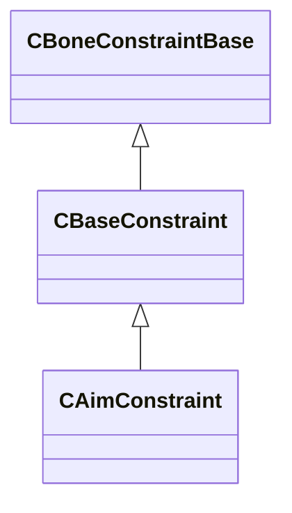
```mermaid
classDiagram
    CBaseConstraint <|-- CAimConstraint
    CBoneConstraintBase <|-- CBaseConstraint
```

**Fields:**

| Name | Type | Annotations |
|------|------|-------------|
| `m_qAimOffset` | Quaternion |  |
| `m_nUpType` | uint32 |  |

### CAnimAttachment

**Metadata:** `MGetKV3ClassDefaults`

**Fields:**

| Name | Type | Annotations |
|------|------|-------------|
| `m_influenceRotations` | Quaternion[3] |  |
| `m_influenceOffsets` | VectorAligned[3] |  |
| `m_influenceIndices` | int32[3] |  |
| `m_influenceWeights` | float32[3] |  |
| `m_numInfluences` | uint8 |  |

### CAnimCycle

**Inherits from:** [CCycleBase](modellib.md#ccyclebase)

**Metadata:** `MGetKV3ClassDefaults`

**Relationships:**

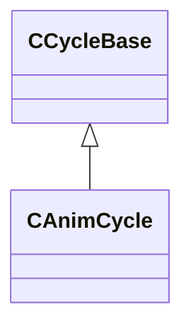
```mermaid
classDiagram
    CCycleBase <|-- CAnimCycle
```

### CAnimFoot

**Metadata:** `MGetKV3ClassDefaults`

**Fields:**

| Name | Type | Annotations |
|------|------|-------------|
| `m_name` | CUtlString |  |
| `m_vBallOffset` | Vector |  |
| `m_vHeelOffset` | Vector |  |
| `m_ankleBoneIndex` | int32 |  |
| `m_toeBoneIndex` | int32 |  |

### CAnimSkeleton

**Metadata:** `MGetKV3ClassDefaults`

**Relationships:**

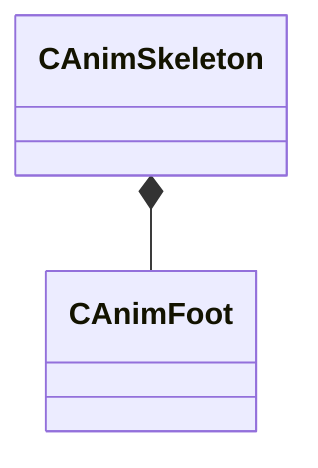
```mermaid
classDiagram
    CAnimSkeleton *-- CAnimFoot
```

**Fields:**

| Name | Type | Annotations |
|------|------|-------------|
| `m_localSpaceTransforms` | CUtlVector< CTransform > |  |
| `m_modelSpaceTransforms` | CUtlVector< CTransform > |  |
| `m_boneNames` | CUtlVector< CUtlString > |  |
| `m_children` | CUtlVector< CUtlVector< int32 > > |  |
| `m_parents` | CUtlVector< int32 > |  |
| `m_feet` | CUtlVector< [CAnimFoot](../schemas/modellib.md#canimfoot) > |  |
| `m_morphNames` | CUtlVector< CUtlString > |  |
| `m_lodBoneCounts` | CUtlVector< int32 > |  |

### CAttachment

**Metadata:** `MGetKV3ClassDefaults`

**Fields:**

| Name | Type | Annotations |
|------|------|-------------|
| `m_name` | CUtlString |  |
| `m_influenceNames` | CUtlString[3] |  |
| `m_vInfluenceRotations` | Quaternion[3] |  |
| `m_vInfluenceOffsets` | Vector[3] |  |
| `m_influenceWeights` | float32[3] |  |
| `m_bInfluenceRootTransform` | bool[3] |  |
| `m_nInfluences` | uint8 |  |
| `m_bIgnoreRotation` | bool |  |

### CBaseConstraint

**Inherits from:** [CBoneConstraintBase](modellib.md#cboneconstraintbase)

**Derived by:** [CAimConstraint](modellib.md#caimconstraint), [CBoneConstraintPoseSpaceBone](modellib.md#cboneconstraintposespacebone), [CMorphConstraint](modellib.md#cmorphconstraint), [COrientConstraint](modellib.md#corientconstraint), [CParentConstraint](modellib.md#cparentconstraint), [CPointConstraint](modellib.md#cpointconstraint), [CTiltTwistConstraint](modellib.md#ctilttwistconstraint), [CTwistConstraint](modellib.md#ctwistconstraint)

**Metadata:** `MGetKV3ClassDefaults`

**Relationships:**

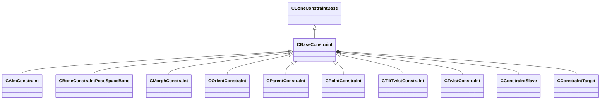
```mermaid
classDiagram
    CBoneConstraintBase <|-- CBaseConstraint
    CBaseConstraint <|-- CAimConstraint
    CBaseConstraint <|-- CBoneConstraintPoseSpaceBone
    CBaseConstraint <|-- CMorphConstraint
    CBaseConstraint <|-- COrientConstraint
    CBaseConstraint <|-- CParentConstraint
    CBaseConstraint <|-- CPointConstraint
    CBaseConstraint <|-- CTiltTwistConstraint
    CBaseConstraint <|-- CTwistConstraint
    CBaseConstraint *-- CConstraintSlave
    CBaseConstraint *-- CConstraintTarget
```

**Fields:**

| Name | Type | Annotations |
|------|------|-------------|
| `m_name` | CUtlString |  |
| `m_vUpVector` | Vector |  |
| `m_slaves` | CUtlLeanVector< [CConstraintSlave](../schemas/modellib.md#cconstraintslave) > |  |
| `m_targets` | CUtlVector< [CConstraintTarget](../schemas/modellib.md#cconstrainttarget) > |  |

### CBoneConstraintBase

**Derived by:** [CBaseConstraint](modellib.md#cbaseconstraint), [CBoneConstraintDotToMorph](modellib.md#cboneconstraintdottomorph), [CBoneConstraintPoseSpaceMorph](modellib.md#cboneconstraintposespacemorph), [CBoneConstraintRbf](modellib.md#cboneconstraintrbf)

**Metadata:** `MGetKV3ClassDefaults`

**Relationships:**

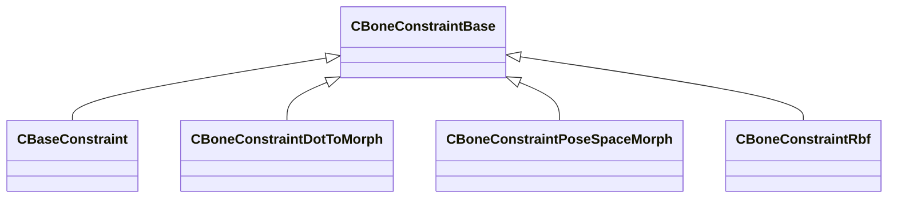
```mermaid
classDiagram
    CBoneConstraintBase <|-- CBaseConstraint
    CBoneConstraintBase <|-- CBoneConstraintDotToMorph
    CBoneConstraintBase <|-- CBoneConstraintPoseSpaceMorph
    CBoneConstraintBase <|-- CBoneConstraintRbf
```

### CBoneConstraintDotToMorph

**Inherits from:** [CBoneConstraintBase](modellib.md#cboneconstraintbase)

**Metadata:** `MGetKV3ClassDefaults`

**Relationships:**

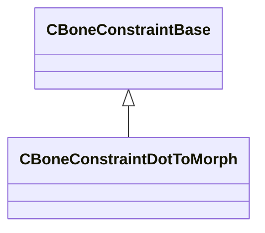
```mermaid
classDiagram
    CBoneConstraintBase <|-- CBoneConstraintDotToMorph
```

**Fields:**

| Name | Type | Annotations |
|------|------|-------------|
| `m_sBoneName` | CUtlString |  |
| `m_sTargetBoneName` | CUtlString |  |
| `m_sMorphChannelName` | CUtlString |  |
| `m_flRemap` | float32[4] |  |

### CBoneConstraintPoseSpaceBone

**Inherits from:** [CBaseConstraint](modellib.md#cbaseconstraint)

**Metadata:** `MGetKV3ClassDefaults`

**Relationships:**

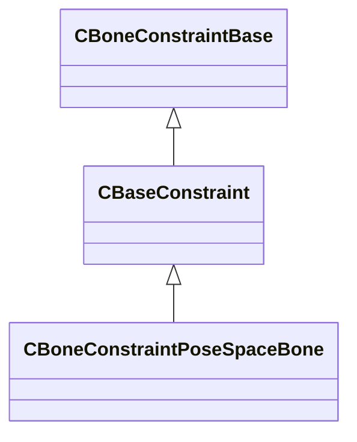
```mermaid
classDiagram
    CBaseConstraint <|-- CBoneConstraintPoseSpaceBone
    CBoneConstraintBase <|-- CBaseConstraint
```

**Fields:**

| Name | Type | Annotations |
|------|------|-------------|
| `m_inputList` | CUtlVector< [CBoneConstraintPoseSpaceBone](../schemas/modellib.md#cboneconstraintposespacebone)::Input_t > |  |

### CBoneConstraintPoseSpaceBone::Input_t

**Fields:**

| Name | Type | Annotations |
|------|------|-------------|
| `m_inputValue` | Vector |  |
| `m_outputTransformList` | CUtlVector< CTransform > |  |

### CBoneConstraintPoseSpaceMorph

**Inherits from:** [CBoneConstraintBase](modellib.md#cboneconstraintbase)

**Metadata:** `MGetKV3ClassDefaults`

**Relationships:**

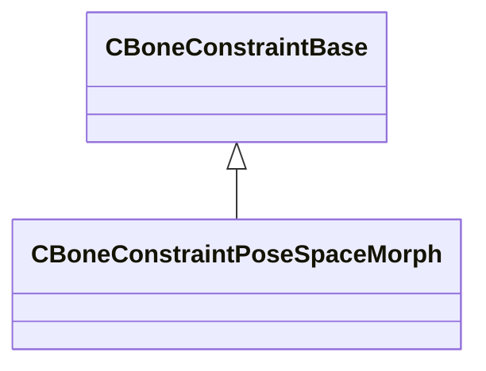
```mermaid
classDiagram
    CBoneConstraintBase <|-- CBoneConstraintPoseSpaceMorph
```

**Fields:**

| Name | Type | Annotations |
|------|------|-------------|
| `m_sBoneName` | CUtlString |  |
| `m_sAttachmentName` | CUtlString |  |
| `m_outputMorph` | CUtlVector< CUtlString > |  |
| `m_inputList` | CUtlVector< [CBoneConstraintPoseSpaceMorph](../schemas/modellib.md#cboneconstraintposespacemorph)::Input_t > |  |
| `m_bClamp` | bool |  |

### CBoneConstraintPoseSpaceMorph::Input_t

**Fields:**

| Name | Type | Annotations |
|------|------|-------------|
| `m_inputValue` | Vector |  |
| `m_outputWeightList` | CUtlVector< float32 > |  |

### CBoneConstraintRbf

**Inherits from:** [CBoneConstraintBase](modellib.md#cboneconstraintbase)

**Metadata:** `MGetKV3ClassDefaults`

**Relationships:**

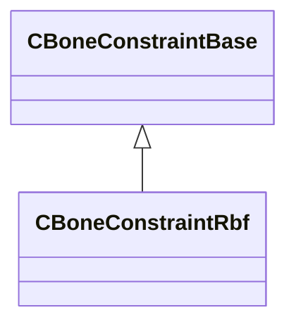
```mermaid
classDiagram
    CBoneConstraintBase <|-- CBoneConstraintRbf
```

**Fields:**

| Name | Type | Annotations |
|------|------|-------------|
| `m_inputBones` | CUtlVector< std::pair< CUtlString, uint32 > > |  |
| `m_outputBones` | CUtlVector< std::pair< CUtlString, uint32 > > |  |

### CConstraintSlave

**Metadata:** `MGetKV3ClassDefaults`

**Fields:**

| Name | Type | Annotations |
|------|------|-------------|
| `m_qBaseOrientation` | Quaternion |  |
| `m_vBasePosition` | Vector |  |
| `m_nBoneHash` | uint32 |  |
| `m_flWeight` | float32 |  |
| `m_sName` | CUtlString |  |

### CConstraintTarget

**Metadata:** `MGetKV3ClassDefaults`

**Fields:**

| Name | Type | Annotations |
|------|------|-------------|
| `m_qOffset` | Quaternion |  |
| `m_vOffset` | Vector |  |
| `m_nBoneHash` | uint32 |  |
| `m_sName` | CUtlString |  |
| `m_flWeight` | float32 |  |
| `m_bIsAttachment` | bool |  |

### CCycleBase

**Derived by:** [CAnimCycle](modellib.md#canimcycle), [CFootCycle](modellib.md#cfootcycle)

**Metadata:** `MGetKV3ClassDefaults`

**Relationships:**

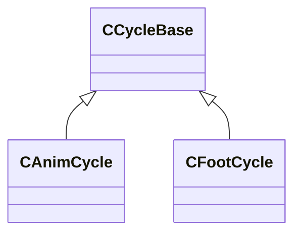
```mermaid
classDiagram
    CCycleBase <|-- CAnimCycle
    CCycleBase <|-- CFootCycle
```

**Fields:**

| Name | Type | Annotations |
|------|------|-------------|
| `m_flCycle` | float32 |  |

### CDrawCullingData

**Metadata:** `MGetKV3ClassDefaults`

**Fields:**

| Name | Type | Annotations |
|------|------|-------------|
| `m_ConeAxis` | int8[3] |  |
| `m_ConeCutoff` | int8 |  |

### CFlexController

**Metadata:** `MGetKV3ClassDefaults`

**Fields:**

| Name | Type | Annotations |
|------|------|-------------|
| `m_szName` | CUtlString |  |
| `m_szType` | CUtlString |  |
| `min` | float32 |  |
| `max` | float32 |  |

### CFlexDesc

**Metadata:** `MGetKV3ClassDefaults`

**Fields:**

| Name | Type | Annotations |
|------|------|-------------|
| `m_szFacs` | CUtlString |  |

### CFlexOp

**Metadata:** `MGetKV3ClassDefaults`

**Relationships:**

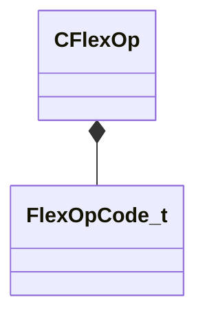
```mermaid
classDiagram
    CFlexOp *-- FlexOpCode_t
```

**Fields:**

| Name | Type | Annotations |
|------|------|-------------|
| `m_OpCode` | [FlexOpCode_t](../schemas/!GlobalTypes.md#flexopcode_t) |  |
| `m_Data` | int32 |  |

### CFlexRule

**Metadata:** `MGetKV3ClassDefaults`

**Relationships:**

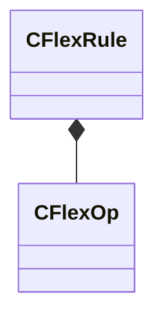
```mermaid
classDiagram
    CFlexRule *-- CFlexOp
```

**Fields:**

| Name | Type | Annotations |
|------|------|-------------|
| `m_nFlex` | int32 |  |
| `m_FlexOps` | CUtlVector< [CFlexOp](../schemas/modellib.md#cflexop) > |  |

### CFootCycle

**Inherits from:** [CCycleBase](modellib.md#ccyclebase)

**Metadata:** `MGetKV3ClassDefaults`

**Relationships:**

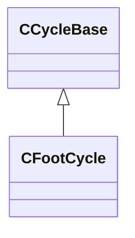
```mermaid
classDiagram
    CCycleBase <|-- CFootCycle
```

### CFootCycleDefinition

**Metadata:** `MGetKV3ClassDefaults`

**Relationships:**

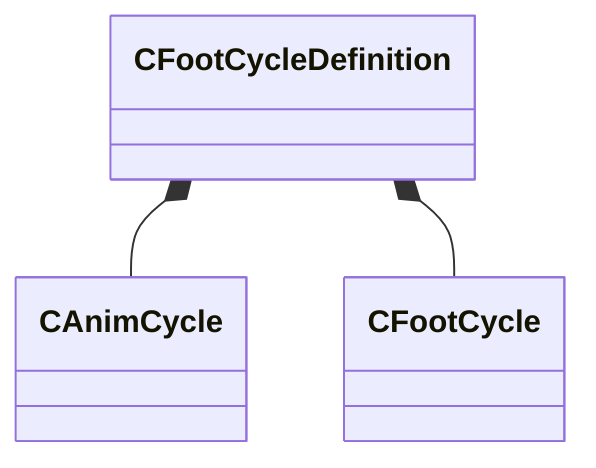
```mermaid
classDiagram
    CFootCycleDefinition *-- CAnimCycle
    CFootCycleDefinition *-- CFootCycle
```

**Fields:**

| Name | Type | Annotations |
|------|------|-------------|
| `m_vStancePositionMS` | Vector |  |
| `m_vMidpointPositionMS` | Vector |  |
| `m_flStanceDirectionMS` | float32 |  |
| `m_vToStrideStartPos` | Vector |  |
| `m_stanceCycle` | [CAnimCycle](../schemas/modellib.md#canimcycle) |  |
| `m_footLiftCycle` | [CFootCycle](../schemas/modellib.md#cfootcycle) |  |
| `m_footOffCycle` | [CFootCycle](../schemas/modellib.md#cfootcycle) |  |
| `m_footStrikeCycle` | [CFootCycle](../schemas/modellib.md#cfootcycle) |  |
| `m_footLandCycle` | [CFootCycle](../schemas/modellib.md#cfootcycle) |  |

### CFootDefinition

**Metadata:** `MGetKV3ClassDefaults`

**Fields:**

| Name | Type | Annotations |
|------|------|-------------|
| `m_name` | CUtlString |  |
| `m_ankleBoneName` | CUtlString |  |
| `m_toeBoneName` | CUtlString |  |
| `m_vBallOffset` | Vector |  |
| `m_vHeelOffset` | Vector |  |
| `m_flFootLength` | float32 |  |
| `m_flBindPoseDirectionMS` | float32 |  |
| `m_flTraceHeight` | float32 |  |
| `m_flTraceRadius` | float32 |  |

### CFootMotion

**Metadata:** `MGetKV3ClassDefaults`

**Relationships:**

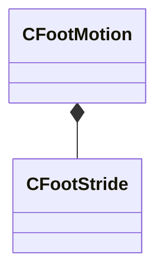
```mermaid
classDiagram
    CFootMotion *-- CFootStride
```

**Fields:**

| Name | Type | Annotations |
|------|------|-------------|
| `m_strides` | CUtlVector< [CFootStride](../schemas/modellib.md#cfootstride) > |  |
| `m_name` | CUtlString |  |
| `m_bAdditive` | bool |  |

### CFootStride

**Metadata:** `MGetKV3ClassDefaults`

**Relationships:**

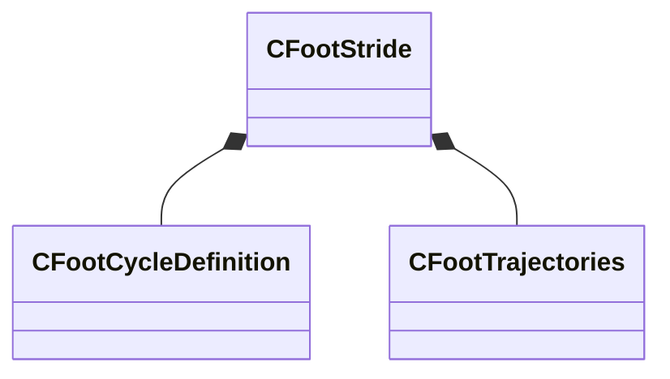
```mermaid
classDiagram
    CFootStride *-- CFootCycleDefinition
    CFootStride *-- CFootTrajectories
```

**Fields:**

| Name | Type | Annotations |
|------|------|-------------|
| `m_definition` | [CFootCycleDefinition](../schemas/modellib.md#cfootcycledefinition) |  |
| `m_trajectories` | [CFootTrajectories](../schemas/modellib.md#cfoottrajectories) |  |

### CFootTrajectories

**Metadata:** `MGetKV3ClassDefaults`

**Relationships:**

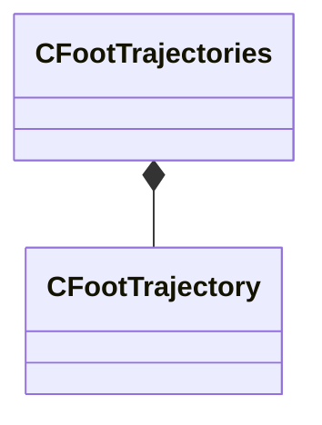
```mermaid
classDiagram
    CFootTrajectories *-- CFootTrajectory
```

**Fields:**

| Name | Type | Annotations |
|------|------|-------------|
| `m_trajectories` | CUtlVector< [CFootTrajectory](../schemas/modellib.md#cfoottrajectory) > |  |

### CFootTrajectory

**Metadata:** `MGetKV3ClassDefaults`

**Fields:**

| Name | Type | Annotations |
|------|------|-------------|
| `m_vOffset` | Vector |  |
| `m_flRotationOffset` | float32 |  |
| `m_flProgression` | float32 |  |

### CHitBox

**Metadata:** `MGetKV3ClassDefaults`

**Fields:**

| Name | Type | Annotations |
|------|------|-------------|
| `m_name` | CUtlString |  |
| `m_sSurfaceProperty` | CUtlString |  |
| `m_sBoneName` | CUtlString |  |
| `m_vMinBounds` | Vector |  |
| `m_vMaxBounds` | Vector |  |
| `m_flShapeRadius` | float32 |  |
| `m_nBoneNameHash` | uint32 |  |
| `m_nGroupId` | int32 |  |
| `m_nShapeType` | uint8 |  |
| `m_bTranslationOnly` | bool |  |
| `m_CRC` | uint32 |  |
| `m_cRenderColor` | Color |  |
| `m_nHitBoxIndex` | uint16 |  |

### CHitBoxSet

**Metadata:** `MGetKV3ClassDefaults`

**Relationships:**

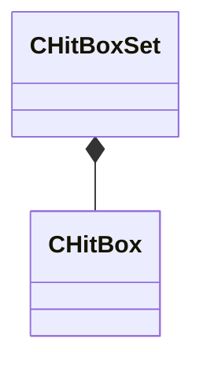
```mermaid
classDiagram
    CHitBoxSet *-- CHitBox
```

**Fields:**

| Name | Type | Annotations |
|------|------|-------------|
| `m_name` | CUtlString |  |
| `m_nNameHash` | uint32 |  |
| `m_HitBoxes` | CUtlVector< [CHitBox](../schemas/modellib.md#chitbox) > |  |
| `m_SourceFilename` | CUtlString |  |

### CHitBoxSetList

**Metadata:** `MGetKV3ClassDefaults`

**Relationships:**

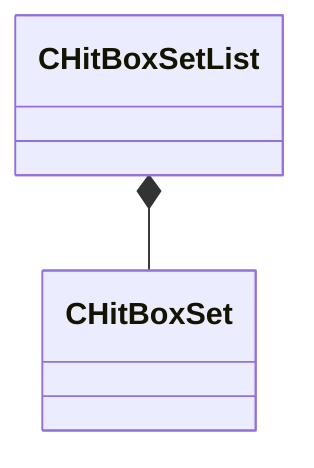
```mermaid
classDiagram
    CHitBoxSetList *-- CHitBoxSet
```

**Fields:**

| Name | Type | Annotations |
|------|------|-------------|
| `m_HitBoxSets` | CUtlVector< [CHitBoxSet](../schemas/modellib.md#chitboxset) > |  |

### CMaterialDrawDescriptor

**Metadata:** `MGetKV3ClassDefaults`

**Relationships:**

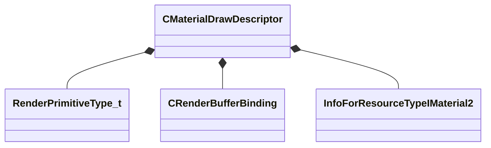
```mermaid
classDiagram
    CMaterialDrawDescriptor *-- RenderPrimitiveType_t
    CMaterialDrawDescriptor *-- CRenderBufferBinding
    CMaterialDrawDescriptor *-- InfoForResourceTypeIMaterial2
```

**Fields:**

| Name | Type | Annotations |
|------|------|-------------|
| `m_flUvDensity` | float32 |  |
| `m_vTintColor` | Vector |  |
| `m_flAlpha` | float32 |  |
| `m_nNumMeshlets` | uint16 |  |
| `m_nFirstMeshlet` | uint32 |  |
| `m_nAppliedIndexOffset` | uint32 |  |
| `m_nDepthVertexBufferIndex` | uint8 |  |
| `m_nMeshletPackedIVBIndex` | uint8 |  |
| `m_rigidMeshParts` | CUtlLeanVector< [CMaterialDrawDescriptor](../schemas/modellib.md#cmaterialdrawdescriptor)::RigidMeshPart_t > |  |
| `m_rootBvhNodes` | CUtlLeanVector< uint16 > |  |
| `m_nPrimitiveType` | [RenderPrimitiveType_t](../schemas/!GlobalTypes.md#renderprimitivetype_t) |  |
| `m_nBaseVertex` | int32 |  |
| `m_nVertexCount` | int32 |  |
| `m_nStartIndex` | int32 |  |
| `m_nIndexCount` | int32 |  |
| `m_indexBuffer` | [CRenderBufferBinding](../schemas/modellib.md#crenderbufferbinding) |  |
| `m_meshletPackedIVB` | [CRenderBufferBinding](../schemas/modellib.md#crenderbufferbinding) |  |
| `m_material` | CStrongHandle< [InfoForResourceTypeIMaterial2](../schemas/resourcesystem.md#infoforresourcetypeimaterial2) > |  |

### CMaterialDrawDescriptor::RigidMeshPart_t

**Metadata:** `MGetKV3ClassDefaults`

**Fields:**

| Name | Type | Annotations |
|------|------|-------------|
| `m_nRigidBLASIndex` | uint16 |  |
| `m_nBoneIndex` | int16 |  |
| `m_nStartIndexOffset` | uint32 |  |
| `m_nPrimitiveCount` | uint32 |  |

### CMeshletDescriptor

**Metadata:** `MGetKV3ClassDefaults`

**Relationships:**

```mermaid
classDiagram
    CMeshletDescriptor *-- PackedAABB_t
    CMeshletDescriptor *-- CDrawCullingData
```

**Fields:**

| Name | Type | Annotations |
|------|------|-------------|
| `m_PackedAABB` | [PackedAABB_t](../schemas/mathlib_extended.md#packedaabb_t) |  |
| `m_CullingData` | [CDrawCullingData](../schemas/modellib.md#cdrawcullingdata) |  |
| `m_nVertexOffset` | uint32 |  |
| `m_nTriangleOffset` | uint32 |  |
| `m_nVertexCount` | uint8 |  |
| `m_nTriangleCount` | uint8 |  |

### CModelConfig

**Metadata:** `MGetKV3ClassDefaults`

**Relationships:**

```mermaid
classDiagram
    CModelConfig --> CModelConfigElement
```

**Fields:**

| Name | Type | Annotations |
|------|------|-------------|
| `m_ConfigName` | CUtlString |  |
| `m_Elements` | CUtlVector< [CModelConfigElement](../schemas/modellib.md#cmodelconfigelement)* > |  |
| `m_bTopLevel` | bool |  |
| `m_bActiveInEditorByDefault` | bool |  |

### CModelConfigElement

**Derived by:** [CModelConfigElement_AttachedModel](modellib.md#cmodelconfigelement_attachedmodel), [CModelConfigElement_Command](modellib.md#cmodelconfigelement_command), [CModelConfigElement_RandomColor](modellib.md#cmodelconfigelement_randomcolor), [CModelConfigElement_RandomPick](modellib.md#cmodelconfigelement_randompick), [CModelConfigElement_SetBodygroup](modellib.md#cmodelconfigelement_setbodygroup), [CModelConfigElement_SetBodygroupOnAttachedModels](modellib.md#cmodelconfigelement_setbodygrouponattachedmodels), [CModelConfigElement_SetMaterialGroup](modellib.md#cmodelconfigelement_setmaterialgroup), [CModelConfigElement_SetMaterialGroupOnAttachedModels](modellib.md#cmodelconfigelement_setmaterialgrouponattachedmodels), [CModelConfigElement_SetRenderColor](modellib.md#cmodelconfigelement_setrendercolor), [CModelConfigElement_UserPick](modellib.md#cmodelconfigelement_userpick)

**Metadata:** `MGetKV3ClassDefaults`

**Relationships:**

```mermaid
classDiagram
    CModelConfigElement <|-- CModelConfigElement_AttachedModel
    CModelConfigElement <|-- CModelConfigElement_Command
    CModelConfigElement <|-- CModelConfigElement_RandomColor
    CModelConfigElement <|-- CModelConfigElement_RandomPick
    CModelConfigElement <|-- CModelConfigElement_SetBodygroup
    CModelConfigElement <|-- CModelConfigElement_SetBodygroupOnAttachedModels
    CModelConfigElement <|-- CModelConfigElement_SetMaterialGroup
    CModelConfigElement <|-- CModelConfigElement_SetMaterialGroupOnAttachedModels
    CModelConfigElement <|-- CModelConfigElement_SetRenderColor
    CModelConfigElement <|-- CModelConfigElement_UserPick
```

**Fields:**

| Name | Type | Annotations |
|------|------|-------------|
| `m_ElementName` | CUtlString |  |
| `m_NestedElements` | CUtlVector< [CModelConfigElement](../schemas/modellib.md#cmodelconfigelement)* > |  |

### CModelConfigElement_AttachedModel

**Inherits from:** [CModelConfigElement](modellib.md#cmodelconfigelement)

**Metadata:** `MGetKV3ClassDefaults`

**Relationships:**

```mermaid
classDiagram
    CModelConfigElement <|-- CModelConfigElement_AttachedModel
    CModelConfigElement_AttachedModel *-- InfoForResourceTypeCModel
    CModelConfigElement_AttachedModel *-- ModelConfigAttachmentType_t
```

**Fields:**

| Name | Type | Annotations |
|------|------|-------------|
| `m_InstanceName` | CUtlString |  |
| `m_EntityClass` | CUtlString |  |
| `m_hModel` | CStrongHandle< [InfoForResourceTypeCModel](../schemas/resourcesystem.md#infoforresourcetypecmodel) > |  |
| `m_vOffset` | Vector |  |
| `m_aAngOffset` | QAngle |  |
| `m_AttachmentName` | CUtlString |  |
| `m_LocalAttachmentOffsetName` | CUtlString |  |
| `m_AttachmentType` | [ModelConfigAttachmentType_t](../schemas/!GlobalTypes.md#modelconfigattachmenttype_t) |  |
| `m_bBoneMergeFlex` | bool |  |
| `m_bUserSpecifiedColor` | bool |  |
| `m_bUserSpecifiedMaterialGroup` | bool |  |
| `m_BodygroupOnOtherModels` | CUtlString |  |
| `m_MaterialGroupOnOtherModels` | CUtlString |  |

### CModelConfigElement_Command

**Inherits from:** [CModelConfigElement](modellib.md#cmodelconfigelement)

**Metadata:** `MGetKV3ClassDefaults`

**Relationships:**

```mermaid
classDiagram
    CModelConfigElement <|-- CModelConfigElement_Command
```

**Fields:**

| Name | Type | Annotations |
|------|------|-------------|
| `m_Command` | CUtlString |  |
| `m_Args` | KeyValues3 |  |

### CModelConfigElement_RandomColor

**Inherits from:** [CModelConfigElement](modellib.md#cmodelconfigelement)

**Metadata:** `MGetKV3ClassDefaults`

**Relationships:**

```mermaid
classDiagram
    CModelConfigElement <|-- CModelConfigElement_RandomColor
```

**Fields:**

| Name | Type | Annotations |
|------|------|-------------|
| `m_Gradient` | CColorGradient |  |

### CModelConfigElement_RandomPick

**Inherits from:** [CModelConfigElement](modellib.md#cmodelconfigelement)

**Metadata:** `MGetKV3ClassDefaults`

**Relationships:**

```mermaid
classDiagram
    CModelConfigElement <|-- CModelConfigElement_RandomPick
```

**Fields:**

| Name | Type | Annotations |
|------|------|-------------|
| `m_Choices` | CUtlVector< CUtlString > |  |
| `m_ChoiceWeights` | CUtlVector< float32 > |  |

### CModelConfigElement_SetBodygroup

**Inherits from:** [CModelConfigElement](modellib.md#cmodelconfigelement)

**Metadata:** `MGetKV3ClassDefaults`

**Relationships:**

```mermaid
classDiagram
    CModelConfigElement <|-- CModelConfigElement_SetBodygroup
```

**Fields:**

| Name | Type | Annotations |
|------|------|-------------|
| `m_GroupName` | CGlobalSymbol |  |
| `m_nChoice` | int32 |  |

### CModelConfigElement_SetBodygroupOnAttachedModels

**Inherits from:** [CModelConfigElement](modellib.md#cmodelconfigelement)

**Metadata:** `MGetKV3ClassDefaults`

**Relationships:**

```mermaid
classDiagram
    CModelConfigElement <|-- CModelConfigElement_SetBodygroupOnAttachedModels
```

**Fields:**

| Name | Type | Annotations |
|------|------|-------------|
| `m_GroupName` | CUtlString |  |
| `m_nChoice` | int32 |  |

### CModelConfigElement_SetMaterialGroup

**Inherits from:** [CModelConfigElement](modellib.md#cmodelconfigelement)

**Metadata:** `MGetKV3ClassDefaults`

**Relationships:**

```mermaid
classDiagram
    CModelConfigElement <|-- CModelConfigElement_SetMaterialGroup
```

**Fields:**

| Name | Type | Annotations |
|------|------|-------------|
| `m_MaterialGroupName` | CUtlString |  |

### CModelConfigElement_SetMaterialGroupOnAttachedModels

**Inherits from:** [CModelConfigElement](modellib.md#cmodelconfigelement)

**Metadata:** `MGetKV3ClassDefaults`

**Relationships:**

```mermaid
classDiagram
    CModelConfigElement <|-- CModelConfigElement_SetMaterialGroupOnAttachedModels
```

**Fields:**

| Name | Type | Annotations |
|------|------|-------------|
| `m_MaterialGroupName` | CUtlString |  |

### CModelConfigElement_SetRenderColor

**Inherits from:** [CModelConfigElement](modellib.md#cmodelconfigelement)

**Metadata:** `MGetKV3ClassDefaults`

**Relationships:**

```mermaid
classDiagram
    CModelConfigElement <|-- CModelConfigElement_SetRenderColor
```

**Fields:**

| Name | Type | Annotations |
|------|------|-------------|
| `m_Color` | Color |  |

### CModelConfigElement_UserPick

**Inherits from:** [CModelConfigElement](modellib.md#cmodelconfigelement)

**Metadata:** `MGetKV3ClassDefaults`

**Relationships:**

```mermaid
classDiagram
    CModelConfigElement <|-- CModelConfigElement_UserPick
```

**Fields:**

| Name | Type | Annotations |
|------|------|-------------|
| `m_Choices` | CUtlVector< CUtlString > |  |

### CModelConfigList

**Metadata:** `MGetKV3ClassDefaults`

**Relationships:**

```mermaid
classDiagram
    CModelConfigList --> CModelConfig
```

**Fields:**

| Name | Type | Annotations |
|------|------|-------------|
| `m_bHideMaterialGroupInTools` | bool |  |
| `m_bHideRenderColorInTools` | bool |  |
| `m_Configs` | CUtlVector< [CModelConfig](../schemas/modellib.md#cmodelconfig)* > |  |

### CMorphBundleData

**Metadata:** `MGetKV3ClassDefaults`

**Fields:**

| Name | Type | Annotations |
|------|------|-------------|
| `m_flULeftSrc` | float32 |  |
| `m_flVTopSrc` | float32 |  |
| `m_offsets` | CUtlVector< float32 > |  |
| `m_ranges` | CUtlVector< float32 > |  |

### CMorphConstraint

**Inherits from:** [CBaseConstraint](modellib.md#cbaseconstraint)

**Metadata:** `MGetKV3ClassDefaults`

**Relationships:**

```mermaid
classDiagram
    CBaseConstraint <|-- CMorphConstraint
    CBoneConstraintBase <|-- CBaseConstraint
```

**Fields:**

| Name | Type | Annotations |
|------|------|-------------|
| `m_sTargetMorph` | CUtlString |  |
| `m_nSlaveChannel` | int32 |  |
| `m_flMin` | float32 |  |
| `m_flMax` | float32 |  |

### CMorphData

**Metadata:** `MGetKV3ClassDefaults`

**Relationships:**

```mermaid
classDiagram
    CMorphData *-- CMorphRectData
```

**Fields:**

| Name | Type | Annotations |
|------|------|-------------|
| `m_name` | CUtlString |  |
| `m_morphRectDatas` | CUtlVector< [CMorphRectData](../schemas/modellib.md#cmorphrectdata) > |  |

### CMorphRectData

**Metadata:** `MGetKV3ClassDefaults`

**Relationships:**

```mermaid
classDiagram
    CMorphRectData *-- CMorphBundleData
```

**Fields:**

| Name | Type | Annotations |
|------|------|-------------|
| `m_nXLeftDst` | int16 |  |
| `m_nYTopDst` | int16 |  |
| `m_flUWidthSrc` | float32 |  |
| `m_flVHeightSrc` | float32 |  |
| `m_bundleDatas` | CUtlVector< [CMorphBundleData](../schemas/modellib.md#cmorphbundledata) > |  |

### CMorphSetData

**Metadata:** `MGetKV3ClassDefaults`

**Relationships:**

```mermaid
classDiagram
    CMorphSetData *-- MorphBundleType_t
    CMorphSetData *-- CMorphData
    CMorphSetData *-- InfoForResourceTypeCTextureBase
    CMorphSetData *-- CFlexDesc
    CMorphSetData *-- CFlexController
    CMorphSetData *-- CFlexRule
```

**Fields:**

| Name | Type | Annotations |
|------|------|-------------|
| `m_nWidth` | int32 |  |
| `m_nHeight` | int32 |  |
| `m_bundleTypes` | CUtlVector< [MorphBundleType_t](../schemas/!GlobalTypes.md#morphbundletype_t) > |  |
| `m_morphDatas` | CUtlVector< [CMorphData](../schemas/modellib.md#cmorphdata) > |  |
| `m_pTextureAtlas` | CStrongHandle< [InfoForResourceTypeCTextureBase](../schemas/resourcesystem.md#infoforresourcetypectexturebase) > |  |
| `m_FlexDesc` | CUtlVector< [CFlexDesc](../schemas/modellib.md#cflexdesc) > |  |
| `m_FlexControllers` | CUtlVector< [CFlexController](../schemas/modellib.md#cflexcontroller) > |  |
| `m_FlexRules` | CUtlVector< [CFlexRule](../schemas/modellib.md#cflexrule) > |  |

### CNPCPhysicsHull

**Metadata:** `MFgdHelper`, `MFgdHelper`, `MGetKV3ClassDefaults`, `MModelGameData`

**Relationships:**

```mermaid
classDiagram
    CNPCPhysicsHull *-- NPCPhysicsHullType_t
```

**Fields:**

| Name | Type | Annotations |
|------|------|-------------|
| `m_sName` | CGlobalSymbol | `MPropertyFriendlyName Name` `MPropertySuppressField` |
| `m_eType` | [NPCPhysicsHullType_t](../schemas/!GlobalTypes.md#npcphysicshulltype_t) | `MPropertyFriendlyName Type` |
| `m_flCapsuleHeight` | float32 | `MPropertyFriendlyName Height` `MPropertySuppressExpr` |
| `m_flCapsuleRadius` | float32 | `MPropertyFriendlyName Radius` `MPropertySuppressExpr` |
| `m_vCapsuleCenter1` | Vector | `MPropertyFriendlyName Center 1` `MPropertySuppressExpr` |
| `m_vCapsuleCenter2` | Vector | `MPropertyFriendlyName Center 2` `MPropertySuppressExpr` |
| `m_flGroundBoxHeight` | float32 | `MPropertyFriendlyName Height` `MPropertySuppressExpr` |
| `m_flGroundBoxWidth` | float32 | `MPropertyFriendlyName Width` `MPropertySuppressExpr` |

### COrientConstraint

**Inherits from:** [CBaseConstraint](modellib.md#cbaseconstraint)

**Metadata:** `MGetKV3ClassDefaults`

**Relationships:**

```mermaid
classDiagram
    CBaseConstraint <|-- COrientConstraint
    CBoneConstraintBase <|-- CBaseConstraint
```

### CParentConstraint

**Inherits from:** [CBaseConstraint](modellib.md#cbaseconstraint)

**Metadata:** `MGetKV3ClassDefaults`

**Relationships:**

```mermaid
classDiagram
    CBaseConstraint <|-- CParentConstraint
    CBoneConstraintBase <|-- CBaseConstraint
```

### CPhysSurfaceProperties

**Metadata:** `MGetKV3ClassDefaults`

**Relationships:**

```mermaid
classDiagram
    CPhysSurfaceProperties *-- CPhysSurfacePropertiesPhysics
    CPhysSurfaceProperties *-- CPhysSurfacePropertiesVehicle
    CPhysSurfaceProperties *-- CPhysSurfacePropertiesSoundNames
    CPhysSurfaceProperties *-- CPhysSurfacePropertiesAudio
```

**Fields:**

| Name | Type | Annotations |
|------|------|-------------|
| `m_name` | CUtlString | `MKV3TransferName surfacePropertyName` |
| `m_nameHash` | uint32 |  |
| `m_baseNameHash` | uint32 |  |
| `m_bHidden` | bool | `MKV3TransferName hidden` |
| `m_description` | CUtlString | `MKV3TransferName description` |
| `m_physics` | [CPhysSurfacePropertiesPhysics](../schemas/modellib.md#cphyssurfacepropertiesphysics) | `MKV3TransferName physics` |
| `m_vehicleParams` | [CPhysSurfacePropertiesVehicle](../schemas/modellib.md#cphyssurfacepropertiesvehicle) | `MKV3TransferName vehicleparams` |
| `m_audioSounds` | [CPhysSurfacePropertiesSoundNames](../schemas/modellib.md#cphyssurfacepropertiessoundnames) | `MKV3TransferName audiosounds` |
| `m_audioParams` | [CPhysSurfacePropertiesAudio](../schemas/modellib.md#cphyssurfacepropertiesaudio) | `MKV3TransferName audioparams` |

### CPhysSurfacePropertiesAudio

**Metadata:** `MGetKV3ClassDefaults`

**Fields:**

| Name | Type | Annotations |
|------|------|-------------|
| `m_reflectivity` | float32 | `MKV3TransferName audioreflectivity` |
| `m_hardnessFactor` | float32 | `MKV3TransferName audiohardnessfactor` |
| `m_roughnessFactor` | float32 | `MKV3TransferName audioroughnessfactor` |
| `m_roughThreshold` | float32 | `MKV3TransferName scrapeRoughThreshold` |
| `m_hardThreshold` | float32 | `MKV3TransferName impactHardThreshold` |
| `m_hardVelocityThreshold` | float32 | `MKV3TransferName audioHardMinVelocity` |
| `m_flStaticImpactVolume` | float32 | `MKV3TransferName staticImpactVolume` |
| `m_flOcclusionFactor` | float32 | `MKV3TransferName occlusionFactor` |

### CPhysSurfacePropertiesPhysics

**Metadata:** `MGetKV3ClassDefaults`

**Fields:**

| Name | Type | Annotations |
|------|------|-------------|
| `m_friction` | float32 | `MKV3TransferName friction` |
| `m_elasticity` | float32 | `MKV3TransferName elasticity` |
| `m_density` | float32 | `MKV3TransferName density` |
| `m_thickness` | float32 | `MKV3TransferName thickness` |
| `m_softContactFrequency` | float32 | `MKV3TransferName softcontactfrequency` |
| `m_softContactDampingRatio` | float32 | `MKV3TransferName softcontactdampingratio` |

### CPhysSurfacePropertiesSoundNames

**Metadata:** `MGetKV3ClassDefaults`

**Fields:**

| Name | Type | Annotations |
|------|------|-------------|
| `m_impactSoft` | CUtlString | `MKV3TransferName impactsoft` |
| `m_impactHard` | CUtlString | `MKV3TransferName impacthard` |
| `m_scrapeSmooth` | CUtlString | `MKV3TransferName scrapesmooth` |
| `m_scrapeRough` | CUtlString | `MKV3TransferName scraperough` |
| `m_bulletImpact` | CUtlString | `MKV3TransferName bulletimpact` |
| `m_rolling` | CUtlString | `MKV3TransferName rolling` |
| `m_break` | CUtlString | `MKV3TransferName break` |
| `m_strain` | CUtlString | `MKV3TransferName strain` |
| `m_meleeImpact` | CUtlString | `MKV3TransferName meleeimpact` |
| `m_pushOff` | CUtlString | `MKV3TransferName pushoff` |
| `m_skidStop` | CUtlString | `MKV3TransferName skidstop` |
| `m_resonant` | CUtlString | `MKV3TransferName resonant` |

### CPhysSurfacePropertiesVehicle

**Metadata:** `MGetKV3ClassDefaults`

**Fields:**

| Name | Type | Annotations |
|------|------|-------------|
| `m_wheelDrag` | float32 | `MKV3TransferName wheeldrag` |
| `m_wheelFrictionScale` | float32 | `MKV3TransferName wheelfrictionscale` |

### CPointConstraint

**Inherits from:** [CBaseConstraint](modellib.md#cbaseconstraint)

**Metadata:** `MGetKV3ClassDefaults`

**Relationships:**

```mermaid
classDiagram
    CBaseConstraint <|-- CPointConstraint
    CBoneConstraintBase <|-- CBaseConstraint
```

### CRenderBufferBinding

**Metadata:** `MGetKV3ClassDefaults`

**Fields:**

| Name | Type | Annotations |
|------|------|-------------|
| `m_hBuffer` | uint64 |  |
| `m_nBindOffsetBytes` | uint32 |  |

### CRenderGroom

**Metadata:** `MGetKV3ClassDefaults`

**Relationships:**

```mermaid
classDiagram
    CRenderGroom *-- RenderHairStrandInfo_t
    CRenderGroom *-- InfoForResourceTypeIMaterial2
```

**Fields:**

| Name | Type | Annotations |
|------|------|-------------|
| `m_hairs` | CUtlVector< [RenderHairStrandInfo_t](../schemas/modellib.md#renderhairstrandinfo_t) > |  |
| `m_hairPositionOffsets` | CUtlVector< uint32 > |  |
| `m_hSimParamsMat` | CStrongHandleCopyable< [InfoForResourceTypeIMaterial2](../schemas/resourcesystem.md#infoforresourcetypeimaterial2) > |  |
| `m_strandSegmentCountHist` | CUtlVector< int32 > |  |
| `m_nMaxSegmentsPerHairStrand` | int32 |  |
| `m_nGuideHairCount` | int32 |  |
| `m_nHairCount` | int32 |  |
| `m_nTotalVertexCount` | int32 |  |
| `m_nTotalSegmentCount` | int32 |  |
| `m_nGroomGroupID` | int32 |  |
| `m_nAttachBoneIdx` | int32 |  |
| `m_nAttachMeshIdx` | int32 |  |
| `m_nAttachMeshDrawCallIdx` | int32 |  |
| `m_bEnableSimulation` | bool |  |

### CRenderMesh

**Metadata:** `MGetKV3ClassDefaults`

**Relationships:**

```mermaid
classDiagram
    CRenderMesh *-- CSceneObjectData
    CRenderMesh --> CBaseConstraint
    CRenderMesh *-- CRenderSkeleton
    CRenderMesh *-- DynamicMeshDeformParams_t
    CRenderMesh --> CRenderGroom
```

**Fields:**

| Name | Type | Annotations |
|------|------|-------------|
| `m_sceneObjects` | CUtlLeanVectorFixedGrowable< [CSceneObjectData](../schemas/modellib.md#csceneobjectdata), 1 > |  |
| `m_constraints` | CUtlLeanVector< [CBaseConstraint](../schemas/modellib.md#cbaseconstraint)* > |  |
| `m_skeleton` | [CRenderSkeleton](../schemas/modellib.md#crenderskeleton) |  |
| `m_bUseUV2ForCharting` | bool |  |
| `m_bEmbeddedMapMesh` | bool |  |
| `m_meshDeformParams` | [DynamicMeshDeformParams_t](../schemas/modellib.md#dynamicmeshdeformparams_t) |  |
| `m_pGroomData` | [CRenderGroom](../schemas/modellib.md#crendergroom)* |  |

### CRenderSkeleton

**Metadata:** `MGetKV3ClassDefaults`

**Relationships:**

```mermaid
classDiagram
    CRenderSkeleton *-- RenderSkeletonBone_t
```

**Fields:**

| Name | Type | Annotations |
|------|------|-------------|
| `m_bones` | CUtlVector< [RenderSkeletonBone_t](../schemas/modellib.md#renderskeletonbone_t) > |  |
| `m_boneParents` | CUtlVector< int32 > |  |
| `m_nBoneWeightCount` | int32 |  |

### CSceneObjectData

**Metadata:** `MGetKV3ClassDefaults`

**Relationships:**

```mermaid
classDiagram
    CSceneObjectData *-- CMaterialDrawDescriptor
    CSceneObjectData *-- AABB_t
    CSceneObjectData *-- CMeshletDescriptor
```

**Fields:**

| Name | Type | Annotations |
|------|------|-------------|
| `m_vMinBounds` | Vector |  |
| `m_vMaxBounds` | Vector |  |
| `m_drawCalls` | CUtlLeanVector< [CMaterialDrawDescriptor](../schemas/modellib.md#cmaterialdrawdescriptor) > |  |
| `m_drawBounds` | CUtlLeanVector< [AABB_t](../schemas/mathlib_extended.md#aabb_t) > |  |
| `m_meshlets` | CUtlLeanVector< [CMeshletDescriptor](../schemas/modellib.md#cmeshletdescriptor) > |  |
| `m_rtProxyDrawCalls` | CUtlLeanVector< [CSceneObjectData](../schemas/modellib.md#csceneobjectdata)::RTProxyDrawDescriptor_t > |  |
| `m_vTintColor` | Vector4D |  |

### CSceneObjectData::RTProxyDrawDescriptor_t

**Metadata:** `MGetKV3ClassDefaults`

**Relationships:**

```mermaid
classDiagram
    "CSceneObjectData::RTProxyDrawDescriptor_t" *-- CMaterialDrawDescriptor
    "CSceneObjectData::RTProxyDrawDescriptor_t" *-- VertexAlbedoFormat_t
```

**Fields:**

| Name | Type | Annotations |
|------|------|-------------|
| `m_materialGroupToken` | uint32 |  |
| `m_nSrcDrawIndex` | int32 |  |
| `m_drawDesc` | [CMaterialDrawDescriptor](../schemas/modellib.md#cmaterialdrawdescriptor) |  |
| `m_mWorldFromLocal` | matrix3x4_t |  |
| `m_nVertexAlbedoFormat` | [VertexAlbedoFormat_t](../schemas/!GlobalTypes.md#vertexalbedoformat_t) |  |
| `m_nVertexAlbedoVB` | int8 |  |
| `m_nVertexAlbedoOffset` | uint16 |  |
| `m_nVertexAlbedoStride` | uint16 |  |
| `m_nVertexEmissiveFormat` | [VertexAlbedoFormat_t](../schemas/!GlobalTypes.md#vertexalbedoformat_t) |  |
| `m_nVertexEmissiveVB` | int8 |  |
| `m_nVertexEmissiveOffset` | uint16 |  |
| `m_nVertexEmissiveStride` | uint16 |  |
| `m_fEmissiveFactor` | float32 |  |

### CTiltTwistConstraint

**Inherits from:** [CBaseConstraint](modellib.md#cbaseconstraint)

**Metadata:** `MGetKV3ClassDefaults`

**Relationships:**

```mermaid
classDiagram
    CBaseConstraint <|-- CTiltTwistConstraint
    CBoneConstraintBase <|-- CBaseConstraint
```

**Fields:**

| Name | Type | Annotations |
|------|------|-------------|
| `m_nTargetAxis` | int32 |  |
| `m_nSlaveAxis` | int32 |  |

### CTwistConstraint

**Inherits from:** [CBaseConstraint](modellib.md#cbaseconstraint)

**Metadata:** `MGetKV3ClassDefaults`

**Relationships:**

```mermaid
classDiagram
    CBaseConstraint <|-- CTwistConstraint
    CBoneConstraintBase <|-- CBaseConstraint
```

**Fields:**

| Name | Type | Annotations |
|------|------|-------------|
| `m_bInverse` | bool |  |
| `m_qParentBindRotation` | Quaternion |  |
| `m_qChildBindRotation` | Quaternion |  |

### CVPhysXSurfacePropertiesList

**Metadata:** `MGetKV3ClassDefaults`

**Relationships:**

```mermaid
classDiagram
    CVPhysXSurfacePropertiesList --> CPhysSurfaceProperties
```

**Fields:**

| Name | Type | Annotations |
|------|------|-------------|
| `m_surfacePropertiesList` | CUtlVector< [CPhysSurfaceProperties](../schemas/modellib.md#cphyssurfaceproperties)* > | `MKV3TransferName SurfacePropertiesList` |

### DynamicMeshDeformParams_t

**Metadata:** `MGetKV3ClassDefaults`

**Fields:**

| Name | Type | Annotations |
|------|------|-------------|
| `m_flTensionCompressScale` | float32 |  |
| `m_flTensionStretchScale` | float32 |  |
| `m_bRecomputeSmoothNormalsAfterAnimation` | bool |  |
| `m_bComputeDynamicMeshTensionAfterAnimation` | bool |  |
| `m_bSmoothNormalsAcrossUvSeams` | bool |  |
| `m_bEnableEyeBulgeDeformation` | bool |  |

### MaterialGroup_t

**Metadata:** `MGetKV3ClassDefaults`

**Relationships:**

```mermaid
classDiagram
    MaterialGroup_t *-- InfoForResourceTypeIMaterial2
```

**Fields:**

| Name | Type | Annotations |
|------|------|-------------|
| `m_name` | CUtlString |  |
| `m_materials` | CUtlVector< CStrongHandle< [InfoForResourceTypeIMaterial2](../schemas/resourcesystem.md#infoforresourcetypeimaterial2) > > |  |

### ModelAnimGraph2Ref_t

**Metadata:** `MGetKV3ClassDefaults`

**Relationships:**

```mermaid
classDiagram
    ModelAnimGraph2Ref_t *-- InfoForResourceTypeCNmGraphDefinition
```

**Fields:**

| Name | Type | Annotations |
|------|------|-------------|
| `m_sIdentifier` | CUtlString |  |
| `m_hGraph` | CStrongHandle< [InfoForResourceTypeCNmGraphDefinition](../schemas/resourcesystem.md#infoforresourcetypecnmgraphdefinition) > |  |

### ModelBoneFlexDriverControl_t

**Metadata:** `MGetKV3ClassDefaults`

**Relationships:**

```mermaid
classDiagram
    ModelBoneFlexDriverControl_t *-- ModelBoneFlexComponent_t
```

**Fields:**

| Name | Type | Annotations |
|------|------|-------------|
| `m_nBoneComponent` | [ModelBoneFlexComponent_t](../schemas/!GlobalTypes.md#modelboneflexcomponent_t) |  |
| `m_flexController` | CUtlString |  |
| `m_flexControllerToken` | uint32 |  |
| `m_flMin` | float32 |  |
| `m_flMax` | float32 |  |

### ModelBoneFlexDriver_t

**Metadata:** `MGetKV3ClassDefaults`

**Relationships:**

```mermaid
classDiagram
    ModelBoneFlexDriver_t *-- ModelBoneFlexDriverControl_t
```

**Fields:**

| Name | Type | Annotations |
|------|------|-------------|
| `m_boneName` | CUtlString |  |
| `m_boneNameToken` | uint32 |  |
| `m_controls` | CUtlVector< [ModelBoneFlexDriverControl_t](../schemas/modellib.md#modelboneflexdrivercontrol_t) > |  |

### ModelEmbeddedMesh_t

**Metadata:** `MGetKV3ClassDefaults`

**Relationships:**

```mermaid
classDiagram
    ModelEmbeddedMesh_t *-- ModelMeshBufferData_t
```

**Fields:**

| Name | Type | Annotations |
|------|------|-------------|
| `m_Name` | CUtlString |  |
| `m_nMeshIndex` | int32 |  |
| `m_nDataBlock` | int32 |  |
| `m_nMorphBlock` | int32 |  |
| `m_vertexBuffers` | CUtlVector< [ModelMeshBufferData_t](../schemas/modellib.md#modelmeshbufferdata_t) > |  |
| `m_indexBuffers` | CUtlVector< [ModelMeshBufferData_t](../schemas/modellib.md#modelmeshbufferdata_t) > |  |
| `m_toolsBuffers` | CUtlVector< [ModelMeshBufferData_t](../schemas/modellib.md#modelmeshbufferdata_t) > |  |
| `m_nVBIBBlock` | int32 |  |
| `m_nToolsVBBlock` | int32 |  |

### ModelMeshBufferData_t

**Metadata:** `MGetKV3ClassDefaults`

**Relationships:**

```mermaid
classDiagram
    ModelMeshBufferData_t *-- RenderInputLayoutField_t
```

**Fields:**

| Name | Type | Annotations |
|------|------|-------------|
| `m_nBlockIndex` | int32 |  |
| `m_nElementCount` | uint32 |  |
| `m_nElementSizeInBytes` | uint32 |  |
| `m_bMeshoptCompressed` | bool |  |
| `m_bMeshoptIndexSequence` | bool |  |
| `m_nMeshoptMeshletEncodeVersion` | int8 |  |
| `m_bCompressedZSTD` | bool |  |
| `m_bCreateBufferSRV` | bool |  |
| `m_bCreateBufferUAV` | bool |  |
| `m_bCreateRawBuffer` | bool |  |
| `m_bCreatePooledBuffer` | bool |  |
| `m_nBufferUsage` | uint8 |  |
| `m_inputLayoutFields` | CUtlVector< [RenderInputLayoutField_t](../schemas/modellib.md#renderinputlayoutfield_t) > |  |

### ModelSkeletonData_t

**Metadata:** `MGetKV3ClassDefaults`

**Fields:**

| Name | Type | Annotations |
|------|------|-------------|
| `m_boneName` | CUtlVector< CUtlString > |  |
| `m_nParent` | CUtlVector< int16 > |  |
| `m_boneSphere` | CUtlVector< float32 > |  |
| `m_nFlag` | CUtlVector< uint32 > |  |
| `m_bonePosParent` | CUtlVector< Vector > |  |
| `m_boneRotParent` | CUtlVector< QuaternionStorage > |  |
| `m_boneScaleParent` | CUtlVector< float32 > |  |

### PermModelDataAnimatedMaterialAttribute_t

**Metadata:** `MGetKV3ClassDefaults`

**Fields:**

| Name | Type | Annotations |
|------|------|-------------|
| `m_AttributeName` | CUtlString |  |
| `m_nNumChannels` | int32 |  |

### PermModelData_t

**Metadata:** `MGetKV3ClassDefaults`

**Relationships:**

```mermaid
classDiagram
    PermModelData_t *-- PermModelInfo_t
    PermModelData_t *-- PermModelExtPart_t
    PermModelData_t *-- InfoForResourceTypeCRenderMesh
    PermModelData_t *-- InfoForResourceTypeCPhysAggregateData
    PermModelData_t *-- InfoForResourceTypeCAnimationGroup
    PermModelData_t *-- InfoForResourceTypeCSequenceGroupData
    PermModelData_t *-- MaterialGroup_t
    PermModelData_t *-- ModelSkeletonData_t
    PermModelData_t *-- ModelBoneFlexDriver_t
    PermModelData_t --> CModelConfigList
```

**Fields:**

| Name | Type | Annotations |
|------|------|-------------|
| `m_name` | CUtlString |  |
| `m_modelInfo` | [PermModelInfo_t](../schemas/modellib.md#permmodelinfo_t) |  |
| `m_ExtParts` | CUtlVector< [PermModelExtPart_t](../schemas/modellib.md#permmodelextpart_t) > |  |
| `m_refMeshes` | CUtlVector< CStrongHandle< [InfoForResourceTypeCRenderMesh](../schemas/resourcesystem.md#infoforresourcetypecrendermesh) > > |  |
| `m_refMeshGroupMasks` | CUtlVector< uint64 > |  |
| `m_refPhysGroupMasks` | CUtlVector< uint64 > |  |
| `m_refLODGroupMasks` | CUtlVector< uint8 > |  |
| `m_lodGroupSwitchDistances` | CUtlVector< float32 > |  |
| `m_refPhysicsData` | CUtlVector< CStrongHandle< [InfoForResourceTypeCPhysAggregateData](../schemas/resourcesystem.md#infoforresourcetypecphysaggregatedata) > > |  |
| `m_refPhysicsHitboxData` | CUtlVector< CStrongHandle< [InfoForResourceTypeCPhysAggregateData](../schemas/resourcesystem.md#infoforresourcetypecphysaggregatedata) > > |  |
| `m_refAnimGroups` | CUtlVector< CStrongHandle< [InfoForResourceTypeCAnimationGroup](../schemas/resourcesystem.md#infoforresourcetypecanimationgroup) > > |  |
| `m_refSequenceGroups` | CUtlVector< CStrongHandle< [InfoForResourceTypeCSequenceGroupData](../schemas/resourcesystem.md#infoforresourcetypecsequencegroupdata) > > |  |
| `m_meshGroups` | CUtlVector< CUtlString > |  |
| `m_materialGroups` | CUtlVector< [MaterialGroup_t](../schemas/modellib.md#materialgroup_t) > |  |
| `m_nDefaultMeshGroupMask` | uint64 |  |
| `m_modelSkeleton` | [ModelSkeletonData_t](../schemas/modellib.md#modelskeletondata_t) |  |
| `m_remappingTable` | CUtlVector< int16 > |  |
| `m_remappingTableStarts` | CUtlVector< uint16 > |  |
| `m_boneFlexDrivers` | CUtlVector< [ModelBoneFlexDriver_t](../schemas/modellib.md#modelboneflexdriver_t) > |  |
| `m_pModelConfigList` | [CModelConfigList](../schemas/modellib.md#cmodelconfiglist)* |  |
| `m_BodyGroupsHiddenInTools` | CUtlVector< CUtlString > |  |
| `m_refAnimIncludeModels` | CUtlVector< CStrongHandle< [InfoForResourceTypeCModel](../schemas/resourcesystem.md#infoforresourcetypecmodel) > > |  |
| `m_AnimatedMaterialAttributes` | CUtlVector< [PermModelDataAnimatedMaterialAttribute_t](../schemas/modellib.md#permmodeldataanimatedmaterialattribute_t) > |  |
| `m_animGraph2Refs` | CUtlVector< [ModelAnimGraph2Ref_t](../schemas/modellib.md#modelanimgraph2ref_t) > |  |
| `m_vecNmSkeletonRefs` | CUtlVector< CStrongHandle< [InfoForResourceTypeCNmSkeleton](../schemas/resourcesystem.md#infoforresourcetypecnmskeleton) > > |  |

### PermModelExtPart_t

**Metadata:** `MGetKV3ClassDefaults`

**Relationships:**

```mermaid
classDiagram
    PermModelExtPart_t *-- InfoForResourceTypeCModel
```

**Fields:**

| Name | Type | Annotations |
|------|------|-------------|
| `m_Transform` | CTransform |  |
| `m_Name` | CUtlString |  |
| `m_nParent` | int32 |  |
| `m_refModel` | CStrongHandle< [InfoForResourceTypeCModel](../schemas/resourcesystem.md#infoforresourcetypecmodel) > |  |

### PermModelInfo_t

**Metadata:** `MGetKV3ClassDefaults`

**Fields:**

| Name | Type | Annotations |
|------|------|-------------|
| `m_nFlags` | uint32 |  |
| `m_vHullMin` | Vector |  |
| `m_vHullMax` | Vector |  |
| `m_vViewMin` | Vector |  |
| `m_vViewMax` | Vector |  |
| `m_flMass` | float32 |  |
| `m_vEyePosition` | Vector |  |
| `m_flMaxEyeDeflection` | float32 |  |
| `m_sSurfaceProperty` | CUtlString |  |
| `m_keyValueText` | CUtlString |  |

### PhysShapeMarkup_t

**Metadata:** `MGetKV3ClassDefaults`

**Fields:**

| Name | Type | Annotations |
|------|------|-------------|
| `m_nBodyInAggregate` | int32 |  |
| `m_nShapeInBody` | int32 |  |
| `m_sHitGroup` | CGlobalSymbol |  |

### PhysSoftbodyDesc_t

**Metadata:** `MGetKV3ClassDefaults`

**Relationships:**

```mermaid
classDiagram
    PhysSoftbodyDesc_t *-- RnSoftbodyParticle_t
    PhysSoftbodyDesc_t *-- RnSoftbodySpring_t
    PhysSoftbodyDesc_t *-- RnSoftbodyCapsule_t
```

**Fields:**

| Name | Type | Annotations |
|------|------|-------------|
| `m_ParticleBoneHash` | CUtlVector< uint32 > |  |
| `m_Particles` | CUtlVector< [RnSoftbodyParticle_t](../schemas/physicslib.md#rnsoftbodyparticle_t) > |  |
| `m_Springs` | CUtlVector< [RnSoftbodySpring_t](../schemas/physicslib.md#rnsoftbodyspring_t) > |  |
| `m_Capsules` | CUtlVector< [RnSoftbodyCapsule_t](../schemas/physicslib.md#rnsoftbodycapsule_t) > |  |
| `m_InitPose` | CUtlVector< CTransform > |  |
| `m_ParticleBoneName` | CUtlVector< CUtlString > |  |

### RenderHairStrandInfo_t

**Metadata:** `MGetKV3ClassDefaults`

**Fields:**

| Name | Type | Annotations |
|------|------|-------------|
| `m_nGuideHairIndices_nSurfaceTriIndex` | uint32[2] |  |
| `m_vGuideBary_vBaseBary` | uint16[4] |  |
| `m_vRootOffset_flLengthScale` | uint16[4] |  |
| `m_nPackedBaseUv` | uint16[2] |  |
| `m_nPackedSurfaceNormalOs` | uint32 |  |
| `m_nPackedSurfaceTangentOs` | uint32 |  |
| `m_nDataOffset_Segments` | uint32 |  |

### RenderInputLayoutField_t

**Relationships:**

```mermaid
classDiagram
    RenderInputLayoutField_t *-- RenderSlotType_t
```

**Fields:**

| Name | Type | Annotations |
|------|------|-------------|
| `m_pSemanticName` | char[32] |  |
| `m_nSemanticIndex` | int8 |  |
| `m_nOffset` | int16 |  |
| `m_nSlot` | int8 |  |
| `m_nSlotType` | [RenderSlotType_t](../schemas/!GlobalTypes.md#renderslottype_t) |  |
| `m_szShaderSemantic` | char[32] |  |

### RenderSkeletonBone_t

**Metadata:** `MGetKV3ClassDefaults`

**Relationships:**

```mermaid
classDiagram
    RenderSkeletonBone_t *-- SkeletonBoneBounds_t
```

**Fields:**

| Name | Type | Annotations |
|------|------|-------------|
| `m_boneName` | CUtlString |  |
| `m_parentName` | CUtlString |  |
| `m_invBindPose` | matrix3x4_t |  |
| `m_bbox` | [SkeletonBoneBounds_t](../schemas/modellib.md#skeletonbonebounds_t) |  |
| `m_flSphereRadius` | float32 |  |

### SheetSequenceIntegerId_t

**Metadata:** `MIsBoxedIntegerType`

**Fields:**

| Name | Type | Annotations |
|------|------|-------------|
| `m_Value` | uint32 |  |

### SkeletonAnimCapture_t

**Metadata:** `MGetKV3ClassDefaults`

**Fields:**

| Name | Type | Annotations |
|------|------|-------------|
| `m_nEntIndex` | CEntityIndex |  |
| `m_nEntParent` | CEntityIndex |  |
| `m_ImportedCollision` | CUtlVector< CEntityIndex > |  |
| `m_ModelName` | CUtlString |  |
| `m_CaptureName` | CUtlString |  |
| `m_ModelBindPose` | CUtlVector< [SkeletonAnimCapture_t](../schemas/modellib.md#skeletonanimcapture_t)::Bone_t > |  |
| `m_FeModelInitPose` | CUtlVector< [SkeletonAnimCapture_t](../schemas/modellib.md#skeletonanimcapture_t)::Bone_t > |  |
| `m_nFlexControllers` | int32 |  |
| `m_bPredicted` | bool |  |
| `m_Frames` | CUtlVector< [SkeletonAnimCapture_t](../schemas/modellib.md#skeletonanimcapture_t)::Frame_t > |  |

### SkeletonAnimCapture_t::Bone_t

**Metadata:** `MGetKV3ClassDefaults`

**Fields:**

| Name | Type | Annotations |
|------|------|-------------|
| `m_Name` | CUtlString |  |
| `m_BindPose` | CTransform |  |
| `m_nParent` | int32 |  |

### SkeletonAnimCapture_t::Camera_t

**Metadata:** `MGetKV3ClassDefaults`

**Fields:**

| Name | Type | Annotations |
|------|------|-------------|
| `m_tmCamera` | CTransform |  |
| `m_flTime` | float32 |  |

### SkeletonAnimCapture_t::FrameStamp_t

**Metadata:** `MGetKV3ClassDefaults`

**Fields:**

| Name | Type | Annotations |
|------|------|-------------|
| `m_flTime` | float32 |  |
| `m_flEntitySimTime` | float32 |  |
| `m_bTeleportTick` | bool |  |
| `m_bPredicted` | bool |  |
| `m_flCurTime` | float32 |  |
| `m_flRealTime` | float32 |  |
| `m_nFrameCount` | int32 |  |
| `m_nTickCount` | int32 |  |

### SkeletonAnimCapture_t::Frame_t

**Metadata:** `MGetKV3ClassDefaults`

**Relationships:**

```mermaid
classDiagram
    "SkeletonAnimCapture_t::Frame_t" *-- SkeletonAnimCapture_t
```

**Fields:**

| Name | Type | Annotations |
|------|------|-------------|
| `m_flTime` | float32 |  |
| `m_Stamp` | [SkeletonAnimCapture_t](../schemas/modellib.md#skeletonanimcapture_t)::FrameStamp_t |  |
| `m_Transform` | CTransform |  |
| `m_bTeleport` | bool |  |
| `m_CompositeBones` | CUtlVector< CTransform > |  |
| `m_SimStateBones` | CUtlVector< CTransform > |  |
| `m_FeModelAnims` | CUtlVector< CTransform > |  |
| `m_FeModelPos` | CUtlVector< VectorAligned > |  |
| `m_FlexControllerWeights` | CUtlVector< float32 > |  |

### SkeletonBoneBounds_t

**Metadata:** `MGetKV3ClassDefaults`

**Fields:**

| Name | Type | Annotations |
|------|------|-------------|
| `m_vecCenter` | Vector |  |
| `m_vecSize` | Vector |  |

### SkeletonDemoDb_t

**Metadata:** `MGetKV3ClassDefaults`

**Relationships:**

```mermaid
classDiagram
    SkeletonDemoDb_t --> SkeletonAnimCapture_t
```

**Fields:**

| Name | Type | Annotations |
|------|------|-------------|
| `m_AnimCaptures` | CUtlVector< [SkeletonAnimCapture_t](../schemas/modellib.md#skeletonanimcapture_t)* > |  |
| `m_CameraTrack` | CUtlVector< [SkeletonAnimCapture_t](../schemas/modellib.md#skeletonanimcapture_t)::Camera_t > |  |
| `m_flRecordingTime` | float32 |  |

### VPhysXAggregateData_t

**Metadata:** `MGetKV3ClassDefaults`

**Relationships:**

```mermaid
classDiagram
    VPhysXAggregateData_t *-- VPhysXBodyPart_t
    VPhysXAggregateData_t *-- PhysShapeMarkup_t
    VPhysXAggregateData_t *-- VPhysXConstraint2_t
    VPhysXAggregateData_t *-- VPhysXJoint_t
    VPhysXAggregateData_t --> PhysFeModelDesc_t
    VPhysXAggregateData_t *-- VPhysXCollisionAttributes_t
```

**Fields:**

| Name | Type | Annotations |
|------|------|-------------|
| `m_nFlags` | uint16 |  |
| `m_nRefCounter` | uint16 |  |
| `m_bonesHash` | CUtlVector< uint32 > |  |
| `m_boneNames` | CUtlVector< CUtlString > |  |
| `m_indexNames` | CUtlVector< uint16 > |  |
| `m_indexHash` | CUtlVector< uint16 > |  |
| `m_bindPose` | CUtlVector< matrix3x4a_t > |  |
| `m_parts` | CUtlVector< [VPhysXBodyPart_t](../schemas/modellib.md#vphysxbodypart_t) > |  |
| `m_shapeMarkups` | CUtlVector< [PhysShapeMarkup_t](../schemas/modellib.md#physshapemarkup_t) > |  |
| `m_constraints2` | CUtlVector< [VPhysXConstraint2_t](../schemas/modellib.md#vphysxconstraint2_t) > |  |
| `m_joints` | CUtlVector< [VPhysXJoint_t](../schemas/modellib.md#vphysxjoint_t) > |  |
| `m_pFeModel` | [PhysFeModelDesc_t](../schemas/physicslib.md#physfemodeldesc_t)* |  |
| `m_boneParents` | CUtlVector< uint16 > |  |
| `m_surfacePropertyHashes` | CUtlVector< uint32 > |  |
| `m_collisionAttributes` | CUtlVector< [VPhysXCollisionAttributes_t](../schemas/modellib.md#vphysxcollisionattributes_t) > |  |
| `m_debugPartNames` | CUtlVector< CUtlString > |  |
| `m_embeddedKeyvalues` | CUtlString |  |

### VPhysXBodyPart_t

**Metadata:** `MGetKV3ClassDefaults`

**Relationships:**

```mermaid
classDiagram
    VPhysXBodyPart_t *-- VPhysics2ShapeDef_t
```

**Fields:**

| Name | Type | Annotations |
|------|------|-------------|
| `m_nFlags` | uint32 |  |
| `m_flMass` | float32 |  |
| `m_rnShape` | [VPhysics2ShapeDef_t](../schemas/modellib.md#vphysics2shapedef_t) |  |
| `m_nCollisionAttributeIndex` | uint16 |  |
| `m_nReserved` | uint16 |  |
| `m_flInertiaScale` | float32 |  |
| `m_flLinearDamping` | float32 |  |
| `m_flAngularDamping` | float32 |  |
| `m_flLinearDrag` | float32 |  |
| `m_flAngularDrag` | float32 |  |
| `m_bOverrideMassCenter` | bool |  |
| `m_vMassCenterOverride` | Vector |  |

### VPhysXCollisionAttributes_t

**Metadata:** `MGetKV3ClassDefaults`

**Fields:**

| Name | Type | Annotations |
|------|------|-------------|
| `m_nIncludeDetailLayerCount` | int32 |  |
| `m_CollisionGroup` | uint32 |  |
| `m_InteractAs` | CUtlVector< uint32 > |  |
| `m_InteractWith` | CUtlVector< uint32 > |  |
| `m_InteractExclude` | CUtlVector< uint32 > |  |
| `m_DetailLayers` | CUtlVector< uint32 > |  |
| `m_CollisionGroupString` | CUtlString |  |
| `m_InteractAsStrings` | CUtlVector< CUtlString > |  |
| `m_InteractWithStrings` | CUtlVector< CUtlString > |  |
| `m_InteractExcludeStrings` | CUtlVector< CUtlString > |  |
| `m_DetailLayerStrings` | CUtlVector< CUtlString > |  |

### VPhysXConstraint2_t

**Metadata:** `MGetKV3ClassDefaults`

**Relationships:**

```mermaid
classDiagram
    VPhysXConstraint2_t *-- VPhysXConstraintParams_t
```

**Fields:**

| Name | Type | Annotations |
|------|------|-------------|
| `m_nFlags` | uint32 |  |
| `m_nParent` | uint16 |  |
| `m_nChild` | uint16 |  |
| `m_params` | [VPhysXConstraintParams_t](../schemas/modellib.md#vphysxconstraintparams_t) |  |

### VPhysXConstraintParams_t

**Metadata:** `MGetKV3ClassDefaults`

**Fields:**

| Name | Type | Annotations |
|------|------|-------------|
| `m_nType` | int8 |  |
| `m_nTranslateMotion` | int8 |  |
| `m_nRotateMotion` | int8 |  |
| `m_nFlags` | int8 |  |
| `m_anchor` | Vector[2] |  |
| `m_axes` | QuaternionStorage[2] |  |
| `m_maxForce` | float32 |  |
| `m_maxTorque` | float32 |  |
| `m_linearLimitValue` | float32 |  |
| `m_linearLimitRestitution` | float32 |  |
| `m_linearLimitSpring` | float32 |  |
| `m_linearLimitDamping` | float32 |  |
| `m_twistLowLimitValue` | float32 |  |
| `m_twistLowLimitRestitution` | float32 |  |
| `m_twistLowLimitSpring` | float32 |  |
| `m_twistLowLimitDamping` | float32 |  |
| `m_twistHighLimitValue` | float32 |  |
| `m_twistHighLimitRestitution` | float32 |  |
| `m_twistHighLimitSpring` | float32 |  |
| `m_twistHighLimitDamping` | float32 |  |
| `m_swing1LimitValue` | float32 |  |
| `m_swing1LimitRestitution` | float32 |  |
| `m_swing1LimitSpring` | float32 |  |
| `m_swing1LimitDamping` | float32 |  |
| `m_swing2LimitValue` | float32 |  |
| `m_swing2LimitRestitution` | float32 |  |
| `m_swing2LimitSpring` | float32 |  |
| `m_swing2LimitDamping` | float32 |  |
| `m_goalPosition` | Vector |  |
| `m_goalOrientation` | QuaternionStorage |  |
| `m_goalAngularVelocity` | Vector |  |
| `m_driveSpringX` | float32 |  |
| `m_driveSpringY` | float32 |  |
| `m_driveSpringZ` | float32 |  |
| `m_driveDampingX` | float32 |  |
| `m_driveDampingY` | float32 |  |
| `m_driveDampingZ` | float32 |  |
| `m_driveSpringTwist` | float32 |  |
| `m_driveSpringSwing` | float32 |  |
| `m_driveSpringSlerp` | float32 |  |
| `m_driveDampingTwist` | float32 |  |
| `m_driveDampingSwing` | float32 |  |
| `m_driveDampingSlerp` | float32 |  |
| `m_solverIterationCount` | int32 |  |
| `m_projectionLinearTolerance` | float32 |  |
| `m_projectionAngularTolerance` | float32 |  |

### VPhysXJoint_t

**Metadata:** `MGetKV3ClassDefaults`

**Relationships:**

```mermaid
classDiagram
    VPhysXJoint_t *-- VPhysXRange_t
```

**Fields:**

| Name | Type | Annotations |
|------|------|-------------|
| `m_nType` | uint16 |  |
| `m_nBody1` | uint16 |  |
| `m_nBody2` | uint16 |  |
| `m_nFlags` | uint16 |  |
| `m_Frame1` | CTransform |  |
| `m_Frame2` | CTransform |  |
| `m_bEnableCollision` | bool |  |
| `m_bIsLinearConstraintDisabled` | bool |  |
| `m_bIsAngularConstraintDisabled` | bool |  |
| `m_bEnableLinearLimit` | bool |  |
| `m_LinearLimit` | [VPhysXRange_t](../schemas/modellib.md#vphysxrange_t) |  |
| `m_bEnableLinearMotor` | bool |  |
| `m_vLinearTargetVelocity` | Vector |  |
| `m_flMaxForce` | float32 |  |
| `m_bEnableSwingLimit` | bool |  |
| `m_SwingLimit` | [VPhysXRange_t](../schemas/modellib.md#vphysxrange_t) |  |
| `m_bEnableTwistLimit` | bool |  |
| `m_TwistLimit` | [VPhysXRange_t](../schemas/modellib.md#vphysxrange_t) |  |
| `m_bEnableAngularMotor` | bool |  |
| `m_vAngularTargetVelocity` | Vector |  |
| `m_flMaxTorque` | float32 |  |
| `m_flLinearFrequency` | float32 |  |
| `m_flLinearDampingRatio` | float32 |  |
| `m_flAngularFrequency` | float32 |  |
| `m_flAngularDampingRatio` | float32 |  |
| `m_flFriction` | float32 |  |
| `m_flElasticity` | float32 |  |
| `m_flElasticDamping` | float32 |  |
| `m_flPlasticity` | float32 |  |
| `m_Tag` | CUtlString |  |

### VPhysXRange_t

**Metadata:** `MGetKV3ClassDefaults`

**Fields:**

| Name | Type | Annotations |
|------|------|-------------|
| `m_flMin` | float32 |  |
| `m_flMax` | float32 |  |

### VPhysics2ShapeDef_t

**Metadata:** `MGetKV3ClassDefaults`

**Relationships:**

```mermaid
classDiagram
    VPhysics2ShapeDef_t *-- RnSphereDesc_t
    VPhysics2ShapeDef_t *-- RnCapsuleDesc_t
    VPhysics2ShapeDef_t *-- RnHullDesc_t
    VPhysics2ShapeDef_t *-- RnMeshDesc_t
```

**Fields:**

| Name | Type | Annotations |
|------|------|-------------|
| `m_spheres` | CUtlVector< [RnSphereDesc_t](../schemas/physicslib.md#rnspheredesc_t) > |  |
| `m_capsules` | CUtlVector< [RnCapsuleDesc_t](../schemas/physicslib.md#rncapsuledesc_t) > |  |
| `m_hulls` | CUtlVector< [RnHullDesc_t](../schemas/physicslib.md#rnhulldesc_t) > |  |
| `m_meshes` | CUtlVector< [RnMeshDesc_t](../schemas/physicslib.md#rnmeshdesc_t) > |  |
| `m_CollisionAttributeIndices` | CUtlVector< uint16 > |  |

### VsInputSignatureElement_t

**Fields:**

| Name | Type | Annotations |
|------|------|-------------|
| `m_pName` | char[64] |  |
| `m_pSemantic` | char[64] |  |
| `m_pD3DSemanticName` | char[64] |  |
| `m_nD3DSemanticIndex` | int32 |  |

### VsInputSignature_t

**Relationships:**

```mermaid
classDiagram
    VsInputSignature_t *-- VsInputSignatureElement_t
```

**Fields:**

| Name | Type | Annotations |
|------|------|-------------|
| `m_elems` | CUtlVector< [VsInputSignatureElement_t](../schemas/modellib.md#vsinputsignatureelement_t) > |  |
| `m_depth_elems` | CUtlVector< [VsInputSignatureElement_t](../schemas/modellib.md#vsinputsignatureelement_t) > |  |
