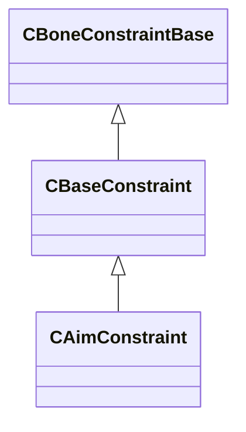

[Schemas](../../schemas.md) / [modellib](../modellib.md) / CAimConstraint

# CAimConstraint

> Source: **Build 25000182** · 2026-08-28 · `windows-x86_64` · schema `0.10.0`

**Kind:** class · **Size:** 128 bytes (`0x80`) · **Align:** 16 · **Module:** modellib

**Inherits from:** [CBaseConstraint](../modellib/CBaseConstraint.md)

**Relationships:**

## Memory layout

6 fields (2 declared here, 4 inherited). Offsets are absolute from the object base.

| Offset | Field | Type | From | Annotations |
|--------|-------|------|------|-------------|
| `0x20` | `m_name` | CUtlString | [CBaseConstraint](../modellib/CBaseConstraint.md) |  |
| `0x28` | `m_vUpVector` | Vector | [CBaseConstraint](../modellib/CBaseConstraint.md) |  |
| `0x38` | `m_slaves` | CUtlLeanVector< [CConstraintSlave](../modellib/CConstraintSlave.md) > | [CBaseConstraint](../modellib/CBaseConstraint.md) |  |
| `0x48` | `m_targets` | CUtlVector< [CConstraintTarget](../modellib/CConstraintTarget.md) > | [CBaseConstraint](../modellib/CBaseConstraint.md) |  |
| `0x60` | `m_qAimOffset` | Quaternion |  |  |
| `0x70` | `m_nUpType` | uint32 |  |  |

KV3 class defaults

<pre>{
	&quot;_class&quot;: &quot;CAimConstraint&quot;,
	&quot;m_name&quot;: &quot;&quot;,
	&quot;m_vUpVector&quot;:
	[
		0.000000,
		0.000000,
		0.000000
	],
	&quot;m_slaves&quot;:
	[
	],
	&quot;m_targets&quot;:
	[
	],
	&quot;m_qAimOffset&quot;:
	[
		0.000000,
		0.000000,
		0.000000,
		1.000000
	],
	&quot;m_nUpType&quot;: 0
}</pre>

