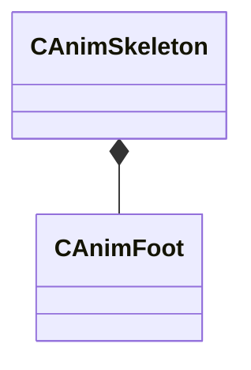

[Schemas](../../schemas.md) / [modellib](../modellib.md) / CAnimSkeleton

# CAnimSkeleton

**Kind:** class · **Size:** 208 bytes (`0xd0`) · **Align:** 8 · **Module:** modellib

**Relationships:**

## Memory layout

8 fields (8 declared here, 0 inherited). Offsets are absolute from the object base.

| Offset | Field | Type | From | Annotations |
|--------|-------|------|------|-------------|
| `0x10` | `m_localSpaceTransforms` | CUtlVector< CTransform > |  |  |
| `0x28` | `m_modelSpaceTransforms` | CUtlVector< CTransform > |  |  |
| `0x40` | `m_boneNames` | CUtlVector< CUtlString > |  |  |
| `0x58` | `m_children` | CUtlVector< CUtlVector< int32 > > |  |  |
| `0x70` | `m_parents` | CUtlVector< int32 > |  |  |
| `0x88` | `m_feet` | CUtlVector< [CAnimFoot](../modellib/CAnimFoot.md) > |  |  |
| `0xa0` | `m_morphNames` | CUtlVector< CUtlString > |  |  |
| `0xb8` | `m_lodBoneCounts` | CUtlVector< int32 > |  |  |

KV3 class defaults

<pre>{
	&quot;_class&quot;: &quot;CAnimSkeleton&quot;,
	&quot;m_localSpaceTransforms&quot;:
	[
	],
	&quot;m_modelSpaceTransforms&quot;:
	[
	],
	&quot;m_boneNames&quot;:
	[
	],
	&quot;m_children&quot;:
	[
	],
	&quot;m_parents&quot;:
	[
	],
	&quot;m_feet&quot;:
	[
	],
	&quot;m_morphNames&quot;:
	[
	],
	&quot;m_lodBoneCounts&quot;:
	[
	]
}</pre>

