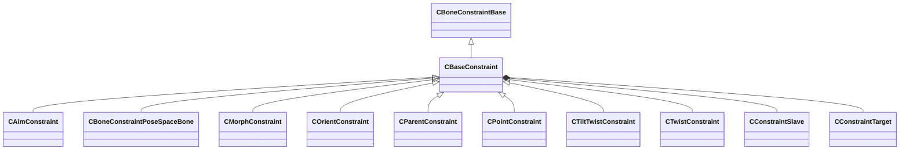

[Schemas](../../schemas.md) / [modellib](../modellib.md) / CBaseConstraint

# CBaseConstraint

**Kind:** class · **Size:** 96 bytes (`0x60`) · **Align:** 255 · **Module:** modellib

**Inherits from:** [CBoneConstraintBase](../modellib/CBoneConstraintBase.md)

**Derived by:** [CAimConstraint](../modellib/CAimConstraint.md), [CBoneConstraintPoseSpaceBone](../modellib/CBoneConstraintPoseSpaceBone.md), [CMorphConstraint](../modellib/CMorphConstraint.md), [COrientConstraint](../modellib/COrientConstraint.md), [CParentConstraint](../modellib/CParentConstraint.md), [CPointConstraint](../modellib/CPointConstraint.md), [CTiltTwistConstraint](../modellib/CTiltTwistConstraint.md), [CTwistConstraint](../modellib/CTwistConstraint.md)

**Relationships:**

## Memory layout

4 fields (4 declared here, 0 inherited). Offsets are absolute from the object base.

| Offset | Field | Type | From | Annotations |
|--------|-------|------|------|-------------|
| `0x20` | `m_name` | CUtlString |  |  |
| `0x28` | `m_vUpVector` | Vector |  |  |
| `0x38` | `m_slaves` | CUtlLeanVector< [CConstraintSlave](../modellib/CConstraintSlave.md) > |  |  |
| `0x48` | `m_targets` | CUtlVector< [CConstraintTarget](../modellib/CConstraintTarget.md) > |  |  |
