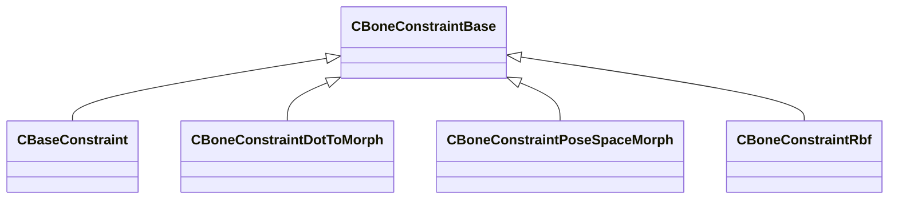

[Schemas](../../schemas.md) / [modellib](../modellib.md) / CBoneConstraintBase

# CBoneConstraintBase

**Kind:** class · **Size:** 32 bytes (`0x20`) · **Align:** 255 · **Module:** modellib

**Derived by:** [CBaseConstraint](../modellib/CBaseConstraint.md), [CBoneConstraintDotToMorph](../modellib/CBoneConstraintDotToMorph.md), [CBoneConstraintPoseSpaceMorph](../modellib/CBoneConstraintPoseSpaceMorph.md), [CBoneConstraintRbf](../modellib/CBoneConstraintRbf.md)

**Relationships:**

