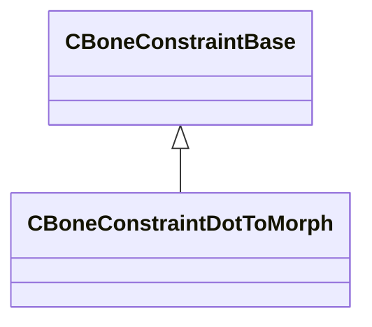

[Schemas](../../schemas.md) / [modellib](../modellib.md) / CBoneConstraintDotToMorph

# CBoneConstraintDotToMorph

> Source: **Build 25000182** · 2026-08-28 · `windows-x86_64` · schema `0.10.0`

**Kind:** class · **Size:** 88 bytes (`0x58`) · **Align:** 8 · **Module:** modellib

**Inherits from:** [CBoneConstraintBase](../modellib/CBoneConstraintBase.md)

**Relationships:**

## Memory layout

4 fields (4 declared here, 0 inherited). Offsets are absolute from the object base.

| Offset | Field | Type | From | Annotations |
|--------|-------|------|------|-------------|
| `0x20` | `m_sBoneName` | CUtlString |  |  |
| `0x28` | `m_sTargetBoneName` | CUtlString |  |  |
| `0x30` | `m_sMorphChannelName` | CUtlString |  |  |
| `0x38` | `m_flRemap` | float32[4] |  |  |

KV3 class defaults

<pre>{
	&quot;_class&quot;: &quot;CBoneConstraintDotToMorph&quot;,
	&quot;m_sBoneName&quot;: &quot;&quot;,
	&quot;m_sTargetBoneName&quot;: &quot;&quot;,
	&quot;m_sMorphChannelName&quot;: &quot;&quot;,
	&quot;m_flRemap&quot;:
	[
		0.000000,
		180.000000,
		0.000000,
		1.000000
	]
}</pre>

