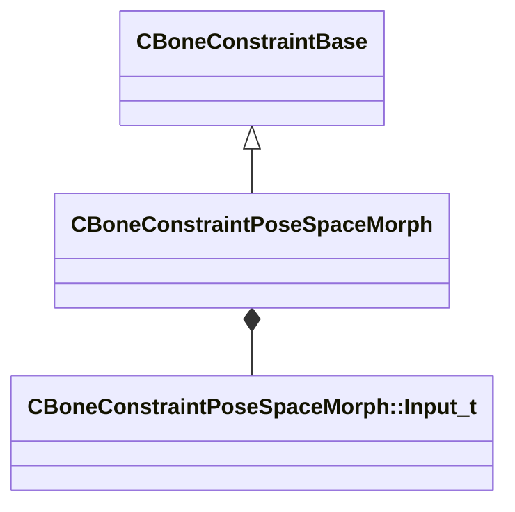

[Schemas](../../schemas.md) / [modellib](../modellib.md) / CBoneConstraintPoseSpaceMorph

# CBoneConstraintPoseSpaceMorph

> Source: **Build 25000182** · 2026-08-28 · `windows-x86_64` · schema `0.10.0`

**Kind:** class · **Size:** 160 bytes (`0xa0`) · **Align:** 8 · **Module:** modellib

**Inherits from:** [CBoneConstraintBase](../modellib/CBoneConstraintBase.md)

**Relationships:**

## Memory layout

5 fields (5 declared here, 0 inherited). Offsets are absolute from the object base.

| Offset | Field | Type | From | Annotations |
|--------|-------|------|------|-------------|
| `0x20` | `m_sBoneName` | CUtlString |  |  |
| `0x28` | `m_sAttachmentName` | CUtlString |  |  |
| `0x30` | `m_outputMorph` | CUtlVector< CUtlString > |  |  |
| `0x48` | `m_inputList` | CUtlVector< [CBoneConstraintPoseSpaceMorph::Input_t](../modellib/CBoneConstraintPoseSpaceMorph.Input_t.md) > |  |  |
| `0x60` | `m_bClamp` | bool |  |  |

KV3 class defaults

<pre>{
	&quot;_class&quot;: &quot;CBoneConstraintPoseSpaceMorph&quot;,
	&quot;m_sBoneName&quot;: &quot;&quot;,
	&quot;m_sAttachmentName&quot;: &quot;&quot;,
	&quot;m_outputMorph&quot;:
	[
	],
	&quot;m_inputList&quot;:
	[
	],
	&quot;m_bClamp&quot;: false,
	&quot;m_eRbfType&quot;: 0,
	&quot;m_flFalloff&quot;: 1.000000
}</pre>

