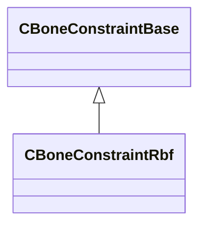

[Schemas](../../schemas.md) / [modellib](../modellib.md) / CBoneConstraintRbf

# CBoneConstraintRbf

> Source: **Build 25000182** · 2026-08-28 · `windows-x86_64` · schema `0.10.0`

**Kind:** class · **Size:** 200 bytes (`0xc8`) · **Align:** 8 · **Module:** modellib

**Inherits from:** [CBoneConstraintBase](../modellib/CBoneConstraintBase.md)

**Relationships:**

## Memory layout

2 fields (2 declared here, 0 inherited). Offsets are absolute from the object base.

| Offset | Field | Type | From | Annotations |
|--------|-------|------|------|-------------|
| `0x20` | `m_inputBones` | CUtlVector< std::pair< CUtlString, uint32 > > |  |  |
| `0x38` | `m_outputBones` | CUtlVector< std::pair< CUtlString, uint32 > > |  |  |

KV3 class defaults

<pre>{
	&quot;_class&quot;: &quot;CBoneConstraintRbf&quot;,
	&quot;m_inputBones&quot;:
	[
	],
	&quot;m_outputBones&quot;:
	[
	],
	&quot;m_rbfParameters&quot;: &quot;[BINARY BLOB]&quot;
}</pre>

