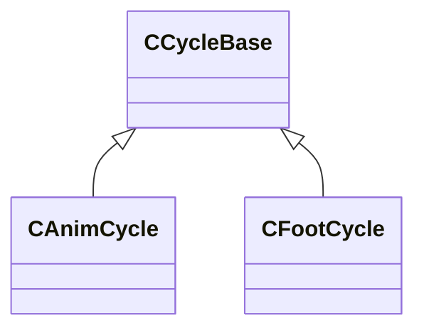

[Schemas](../../schemas.md) / [modellib](../modellib.md) / CCycleBase

# CCycleBase

**Kind:** class · **Size:** 4 bytes (`0x4`) · **Align:** 4 · **Module:** modellib

**Derived by:** [CAnimCycle](../modellib/CAnimCycle.md), [CFootCycle](../modellib/CFootCycle.md)

**Relationships:**

## Memory layout

1 fields (1 declared here, 0 inherited). Offsets are absolute from the object base.

| Offset | Field | Type | From | Annotations |
|--------|-------|------|------|-------------|
| `0x0` | `m_flCycle` | float32 |  |  |

KV3 class defaults

<pre>{
	&quot;m_flCycle&quot;: 0.000000
}</pre>

