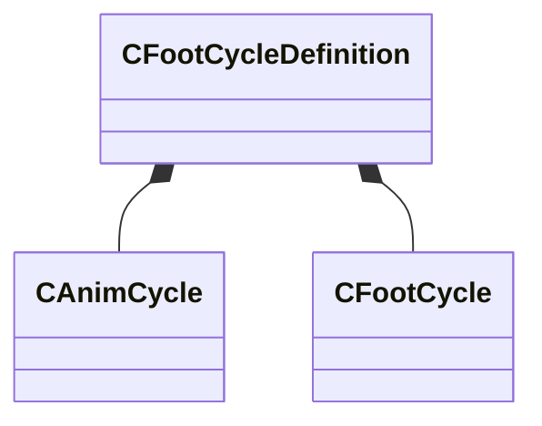

[Schemas](../../schemas.md) / [modellib](../modellib.md) / CFootCycleDefinition

# CFootCycleDefinition

**Kind:** class · **Size:** 60 bytes (`0x3c`) · **Align:** 4 · **Module:** modellib

**Relationships:**

## Memory layout

9 fields (9 declared here, 0 inherited). Offsets are absolute from the object base.

| Offset | Field | Type | From | Annotations |
|--------|-------|------|------|-------------|
| `0x0` | `m_vStancePositionMS` | Vector |  |  |
| `0xc` | `m_vMidpointPositionMS` | Vector |  |  |
| `0x18` | `m_flStanceDirectionMS` | float32 |  |  |
| `0x1c` | `m_vToStrideStartPos` | Vector |  |  |
| `0x28` | `m_stanceCycle` | [CAnimCycle](../modellib/CAnimCycle.md) |  |  |
| `0x2c` | `m_footLiftCycle` | [CFootCycle](../modellib/CFootCycle.md) |  |  |
| `0x30` | `m_footOffCycle` | [CFootCycle](../modellib/CFootCycle.md) |  |  |
| `0x34` | `m_footStrikeCycle` | [CFootCycle](../modellib/CFootCycle.md) |  |  |
| `0x38` | `m_footLandCycle` | [CFootCycle](../modellib/CFootCycle.md) |  |  |

KV3 class defaults

<pre>{
	&quot;m_vStancePositionMS&quot;:
	[
		0.000000,
		0.000000,
		0.000000
	],
	&quot;m_vMidpointPositionMS&quot;:
	[
		0.000000,
		0.000000,
		0.000000
	],
	&quot;m_flStanceDirectionMS&quot;: 0.000000,
	&quot;m_vToStrideStartPos&quot;:
	[
		0.000000,
		0.000000,
		0.000000
	],
	&quot;m_stanceCycle&quot;:
	{
		&quot;m_flCycle&quot;: 0.000000
	},
	&quot;m_footLiftCycle&quot;:
	{
		&quot;m_flCycle&quot;: 0.000000
	},
	&quot;m_footOffCycle&quot;:
	{
		&quot;m_flCycle&quot;: 0.000000
	},
	&quot;m_footStrikeCycle&quot;:
	{
		&quot;m_flCycle&quot;: 0.000000
	},
	&quot;m_footLandCycle&quot;:
	{
		&quot;m_flCycle&quot;: 0.000000
	}
}</pre>

