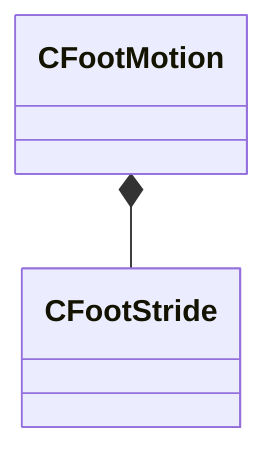

[Schemas](../../schemas.md) / [modellib](../modellib.md) / CFootMotion

# CFootMotion

**Kind:** class · **Size:** 40 bytes (`0x28`) · **Align:** 8 · **Module:** modellib

**Relationships:**

## Memory layout

3 fields (3 declared here, 0 inherited). Offsets are absolute from the object base.

| Offset | Field | Type | From | Annotations |
|--------|-------|------|------|-------------|
| `0x0` | `m_strides` | CUtlVector< [CFootStride](../modellib/CFootStride.md) > |  |  |
| `0x18` | `m_name` | CUtlString |  |  |
| `0x20` | `m_bAdditive` | bool |  |  |

KV3 class defaults

<pre>{
	&quot;m_strides&quot;:
	[
	],
	&quot;m_name&quot;: &quot;&quot;,
	&quot;m_bAdditive&quot;: false
}</pre>

