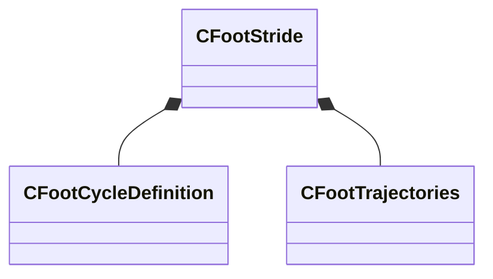

[Schemas](../../schemas.md) / [modellib](../modellib.md) / CFootStride

# CFootStride

> Source: **Build 25000182** · 2026-08-28 · `windows-x86_64` · schema `0.10.0`

**Kind:** class · **Size:** 88 bytes (`0x58`) · **Align:** 8 · **Module:** modellib

**Relationships:**

## Memory layout

2 fields (2 declared here, 0 inherited). Offsets are absolute from the object base.

| Offset | Field | Type | From | Annotations |
|--------|-------|------|------|-------------|
| `0x0` | `m_definition` | [CFootCycleDefinition](../modellib/CFootCycleDefinition.md) |  |  |
| `0x40` | `m_trajectories` | [CFootTrajectories](../modellib/CFootTrajectories.md) |  |  |

KV3 class defaults

<pre>{
	&quot;m_definition&quot;:
	{
		&quot;m_vStancePositionMS&quot;:
		[
			0.000000,
			0.000000,
			0.000000
		],
		&quot;m_vMidpointPositionMS&quot;:
		[
			0.000000,
			0.000000,
			0.000000
		],
		&quot;m_flStanceDirectionMS&quot;: 0.000000,
		&quot;m_vToStrideStartPos&quot;:
		[
			0.000000,
			0.000000,
			0.000000
		],
		&quot;m_stanceCycle&quot;:
		{
			&quot;m_flCycle&quot;: 0.000000
		},
		&quot;m_footLiftCycle&quot;:
		{
			&quot;m_flCycle&quot;: 0.000000
		},
		&quot;m_footOffCycle&quot;:
		{
			&quot;m_flCycle&quot;: 0.000000
		},
		&quot;m_footStrikeCycle&quot;:
		{
			&quot;m_flCycle&quot;: 0.000000
		},
		&quot;m_footLandCycle&quot;:
		{
			&quot;m_flCycle&quot;: 0.000000
		}
	},
	&quot;m_trajectories&quot;:
	{
		&quot;m_trajectories&quot;:
		[
		]
	}
}</pre>

