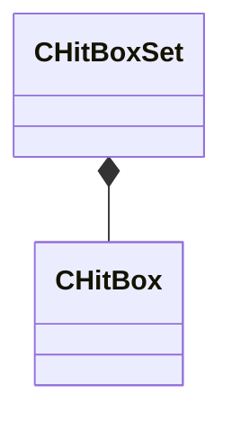

[Schemas](../../schemas.md) / [modellib](../modellib.md) / CHitBoxSet

# CHitBoxSet

**Kind:** class · **Size:** 48 bytes (`0x30`) · **Align:** 8 · **Module:** modellib

**Relationships:**

## Memory layout

4 fields (4 declared here, 0 inherited). Offsets are absolute from the object base.

| Offset | Field | Type | From | Annotations |
|--------|-------|------|------|-------------|
| `0x0` | `m_name` | CUtlString |  |  |
| `0x8` | `m_nNameHash` | uint32 |  |  |
| `0x10` | `m_HitBoxes` | CUtlVector< [CHitBox](../modellib/CHitBox.md) > |  |  |
| `0x28` | `m_SourceFilename` | CUtlString |  |  |

KV3 class defaults

<pre>{
	&quot;m_name&quot;: &quot;&quot;,
	&quot;m_nNameHash&quot;: 0,
	&quot;m_HitBoxes&quot;:
	[
	],
	&quot;m_SourceFilename&quot;: &quot;&quot;
}</pre>

