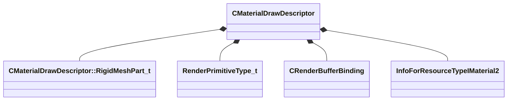

[Schemas](../../schemas.md) / [modellib](../modellib.md) / CMaterialDrawDescriptor

# CMaterialDrawDescriptor

> Source: **Build 25000182** · 2026-08-28 · `windows-x86_64` · schema `0.10.0`

**Kind:** class · **Size:** 280 bytes (`0x118`) · **Align:** 8 · **Module:** modellib

**Relationships:**

## Memory layout

18 fields (18 declared here, 0 inherited). Offsets are absolute from the object base.

| Offset | Field | Type | From | Annotations |
|--------|-------|------|------|-------------|
| `0x0` | `m_flUvDensity` | float32 |  |  |
| `0x4` | `m_vTintColor` | Vector |  |  |
| `0x10` | `m_flAlpha` | float32 |  |  |
| `0x16` | `m_nNumMeshlets` | uint16 |  |  |
| `0x1c` | `m_nFirstMeshlet` | uint32 |  |  |
| `0x20` | `m_nAppliedIndexOffset` | uint32 |  |  |
| `0x24` | `m_nDepthVertexBufferIndex` | uint8 |  |  |
| `0x25` | `m_nMeshletPackedIVBIndex` | uint8 |  |  |
| `0x28` | `m_rigidMeshParts` | CUtlLeanVector< [CMaterialDrawDescriptor::RigidMeshPart_t](../modellib/CMaterialDrawDescriptor.RigidMeshPart_t.md) > |  |  |
| `0x38` | `m_rootBvhNodes` | CUtlLeanVector< uint16 > |  |  |
| `0x48` | `m_nPrimitiveType` | [RenderPrimitiveType_t](../modellib/RenderPrimitiveType_t.md) |  |  |
| `0x4c` | `m_nBaseVertex` | int32 |  |  |
| `0x50` | `m_nVertexCount` | int32 |  |  |
| `0x54` | `m_nStartIndex` | int32 |  |  |
| `0x58` | `m_nIndexCount` | int32 |  |  |
| `0xc0` | `m_indexBuffer` | [CRenderBufferBinding](../modellib/CRenderBufferBinding.md) |  |  |
| `0xe0` | `m_meshletPackedIVB` | [CRenderBufferBinding](../modellib/CRenderBufferBinding.md) |  |  |
| `0x110` | `m_material` | CStrongHandle< [InfoForResourceTypeIMaterial2](../resourcesystem/InfoForResourceTypeIMaterial2.md) > |  |  |

KV3 class defaults

<pre>{
	&quot;m_flUvDensity&quot;: 0.000000,
	&quot;m_vTintColor&quot;:
	[
		1.000000,
		1.000000,
		1.000000
	],
	&quot;m_flAlpha&quot;: 1.000000,
	&quot;m_nNumMeshlets&quot;: 0,
	&quot;m_nFirstMeshlet&quot;: 0,
	&quot;m_nAppliedIndexOffset&quot;: 0,
	&quot;m_nDepthVertexBufferIndex&quot;: 255,
	&quot;m_nMeshletPackedIVBIndex&quot;: 255,
	&quot;m_rigidMeshParts&quot;:
	[
	],
	&quot;m_rootBvhNodes&quot;:
	[
	],
	&quot;m_nPrimitiveType&quot;: &quot;RENDER_PRIM_TRIANGLES&quot;,
	&quot;m_nBaseVertex&quot;: 0,
	&quot;m_nVertexCount&quot;: 0,
	&quot;m_nStartIndex&quot;: 0,
	&quot;m_nIndexCount&quot;: 0,
	&quot;m_indexBuffer&quot;:
	{
		&quot;m_hBuffer&quot;: 0,
		&quot;m_nBindOffsetBytes&quot;: 0
	},
	&quot;m_meshletPackedIVB&quot;:
	{
		&quot;m_hBuffer&quot;: 0,
		&quot;m_nBindOffsetBytes&quot;: 0
	},
	&quot;m_material&quot;: &quot;&quot;,
	&quot;m_vertexBuffers&quot;:
	[
	]
}</pre>

