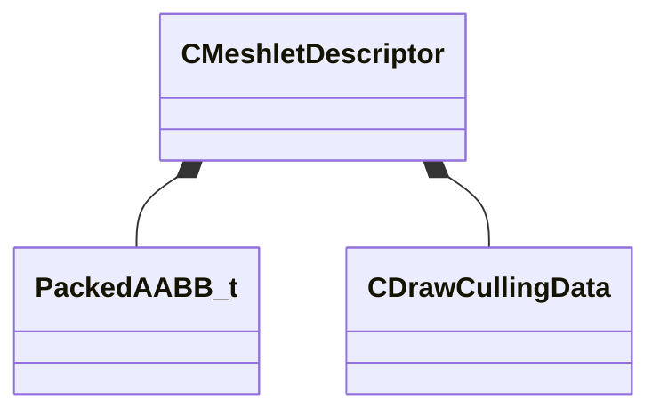

[Schemas](../../schemas.md) / [modellib](../modellib.md) / CMeshletDescriptor

# CMeshletDescriptor

> Source: **Build 25000182** · 2026-08-28 · `windows-x86_64` · schema `0.10.0`

**Kind:** class · **Size:** 24 bytes (`0x18`) · **Align:** 4 · **Module:** modellib

**Relationships:**

## Memory layout

6 fields (6 declared here, 0 inherited). Offsets are absolute from the object base.

| Offset | Field | Type | From | Annotations |
|--------|-------|------|------|-------------|
| `0x0` | `m_PackedAABB` | [PackedAABB_t](../mathlib_extended/PackedAABB_t.md) |  |  |
| `0x8` | `m_CullingData` | [CDrawCullingData](../modellib/CDrawCullingData.md) |  |  |
| `0xc` | `m_nVertexOffset` | uint32 |  |  |
| `0x10` | `m_nTriangleOffset` | uint32 |  |  |
| `0x14` | `m_nVertexCount` | uint8 |  |  |
| `0x15` | `m_nTriangleCount` | uint8 |  |  |

KV3 class defaults

<pre>{
	&quot;m_PackedAABB&quot;:
	{
		&quot;m_nMin&quot;: 0,
		&quot;m_nMax&quot;: 0
	},
	&quot;m_CullingData&quot;:
	{
		&quot;m_ConeAxis&quot;:
		[
			0,
			0,
			0
		],
		&quot;m_ConeCutoff&quot;: 0
	},
	&quot;m_nVertexOffset&quot;: 0,
	&quot;m_nTriangleOffset&quot;: 0,
	&quot;m_nVertexCount&quot;: 0,
	&quot;m_nTriangleCount&quot;: 0
}</pre>

