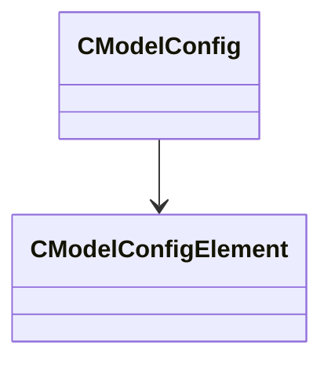

[Schemas](../../schemas.md) / [modellib](../modellib.md) / CModelConfig

# CModelConfig

> Source: **Build 25000182** · 2026-08-28 · `windows-x86_64` · schema `0.10.0`

**Kind:** class · **Size:** 40 bytes (`0x28`) · **Align:** 8 · **Module:** modellib

**Relationships:**

## Memory layout

4 fields (4 declared here, 0 inherited). Offsets are absolute from the object base.

| Offset | Field | Type | From | Annotations |
|--------|-------|------|------|-------------|
| `0x0` | `m_ConfigName` | CUtlString |  |  |
| `0x8` | `m_Elements` | CUtlVector< [CModelConfigElement](../modellib/CModelConfigElement.md)* > |  |  |
| `0x20` | `m_bTopLevel` | bool |  |  |
| `0x21` | `m_bActiveInEditorByDefault` | bool |  |  |

KV3 class defaults

<pre>{
	&quot;m_ConfigName&quot;: &quot;&quot;,
	&quot;m_Elements&quot;:
	[
	],
	&quot;m_bTopLevel&quot;: false,
	&quot;m_bActiveInEditorByDefault&quot;: false
}</pre>

