[Schemas](../../schemas.md) / [modellib](../modellib.md) / CModelConfigElement

# CModelConfigElement

**Kind:** class · **Size:** 72 bytes (`0x48`) · **Align:** 255 · **Module:** modellib

**Derived by:** [CModelConfigElement_AttachedModel](../modellib/CModelConfigElement_AttachedModel.md), [CModelConfigElement_Command](../modellib/CModelConfigElement_Command.md), [CModelConfigElement_RandomColor](../modellib/CModelConfigElement_RandomColor.md), [CModelConfigElement_RandomPick](../modellib/CModelConfigElement_RandomPick.md), [CModelConfigElement_SetBodygroup](../modellib/CModelConfigElement_SetBodygroup.md), [CModelConfigElement_SetBodygroupOnAttachedModels](../modellib/CModelConfigElement_SetBodygroupOnAttachedModels.md), [CModelConfigElement_SetMaterialGroup](../modellib/CModelConfigElement_SetMaterialGroup.md), [CModelConfigElement_SetMaterialGroupOnAttachedModels](../modellib/CModelConfigElement_SetMaterialGroupOnAttachedModels.md), [CModelConfigElement_SetRenderColor](../modellib/CModelConfigElement_SetRenderColor.md), [CModelConfigElement_UserPick](../modellib/CModelConfigElement_UserPick.md)

**Relationships:**

```mermaid
classDiagram
    CModelConfigElement <|-- CModelConfigElement_AttachedModel
    CModelConfigElement <|-- CModelConfigElement_Command
    CModelConfigElement <|-- CModelConfigElement_RandomColor
    CModelConfigElement <|-- CModelConfigElement_RandomPick
    CModelConfigElement <|-- CModelConfigElement_SetBodygroup
    CModelConfigElement <|-- CModelConfigElement_SetBodygroupOnAttachedModels
    CModelConfigElement <|-- CModelConfigElement_SetMaterialGroup
    CModelConfigElement <|-- CModelConfigElement_SetMaterialGroupOnAttachedModels
    CModelConfigElement <|-- CModelConfigElement_SetRenderColor
    CModelConfigElement <|-- CModelConfigElement_UserPick
```

## Memory layout

2 fields (2 declared here, 0 inherited). Offsets are absolute from the object base.

| Offset | Field | Type | From | Annotations |
|--------|-------|------|------|-------------|
| `0x8` | `m_ElementName` | CUtlString |  |  |
| `0x10` | `m_NestedElements` | CUtlVector< [CModelConfigElement](../modellib/CModelConfigElement.md)* > |  |  |
