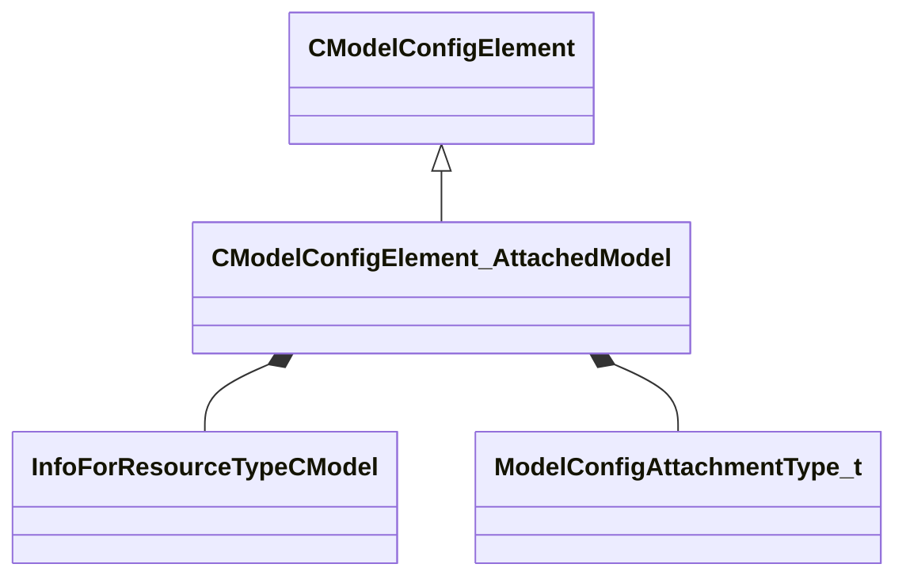

[Schemas](../../schemas.md) / [modellib](../modellib.md) / CModelConfigElement_AttachedModel

# CModelConfigElement_AttachedModel

> Source: **Build 25000182** · 2026-08-28 · `windows-x86_64` · schema `0.10.0`

**Kind:** class · **Size:** 232 bytes (`0xe8`) · **Align:** 8 · **Module:** modellib

**Inherits from:** [CModelConfigElement](../modellib/CModelConfigElement.md)

**Relationships:**

## Memory layout

15 fields (13 declared here, 2 inherited). Offsets are absolute from the object base.

| Offset | Field | Type | From | Annotations |
|--------|-------|------|------|-------------|
| `0x8` | `m_ElementName` | CUtlString | [CModelConfigElement](../modellib/CModelConfigElement.md) |  |
| `0x10` | `m_NestedElements` | CUtlVector< [CModelConfigElement](../modellib/CModelConfigElement.md)* > | [CModelConfigElement](../modellib/CModelConfigElement.md) |  |
| `0x48` | `m_InstanceName` | CUtlString |  |  |
| `0x50` | `m_EntityClass` | CUtlString |  |  |
| `0x58` | `m_hModel` | CStrongHandle< [InfoForResourceTypeCModel](../resourcesystem/InfoForResourceTypeCModel.md) > |  |  |
| `0x60` | `m_vOffset` | Vector |  |  |
| `0x6c` | `m_aAngOffset` | QAngle |  |  |
| `0x78` | `m_AttachmentName` | CUtlString |  |  |
| `0x80` | `m_LocalAttachmentOffsetName` | CUtlString |  |  |
| `0x88` | `m_AttachmentType` | [ModelConfigAttachmentType_t](../modellib/ModelConfigAttachmentType_t.md) |  |  |
| `0x8c` | `m_bBoneMergeFlex` | bool |  |  |
| `0x8d` | `m_bUserSpecifiedColor` | bool |  |  |
| `0x8e` | `m_bUserSpecifiedMaterialGroup` | bool |  |  |
| `0x90` | `m_BodygroupOnOtherModels` | CUtlString |  |  |
| `0x98` | `m_MaterialGroupOnOtherModels` | CUtlString |  |  |

KV3 class defaults

<pre>{
	&quot;_class&quot;: &quot;CModelConfigElement_AttachedModel&quot;,
	&quot;m_ElementName&quot;: &quot;&quot;,
	&quot;m_NestedElements&quot;:
	[
	],
	&quot;m_InstanceName&quot;: &quot;&quot;,
	&quot;m_EntityClass&quot;: &quot;&quot;,
	&quot;m_hModel&quot;: &quot;&quot;,
	&quot;m_vOffset&quot;:
	[
		0.000000,
		0.000000,
		0.000000
	],
	&quot;m_aAngOffset&quot;:
	[
		0.000000,
		0.000000,
		0.000000
	],
	&quot;m_AttachmentName&quot;: &quot;&quot;,
	&quot;m_LocalAttachmentOffsetName&quot;: &quot;&quot;,
	&quot;m_AttachmentType&quot;: &quot;MODEL_CONFIG_ATTACHMENT_ROOT_RELATIVE&quot;,
	&quot;m_bBoneMergeFlex&quot;: false,
	&quot;m_bUserSpecifiedColor&quot;: false,
	&quot;m_bUserSpecifiedMaterialGroup&quot;: false,
	&quot;m_BodygroupOnOtherModels&quot;: &quot;&quot;,
	&quot;m_MaterialGroupOnOtherModels&quot;: &quot;&quot;
}</pre>

