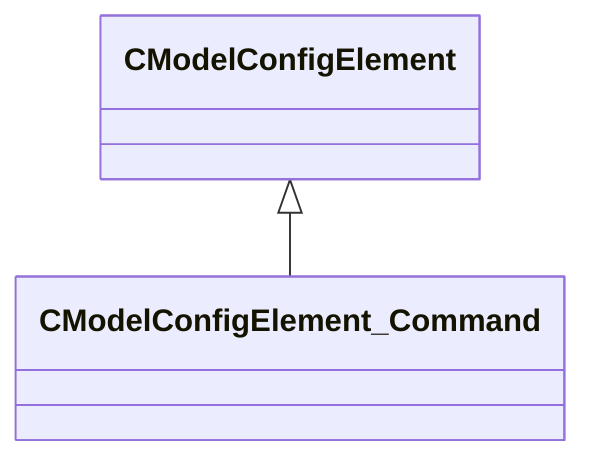

[Schemas](../../schemas.md) / [modellib](../modellib.md) / CModelConfigElement_Command

# CModelConfigElement_Command

> Source: **Build 25000182** · 2026-08-28 · `windows-x86_64` · schema `0.10.0`

**Kind:** class · **Size:** 96 bytes (`0x60`) · **Align:** 8 · **Module:** modellib

**Inherits from:** [CModelConfigElement](../modellib/CModelConfigElement.md)

**Relationships:**

## Memory layout

4 fields (2 declared here, 2 inherited). Offsets are absolute from the object base.

| Offset | Field | Type | From | Annotations |
|--------|-------|------|------|-------------|
| `0x8` | `m_ElementName` | CUtlString | [CModelConfigElement](../modellib/CModelConfigElement.md) |  |
| `0x10` | `m_NestedElements` | CUtlVector< [CModelConfigElement](../modellib/CModelConfigElement.md)* > | [CModelConfigElement](../modellib/CModelConfigElement.md) |  |
| `0x48` | `m_Command` | CUtlString |  |  |
| `0x50` | `m_Args` | KeyValues3 |  |  |

KV3 class defaults

<pre>{
	&quot;_class&quot;: &quot;CModelConfigElement_Command&quot;,
	&quot;m_ElementName&quot;: &quot;&quot;,
	&quot;m_NestedElements&quot;:
	[
	],
	&quot;m_Command&quot;: &quot;&quot;,
	&quot;m_Args&quot;: null
}</pre>

