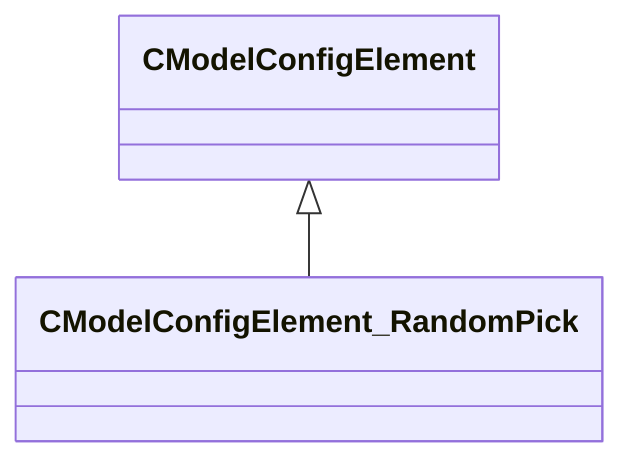

[Schemas](../../schemas.md) / [modellib](../modellib.md) / CModelConfigElement_RandomPick

# CModelConfigElement_RandomPick

**Kind:** class · **Size:** 128 bytes (`0x80`) · **Align:** 8 · **Module:** modellib

**Inherits from:** [CModelConfigElement](../modellib/CModelConfigElement.md)

**Relationships:**

## Memory layout

4 fields (2 declared here, 2 inherited). Offsets are absolute from the object base.

| Offset | Field | Type | From | Annotations |
|--------|-------|------|------|-------------|
| `0x8` | `m_ElementName` | CUtlString | [CModelConfigElement](../modellib/CModelConfigElement.md) |  |
| `0x10` | `m_NestedElements` | CUtlVector< [CModelConfigElement](../modellib/CModelConfigElement.md)* > | [CModelConfigElement](../modellib/CModelConfigElement.md) |  |
| `0x48` | `m_Choices` | CUtlVector< CUtlString > |  |  |
| `0x60` | `m_ChoiceWeights` | CUtlVector< float32 > |  |  |

KV3 class defaults

<pre>{
	&quot;_class&quot;: &quot;CModelConfigElement_RandomPick&quot;,
	&quot;m_ElementName&quot;: &quot;&quot;,
	&quot;m_NestedElements&quot;:
	[
	],
	&quot;m_Choices&quot;:
	[
	],
	&quot;m_ChoiceWeights&quot;:
	[
	]
}</pre>

