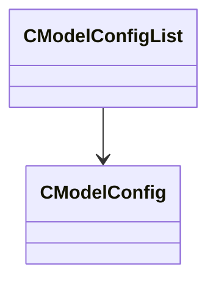

[Schemas](../../schemas.md) / [modellib](../modellib.md) / CModelConfigList

# CModelConfigList

**Kind:** class · **Size:** 32 bytes (`0x20`) · **Align:** 8 · **Module:** modellib

**Relationships:**

## Memory layout

3 fields (3 declared here, 0 inherited). Offsets are absolute from the object base.

| Offset | Field | Type | From | Annotations |
|--------|-------|------|------|-------------|
| `0x0` | `m_bHideMaterialGroupInTools` | bool |  |  |
| `0x1` | `m_bHideRenderColorInTools` | bool |  |  |
| `0x8` | `m_Configs` | CUtlVector< [CModelConfig](../modellib/CModelConfig.md)* > |  |  |

KV3 class defaults

<pre>{
	&quot;m_bHideMaterialGroupInTools&quot;: false,
	&quot;m_bHideRenderColorInTools&quot;: false,
	&quot;m_Configs&quot;:
	[
	]
}</pre>

