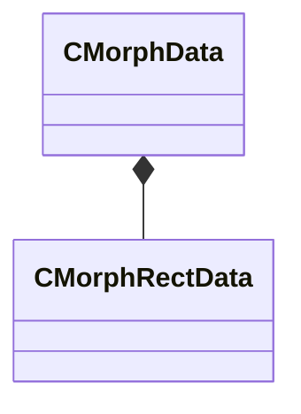

[Schemas](../../schemas.md) / [modellib](../modellib.md) / CMorphData

# CMorphData

> Source: **Build 25000182** · 2026-08-28 · `windows-x86_64` · schema `0.10.0`

**Kind:** class · **Size:** 32 bytes (`0x20`) · **Align:** 8 · **Module:** modellib

**Relationships:**

## Memory layout

2 fields (2 declared here, 0 inherited). Offsets are absolute from the object base.

| Offset | Field | Type | From | Annotations |
|--------|-------|------|------|-------------|
| `0x0` | `m_name` | CUtlString |  |  |
| `0x8` | `m_morphRectDatas` | CUtlVector< [CMorphRectData](../modellib/CMorphRectData.md) > |  |  |

KV3 class defaults

<pre>{
	&quot;m_name&quot;: &quot;&quot;,
	&quot;m_morphRectDatas&quot;:
	[
	]
}</pre>

