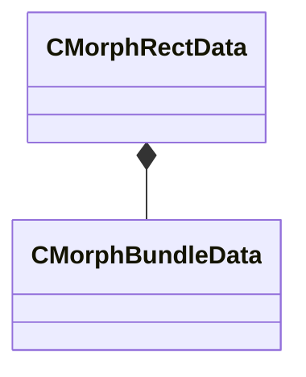

[Schemas](../../schemas.md) / [modellib](../modellib.md) / CMorphRectData

# CMorphRectData

**Kind:** class · **Size:** 40 bytes (`0x28`) · **Align:** 8 · **Module:** modellib

**Relationships:**

## Memory layout

5 fields (5 declared here, 0 inherited). Offsets are absolute from the object base.

| Offset | Field | Type | From | Annotations |
|--------|-------|------|------|-------------|
| `0x0` | `m_nXLeftDst` | int16 |  |  |
| `0x2` | `m_nYTopDst` | int16 |  |  |
| `0x4` | `m_flUWidthSrc` | float32 |  |  |
| `0x8` | `m_flVHeightSrc` | float32 |  |  |
| `0x10` | `m_bundleDatas` | CUtlVector< [CMorphBundleData](../modellib/CMorphBundleData.md) > |  |  |

KV3 class defaults

<pre>{
	&quot;m_nXLeftDst&quot;: 0,
	&quot;m_nYTopDst&quot;: 0,
	&quot;m_flUWidthSrc&quot;: 0.000000,
	&quot;m_flVHeightSrc&quot;: 0.000000,
	&quot;m_bundleDatas&quot;:
	[
	]
}</pre>

