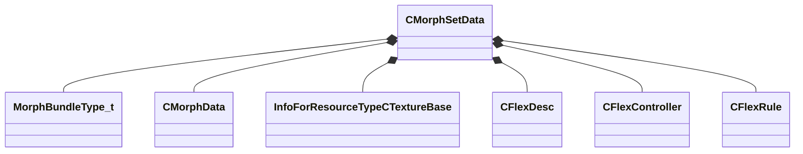

[Schemas](../../schemas.md) / [modellib](../modellib.md) / CMorphSetData

# CMorphSetData

**Kind:** class · **Size:** 152 bytes (`0x98`) · **Align:** 8 · **Module:** modellib

**Relationships:**

## Memory layout

8 fields (8 declared here, 0 inherited). Offsets are absolute from the object base.

| Offset | Field | Type | From | Annotations |
|--------|-------|------|------|-------------|
| `0x10` | `m_nWidth` | int32 |  |  |
| `0x14` | `m_nHeight` | int32 |  |  |
| `0x18` | `m_bundleTypes` | CUtlVector< [MorphBundleType_t](../!GlobalTypes/MorphBundleType_t.md) > |  |  |
| `0x30` | `m_morphDatas` | CUtlVector< [CMorphData](../modellib/CMorphData.md) > |  |  |
| `0x48` | `m_pTextureAtlas` | CStrongHandle< [InfoForResourceTypeCTextureBase](../resourcesystem/InfoForResourceTypeCTextureBase.md) > |  |  |
| `0x50` | `m_FlexDesc` | CUtlVector< [CFlexDesc](../modellib/CFlexDesc.md) > |  |  |
| `0x68` | `m_FlexControllers` | CUtlVector< [CFlexController](../modellib/CFlexController.md) > |  |  |
| `0x80` | `m_FlexRules` | CUtlVector< [CFlexRule](../modellib/CFlexRule.md) > |  |  |

KV3 class defaults

<pre>{
	&quot;m_nWidth&quot;: 0,
	&quot;m_nHeight&quot;: 0,
	&quot;m_bundleTypes&quot;:
	[
	],
	&quot;m_morphDatas&quot;:
	[
	],
	&quot;m_pTextureAtlas&quot;: &quot;&quot;,
	&quot;m_FlexDesc&quot;:
	[
	],
	&quot;m_FlexControllers&quot;:
	[
	],
	&quot;m_FlexRules&quot;:
	[
	]
}</pre>

