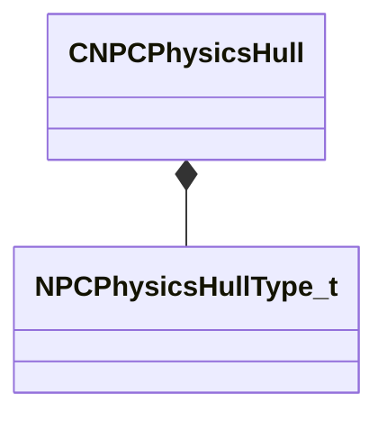

[Schemas](../../schemas.md) / [modellib](../modellib.md) / CNPCPhysicsHull

# CNPCPhysicsHull

**Kind:** class · **Size:** 64 bytes (`0x40`) · **Align:** 8 · **Module:** modellib

**Metadata:** `MFgdHelper game_data_list{ key = 'CNPCPhysicsHull' }`, `MFgdHelper npcphysicshull{}`, `MModelGameData`

**Relationships:**

## Memory layout

8 fields (8 declared here, 0 inherited). Offsets are absolute from the object base.

| Offset | Field | Type | From | Annotations |
|--------|-------|------|------|-------------|
| `0x0` | `m_sName` | CGlobalSymbol |  | `MPropertyFriendlyName Name` `MPropertySuppressField` |
| `0x8` | `m_eType` | [NPCPhysicsHullType_t](../modellib/NPCPhysicsHullType_t.md) |  | `MPropertyFriendlyName Type` |
| `0xc` | `m_flCapsuleHeight` | float32 |  | `MPropertyFriendlyName Height` `MPropertySuppressExpr m_eType != eGroundCapsule && m_eType != eCenteredCapsule && m_eType != eCenteredCylinder && m_eType != eGroundCylinder` |
| `0x10` | `m_flCapsuleRadius` | float32 |  | `MPropertyFriendlyName Radius` `MPropertySuppressExpr m_eType != eGroundCapsule && m_eType != eGenericCapsule && m_eType != eCenteredCapsule && m_eType != eCenteredCylinder && m_eType != eGroundCylinder` |
| `0x14` | `m_vCapsuleCenter1` | Vector |  | `MPropertyFriendlyName Center 1` `MPropertySuppressExpr m_eType != eGenericCapsule` |
| `0x20` | `m_vCapsuleCenter2` | Vector |  | `MPropertyFriendlyName Center 2` `MPropertySuppressExpr m_eType != eGenericCapsule` |
| `0x2c` | `m_flGroundBoxHeight` | float32 |  | `MPropertyFriendlyName Height` `MPropertySuppressExpr m_eType != eGroundBox` |
| `0x30` | `m_flGroundBoxWidth` | float32 |  | `MPropertyFriendlyName Width` `MPropertySuppressExpr m_eType != eGroundBox` |

KV3 class defaults

<pre>{
	&quot;m_sName&quot;: &quot;&quot;,
	&quot;m_eType&quot;: &quot;eInvalid&quot;,
	&quot;m_flCapsuleHeight&quot;: 50.000000,
	&quot;m_flCapsuleRadius&quot;: 11.000000,
	&quot;m_vCapsuleCenter1&quot;:
	[
		0.000000,
		0.000000,
		11.000000
	],
	&quot;m_vCapsuleCenter2&quot;:
	[
		0.000000,
		0.000000,
		61.000000
	],
	&quot;m_flGroundBoxHeight&quot;: 50.000000,
	&quot;m_flGroundBoxWidth&quot;: 11.000000
}</pre>

