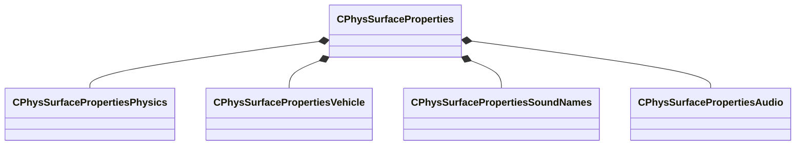

[Schemas](../../schemas.md) / [modellib](../modellib.md) / CPhysSurfaceProperties

# CPhysSurfaceProperties

**Kind:** class · **Size:** 200 bytes (`0xc8`) · **Align:** 8 · **Module:** modellib

**Relationships:**

## Memory layout

9 fields (9 declared here, 0 inherited). Offsets are absolute from the object base.

| Offset | Field | Type | From | Annotations |
|--------|-------|------|------|-------------|
| `0x0` | `m_name` | CUtlString |  | `MKV3TransferName surfacePropertyName` |
| `0x8` | `m_nameHash` | uint32 |  |  |
| `0xc` | `m_baseNameHash` | uint32 |  |  |
| `0x18` | `m_bHidden` | bool |  | `MKV3TransferName hidden` |
| `0x20` | `m_description` | CUtlString |  | `MKV3TransferName description` |
| `0x28` | `m_physics` | [CPhysSurfacePropertiesPhysics](../modellib/CPhysSurfacePropertiesPhysics.md) |  | `MKV3TransferName physics` |
| `0x40` | `m_vehicleParams` | [CPhysSurfacePropertiesVehicle](../modellib/CPhysSurfacePropertiesVehicle.md) |  | `MKV3TransferName vehicleparams` |
| `0x48` | `m_audioSounds` | [CPhysSurfacePropertiesSoundNames](../modellib/CPhysSurfacePropertiesSoundNames.md) |  | `MKV3TransferName audiosounds` |
| `0xa8` | `m_audioParams` | [CPhysSurfacePropertiesAudio](../modellib/CPhysSurfacePropertiesAudio.md) |  | `MKV3TransferName audioparams` |

KV3 class defaults

<pre>{
	&quot;surfacePropertyName&quot;: &quot;&quot;,
	&quot;m_nameHash&quot;: 0,
	&quot;m_baseNameHash&quot;: 0,
	&quot;hidden&quot;: false,
	&quot;description&quot;: &quot;&quot;,
	&quot;physics&quot;:
	{
		&quot;friction&quot;: 0.000000,
		&quot;elasticity&quot;: 0.000000,
		&quot;density&quot;: 0.000000,
		&quot;thickness&quot;: 0.100000,
		&quot;softcontactfrequency&quot;: 0.000000,
		&quot;softcontactdampingratio&quot;: 0.000000
	},
	&quot;vehicleparams&quot;:
	{
		&quot;wheeldrag&quot;: 0.000000,
		&quot;wheelfrictionscale&quot;: 1.000000
	},
	&quot;audiosounds&quot;:
	{
		&quot;impactsoft&quot;: &quot;&quot;,
		&quot;impacthard&quot;: &quot;&quot;,
		&quot;scrapesmooth&quot;: &quot;&quot;,
		&quot;scraperough&quot;: &quot;&quot;,
		&quot;bulletimpact&quot;: &quot;&quot;,
		&quot;rolling&quot;: &quot;&quot;,
		&quot;break&quot;: &quot;&quot;,
		&quot;strain&quot;: &quot;&quot;,
		&quot;meleeimpact&quot;: &quot;&quot;,
		&quot;pushoff&quot;: &quot;&quot;,
		&quot;skidstop&quot;: &quot;&quot;,
		&quot;resonant&quot;: &quot;&quot;
	},
	&quot;audioparams&quot;:
	{
		&quot;audioreflectivity&quot;: 0.000000,
		&quot;audiohardnessfactor&quot;: 0.000000,
		&quot;audioroughnessfactor&quot;: 0.000000,
		&quot;scrapeRoughThreshold&quot;: 0.000000,
		&quot;impactHardThreshold&quot;: 0.000000,
		&quot;audioHardMinVelocity&quot;: 0.000000,
		&quot;staticImpactVolume&quot;: 0.000000,
		&quot;occlusionFactor&quot;: 0.000000
	}
}</pre>

