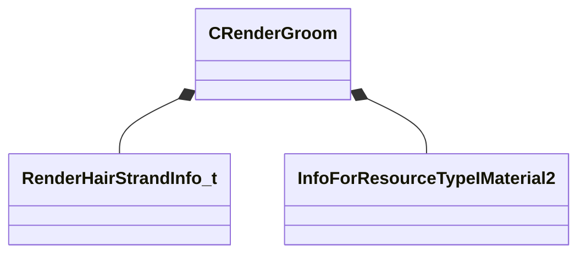

[Schemas](../../schemas.md) / [modellib](../modellib.md) / CRenderGroom

# CRenderGroom

> Source: **Build 25000182** · 2026-08-28 · `windows-x86_64` · schema `0.10.0`

**Kind:** class · **Size:** 176 bytes (`0xb0`) · **Align:** 8 · **Module:** modellib

**Relationships:**

## Memory layout

14 fields (14 declared here, 0 inherited). Offsets are absolute from the object base.

| Offset | Field | Type | From | Annotations |
|--------|-------|------|------|-------------|
| `0x0` | `m_hairs` | CUtlVector< [RenderHairStrandInfo_t](../modellib/RenderHairStrandInfo_t.md) > |  |  |
| `0x18` | `m_hairPositionOffsets` | CUtlVector< uint32 > |  |  |
| `0x40` | `m_hSimParamsMat` | CStrongHandleCopyable< [InfoForResourceTypeIMaterial2](../resourcesystem/InfoForResourceTypeIMaterial2.md) > |  |  |
| `0x48` | `m_strandSegmentCountHist` | CUtlVector< int32 > |  |  |
| `0x78` | `m_nMaxSegmentsPerHairStrand` | int32 |  |  |
| `0x7c` | `m_nGuideHairCount` | int32 |  |  |
| `0x80` | `m_nHairCount` | int32 |  |  |
| `0x84` | `m_nTotalVertexCount` | int32 |  |  |
| `0x88` | `m_nTotalSegmentCount` | int32 |  |  |
| `0x8c` | `m_nGroomGroupID` | int32 |  |  |
| `0x90` | `m_nAttachBoneIdx` | int32 |  |  |
| `0x94` | `m_nAttachMeshIdx` | int32 |  |  |
| `0x98` | `m_nAttachMeshDrawCallIdx` | int32 |  |  |
| `0xac` | `m_bEnableSimulation` | bool |  |  |

KV3 class defaults

<pre>{
	&quot;m_hairs&quot;:
	[
	],
	&quot;m_hairPositionOffsets&quot;:
	[
	],
	&quot;m_hSimParamsMat&quot;: &quot;&quot;,
	&quot;m_strandSegmentCountHist&quot;:
	[
	],
	&quot;m_nMaxSegmentsPerHairStrand&quot;: 0,
	&quot;m_nGuideHairCount&quot;: 0,
	&quot;m_nHairCount&quot;: 0,
	&quot;m_nTotalVertexCount&quot;: 0,
	&quot;m_nTotalSegmentCount&quot;: 0,
	&quot;m_nGroomGroupID&quot;: 0,
	&quot;m_nAttachBoneIdx&quot;: 0,
	&quot;m_nAttachMeshIdx&quot;: -1,
	&quot;m_nAttachMeshDrawCallIdx&quot;: -1,
	&quot;m_bEnableSimulation&quot;: false
}</pre>

