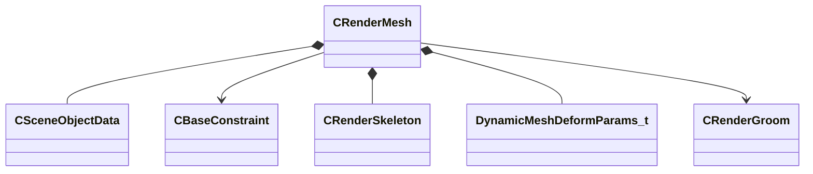

[Schemas](../../schemas.md) / [modellib](../modellib.md) / CRenderMesh

# CRenderMesh

> Source: **Build 25000182** · 2026-08-28 · `windows-x86_64` · schema `0.10.0`

**Kind:** class · **Size:** 552 bytes (`0x228`) · **Align:** 8 · **Module:** modellib

**Relationships:**

## Memory layout

7 fields (7 declared here, 0 inherited). Offsets are absolute from the object base.

| Offset | Field | Type | From | Annotations |
|--------|-------|------|------|-------------|
| `0x10` | `m_sceneObjects` | CUtlLeanVectorFixedGrowable< [CSceneObjectData](../modellib/CSceneObjectData.md), 1 > |  |  |
| `0xd0` | `m_constraints` | CUtlLeanVector< [CBaseConstraint](../modellib/CBaseConstraint.md)* > |  |  |
| `0xe0` | `m_skeleton` | [CRenderSkeleton](../modellib/CRenderSkeleton.md) |  |  |
| `0x1ec` | `m_bUseUV2ForCharting` | bool |  |  |
| `0x1ed` | `m_bEmbeddedMapMesh` | bool |  |  |
| `0x210` | `m_meshDeformParams` | [DynamicMeshDeformParams_t](../modellib/DynamicMeshDeformParams_t.md) |  |  |
| `0x220` | `m_pGroomData` | [CRenderGroom](../modellib/CRenderGroom.md)* |  |  |

KV3 class defaults

<pre>{
	&quot;_class&quot;: &quot;CRenderMesh&quot;,
	&quot;m_sceneObjects&quot;:
	[
	],
	&quot;m_constraints&quot;:
	[
	],
	&quot;m_skeleton&quot;:
	{
		&quot;m_bones&quot;:
		[
		],
		&quot;m_boneParents&quot;:
		[
		],
		&quot;m_nBoneWeightCount&quot;: 4
	},
	&quot;m_bUseUV2ForCharting&quot;: false,
	&quot;m_bEmbeddedMapMesh&quot;: false,
	&quot;m_meshDeformParams&quot;:
	{
		&quot;m_flTensionCompressScale&quot;: 0.000000,
		&quot;m_flTensionStretchScale&quot;: 0.000000,
		&quot;m_bRecomputeSmoothNormalsAfterAnimation&quot;: false,
		&quot;m_bComputeDynamicMeshTensionAfterAnimation&quot;: false,
		&quot;m_bSmoothNormalsAcrossUvSeams&quot;: false,
		&quot;m_bEnableEyeBulgeDeformation&quot;: false
	},
	&quot;m_pGroomData&quot;: null,
	&quot;m_attachments&quot;:
	[
	],
	&quot;m_hitboxsets&quot;:
	[
	],
	&quot;m_morphSet&quot;: &quot;&quot;
}</pre>

