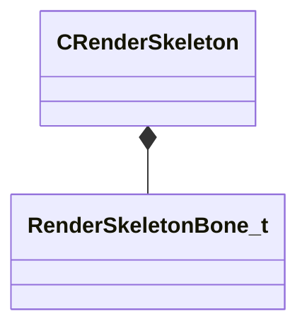

[Schemas](../../schemas.md) / [modellib](../modellib.md) / CRenderSkeleton

# CRenderSkeleton

> Source: **Build 25000182** · 2026-08-28 · `windows-x86_64` · schema `0.10.0`

**Kind:** class · **Size:** 80 bytes (`0x50`) · **Align:** 8 · **Module:** modellib

**Relationships:**

## Memory layout

3 fields (3 declared here, 0 inherited). Offsets are absolute from the object base.

| Offset | Field | Type | From | Annotations |
|--------|-------|------|------|-------------|
| `0x0` | `m_bones` | CUtlVector< [RenderSkeletonBone_t](../modellib/RenderSkeletonBone_t.md) > |  |  |
| `0x30` | `m_boneParents` | CUtlVector< int32 > |  |  |
| `0x48` | `m_nBoneWeightCount` | int32 |  |  |

KV3 class defaults

<pre>{
	&quot;m_bones&quot;:
	[
	],
	&quot;m_boneParents&quot;:
	[
	],
	&quot;m_nBoneWeightCount&quot;: 4
}</pre>

