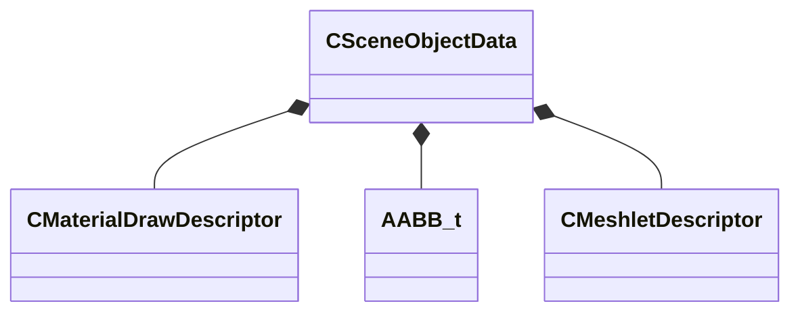

[Schemas](../../schemas.md) / [modellib](../modellib.md) / CSceneObjectData

# CSceneObjectData

**Kind:** class · **Size:** 184 bytes (`0xb8`) · **Align:** 8 · **Module:** modellib

**Relationships:**

## Memory layout

7 fields (7 declared here, 0 inherited). Offsets are absolute from the object base.

| Offset | Field | Type | From | Annotations |
|--------|-------|------|------|-------------|
| `0x0` | `m_vMinBounds` | Vector |  |  |
| `0xc` | `m_vMaxBounds` | Vector |  |  |
| `0x18` | `m_drawCalls` | CUtlLeanVector< [CMaterialDrawDescriptor](../modellib/CMaterialDrawDescriptor.md) > |  |  |
| `0x28` | `m_drawBounds` | CUtlLeanVector< [AABB_t](../mathlib_extended/AABB_t.md) > |  |  |
| `0x38` | `m_meshlets` | CUtlLeanVector< [CMeshletDescriptor](../modellib/CMeshletDescriptor.md) > |  |  |
| `0x48` | `m_rtProxyDrawCalls` | CUtlLeanVector< [CSceneObjectData](../modellib/CSceneObjectData.md)::RTProxyDrawDescriptor_t > |  |  |
| `0x58` | `m_vTintColor` | Vector4D |  |  |

KV3 class defaults

<pre>{
	&quot;m_vMinBounds&quot;:
	[
		340282346638528859811704183484516925440.000000,
		340282346638528859811704183484516925440.000000,
		340282346638528859811704183484516925440.000000
	],
	&quot;m_vMaxBounds&quot;:
	[
		-340282346638528859811704183484516925440.000000,
		-340282346638528859811704183484516925440.000000,
		-340282346638528859811704183484516925440.000000
	],
	&quot;m_drawCalls&quot;:
	[
	],
	&quot;m_drawBounds&quot;:
	[
	],
	&quot;m_meshlets&quot;:
	[
	],
	&quot;m_rtProxyDrawCalls&quot;:
	[
	],
	&quot;m_vTintColor&quot;:
	[
		0.000000,
		0.000000,
		0.000000,
		0.000000
	]
}</pre>

