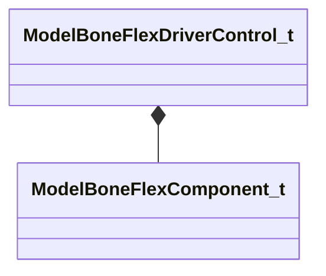

[Schemas](../../schemas.md) / [modellib](../modellib.md) / ModelBoneFlexDriverControl_t

# ModelBoneFlexDriverControl_t

> Source: **Build 25000182** · 2026-08-28 · `windows-x86_64` · schema `0.10.0`

**Kind:** class · **Size:** 32 bytes (`0x20`) · **Align:** 8 · **Module:** modellib

**Relationships:**

## Memory layout

5 fields (5 declared here, 0 inherited). Offsets are absolute from the object base.

| Offset | Field | Type | From | Annotations |
|--------|-------|------|------|-------------|
| `0x0` | `m_nBoneComponent` | [ModelBoneFlexComponent_t](../modellib/ModelBoneFlexComponent_t.md) |  |  |
| `0x8` | `m_flexController` | CUtlString |  |  |
| `0x10` | `m_flexControllerToken` | uint32 |  |  |
| `0x14` | `m_flMin` | float32 |  |  |
| `0x18` | `m_flMax` | float32 |  |  |

KV3 class defaults

<pre>{
	&quot;m_nBoneComponent&quot;: &quot;MODEL_BONE_FLEX_TX&quot;,
	&quot;m_flexController&quot;: &quot;&quot;,
	&quot;m_flexControllerToken&quot;: 0,
	&quot;m_flMin&quot;: 0.000000,
	&quot;m_flMax&quot;: 0.000000
}</pre>

