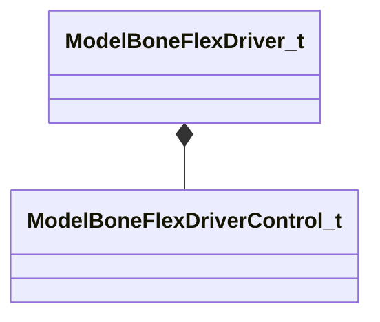

[Schemas](../../schemas.md) / [modellib](../modellib.md) / ModelBoneFlexDriver_t

# ModelBoneFlexDriver_t

> Source: **Build 25000182** · 2026-08-28 · `windows-x86_64` · schema `0.10.0`

**Kind:** class · **Size:** 40 bytes (`0x28`) · **Align:** 8 · **Module:** modellib

**Relationships:**

## Memory layout

3 fields (3 declared here, 0 inherited). Offsets are absolute from the object base.

| Offset | Field | Type | From | Annotations |
|--------|-------|------|------|-------------|
| `0x0` | `m_boneName` | CUtlString |  |  |
| `0x8` | `m_boneNameToken` | uint32 |  |  |
| `0x10` | `m_controls` | CUtlVector< [ModelBoneFlexDriverControl_t](../modellib/ModelBoneFlexDriverControl_t.md) > |  |  |

KV3 class defaults

<pre>{
	&quot;m_boneName&quot;: &quot;&quot;,
	&quot;m_boneNameToken&quot;: 0,
	&quot;m_controls&quot;:
	[
	]
}</pre>

