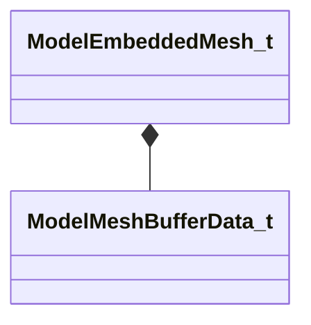

[Schemas](../../schemas.md) / [modellib](../modellib.md) / ModelEmbeddedMesh_t

# ModelEmbeddedMesh_t

> Source: **Build 25000182** · 2026-08-28 · `windows-x86_64` · schema `0.10.0`

**Kind:** class · **Size:** 112 bytes (`0x70`) · **Align:** 8 · **Module:** modellib

**Relationships:**

## Memory layout

9 fields (9 declared here, 0 inherited). Offsets are absolute from the object base.

| Offset | Field | Type | From | Annotations |
|--------|-------|------|------|-------------|
| `0x0` | `m_Name` | CUtlString |  |  |
| `0x10` | `m_nMeshIndex` | int32 |  |  |
| `0x14` | `m_nDataBlock` | int32 |  |  |
| `0x18` | `m_nMorphBlock` | int32 |  |  |
| `0x20` | `m_vertexBuffers` | CUtlVector< [ModelMeshBufferData_t](../modellib/ModelMeshBufferData_t.md) > |  |  |
| `0x38` | `m_indexBuffers` | CUtlVector< [ModelMeshBufferData_t](../modellib/ModelMeshBufferData_t.md) > |  |  |
| `0x50` | `m_toolsBuffers` | CUtlVector< [ModelMeshBufferData_t](../modellib/ModelMeshBufferData_t.md) > |  |  |
| `0x68` | `m_nVBIBBlock` | int32 |  |  |
| `0x6c` | `m_nToolsVBBlock` | int32 |  |  |

KV3 class defaults

<pre>{
	&quot;m_Name&quot;: &quot;&quot;,
	&quot;m_nMeshIndex&quot;: -1,
	&quot;m_nDataBlock&quot;: -1,
	&quot;m_nMorphBlock&quot;: -1,
	&quot;m_vertexBuffers&quot;:
	[
	],
	&quot;m_indexBuffers&quot;:
	[
	],
	&quot;m_toolsBuffers&quot;:
	[
	],
	&quot;m_nVBIBBlock&quot;: -1,
	&quot;m_nToolsVBBlock&quot;: -1
}</pre>

