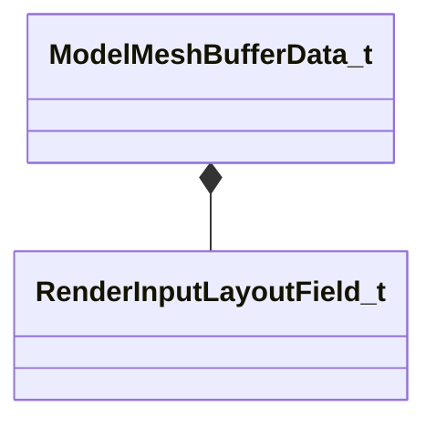

[Schemas](../../schemas.md) / [modellib](../modellib.md) / ModelMeshBufferData_t

# ModelMeshBufferData_t

**Kind:** class · **Size:** 48 bytes (`0x30`) · **Align:** 8 · **Module:** modellib

**Relationships:**

## Memory layout

13 fields (13 declared here, 0 inherited). Offsets are absolute from the object base.

| Offset | Field | Type | From | Annotations |
|--------|-------|------|------|-------------|
| `0x0` | `m_nBlockIndex` | int32 |  |  |
| `0x4` | `m_nElementCount` | uint32 |  |  |
| `0x8` | `m_nElementSizeInBytes` | uint32 |  |  |
| `0xc` | `m_bMeshoptCompressed` | bool |  |  |
| `0xd` | `m_bMeshoptIndexSequence` | bool |  |  |
| `0xe` | `m_nMeshoptMeshletEncodeVersion` | int8 |  |  |
| `0xf` | `m_bCompressedZSTD` | bool |  |  |
| `0x10` | `m_bCreateBufferSRV` | bool |  |  |
| `0x11` | `m_bCreateBufferUAV` | bool |  |  |
| `0x12` | `m_bCreateRawBuffer` | bool |  |  |
| `0x13` | `m_bCreatePooledBuffer` | bool |  |  |
| `0x14` | `m_nBufferUsage` | uint8 |  |  |
| `0x18` | `m_inputLayoutFields` | CUtlVector< [RenderInputLayoutField_t](../modellib/RenderInputLayoutField_t.md) > |  |  |

KV3 class defaults

<pre>{
	&quot;m_nBlockIndex&quot;: -1,
	&quot;m_nElementCount&quot;: 0,
	&quot;m_nElementSizeInBytes&quot;: 0,
	&quot;m_bMeshoptCompressed&quot;: false,
	&quot;m_bMeshoptIndexSequence&quot;: false,
	&quot;m_nMeshoptMeshletEncodeVersion&quot;: -1,
	&quot;m_bCompressedZSTD&quot;: false,
	&quot;m_bCreateBufferSRV&quot;: false,
	&quot;m_bCreateBufferUAV&quot;: false,
	&quot;m_bCreateRawBuffer&quot;: false,
	&quot;m_bCreatePooledBuffer&quot;: false,
	&quot;m_nBufferUsage&quot;: 0,
	&quot;m_inputLayoutFields&quot;:
	[
	]
}</pre>

