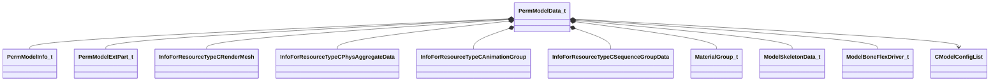

[Schemas](../../schemas.md) / [modellib](../modellib.md) / PermModelData_t

# PermModelData_t

**Kind:** class · **Size:** 760 bytes (`0x2f8`) · **Align:** 8 · **Module:** modellib

**Relationships:**

## Memory layout

25 fields (25 declared here, 0 inherited). Offsets are absolute from the object base.

| Offset | Field | Type | From | Annotations |
|--------|-------|------|------|-------------|
| `0x0` | `m_name` | CUtlString |  |  |
| `0x8` | `m_modelInfo` | [PermModelInfo_t](../modellib/PermModelInfo_t.md) |  |  |
| `0x60` | `m_ExtParts` | CUtlVector< [PermModelExtPart_t](../modellib/PermModelExtPart_t.md) > |  |  |
| `0x78` | `m_refMeshes` | CUtlVector< CStrongHandle< [InfoForResourceTypeCRenderMesh](../resourcesystem/InfoForResourceTypeCRenderMesh.md) > > |  |  |
| `0x90` | `m_refMeshGroupMasks` | CUtlVector< uint64 > |  |  |
| `0xa8` | `m_refPhysGroupMasks` | CUtlVector< uint64 > |  |  |
| `0xc0` | `m_refLODGroupMasks` | CUtlVector< uint8 > |  |  |
| `0xd8` | `m_lodGroupSwitchDistances` | CUtlVector< float32 > |  |  |
| `0xf0` | `m_refPhysicsData` | CUtlVector< CStrongHandle< [InfoForResourceTypeCPhysAggregateData](../resourcesystem/InfoForResourceTypeCPhysAggregateData.md) > > |  |  |
| `0x108` | `m_refPhysicsHitboxData` | CUtlVector< CStrongHandle< [InfoForResourceTypeCPhysAggregateData](../resourcesystem/InfoForResourceTypeCPhysAggregateData.md) > > |  |  |
| `0x120` | `m_refAnimGroups` | CUtlVector< CStrongHandle< [InfoForResourceTypeCAnimationGroup](../resourcesystem/InfoForResourceTypeCAnimationGroup.md) > > |  |  |
| `0x138` | `m_refSequenceGroups` | CUtlVector< CStrongHandle< [InfoForResourceTypeCSequenceGroupData](../resourcesystem/InfoForResourceTypeCSequenceGroupData.md) > > |  |  |
| `0x150` | `m_meshGroups` | CUtlVector< CUtlString > |  |  |
| `0x168` | `m_materialGroups` | CUtlVector< [MaterialGroup_t](../modellib/MaterialGroup_t.md) > |  |  |
| `0x180` | `m_nDefaultMeshGroupMask` | uint64 |  |  |
| `0x188` | `m_modelSkeleton` | [ModelSkeletonData_t](../modellib/ModelSkeletonData_t.md) |  |  |
| `0x230` | `m_remappingTable` | CUtlVector< int16 > |  |  |
| `0x248` | `m_remappingTableStarts` | CUtlVector< uint16 > |  |  |
| `0x260` | `m_boneFlexDrivers` | CUtlVector< [ModelBoneFlexDriver_t](../modellib/ModelBoneFlexDriver_t.md) > |  |  |
| `0x278` | `m_pModelConfigList` | [CModelConfigList](../modellib/CModelConfigList.md)* |  |  |
| `0x280` | `m_BodyGroupsHiddenInTools` | CUtlVector< CUtlString > |  |  |
| `0x298` | `m_refAnimIncludeModels` | CUtlVector< CStrongHandle< [InfoForResourceTypeCModel](../resourcesystem/InfoForResourceTypeCModel.md) > > |  |  |
| `0x2b0` | `m_AnimatedMaterialAttributes` | CUtlVector< [PermModelDataAnimatedMaterialAttribute_t](../modellib/PermModelDataAnimatedMaterialAttribute_t.md) > |  |  |
| `0x2c8` | `m_animGraph2Refs` | CUtlVector< [ModelAnimGraph2Ref_t](../modellib/ModelAnimGraph2Ref_t.md) > |  |  |
| `0x2e0` | `m_vecNmSkeletonRefs` | CUtlVector< CStrongHandle< [InfoForResourceTypeCNmSkeleton](../resourcesystem/InfoForResourceTypeCNmSkeleton.md) > > |  |  |

KV3 class defaults

<pre>{
	&quot;m_name&quot;: &quot;&quot;,
	&quot;m_modelInfo&quot;:
	{
		&quot;m_nFlags&quot;: 0,
		&quot;m_vHullMin&quot;:
		[
			0.000000,
			0.000000,
			0.000000
		],
		&quot;m_vHullMax&quot;:
		[
			0.000000,
			0.000000,
			0.000000
		],
		&quot;m_vViewMin&quot;:
		[
			0.000000,
			0.000000,
			0.000000
		],
		&quot;m_vViewMax&quot;:
		[
			0.000000,
			0.000000,
			0.000000
		],
		&quot;m_flMass&quot;: 0.000000,
		&quot;m_vEyePosition&quot;:
		[
			0.000000,
			0.000000,
			0.000000
		],
		&quot;m_flMaxEyeDeflection&quot;: 0.000000,
		&quot;m_sSurfaceProperty&quot;: &quot;&quot;,
		&quot;m_keyValueText&quot;: &quot;&quot;
	},
	&quot;m_ExtParts&quot;:
	[
	],
	&quot;m_refMeshes&quot;:
	[
	],
	&quot;m_refMeshGroupMasks&quot;:
	[
	],
	&quot;m_refPhysGroupMasks&quot;:
	[
	],
	&quot;m_refLODGroupMasks&quot;:
	[
	],
	&quot;m_lodGroupSwitchDistances&quot;:
	[
	],
	&quot;m_refPhysicsData&quot;:
	[
	],
	&quot;m_refPhysicsHitboxData&quot;:
	[
	],
	&quot;m_refAnimGroups&quot;:
	[
	],
	&quot;m_refSequenceGroups&quot;:
	[
	],
	&quot;m_meshGroups&quot;:
	[
	],
	&quot;m_materialGroups&quot;:
	[
	],
	&quot;m_nDefaultMeshGroupMask&quot;: 0,
	&quot;m_modelSkeleton&quot;:
	{
		&quot;m_boneName&quot;:
		[
		],
		&quot;m_nParent&quot;:
		[
		],
		&quot;m_boneSphere&quot;:
		[
		],
		&quot;m_nFlag&quot;:
		[
		],
		&quot;m_bonePosParent&quot;:
		[
		],
		&quot;m_boneRotParent&quot;:
		[
		],
		&quot;m_boneScaleParent&quot;:
		[
		]
	},
	&quot;m_remappingTable&quot;:
	[
	],
	&quot;m_remappingTableStarts&quot;:
	[
	],
	&quot;m_boneFlexDrivers&quot;:
	[
	],
	&quot;m_pModelConfigList&quot;: null,
	&quot;m_BodyGroupsHiddenInTools&quot;:
	[
	],
	&quot;m_refAnimIncludeModels&quot;:
	[
	],
	&quot;m_AnimatedMaterialAttributes&quot;:
	[
	],
	&quot;m_animGraph2Refs&quot;:
	[
	],
	&quot;m_vecNmSkeletonRefs&quot;:
	[
	]
}</pre>

