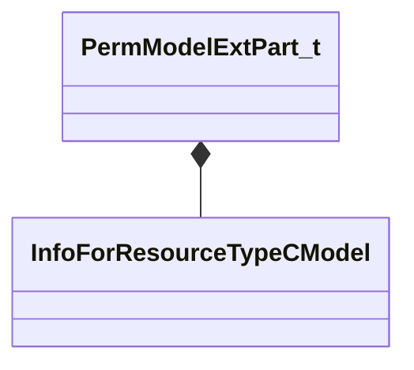

[Schemas](../../schemas.md) / [modellib](../modellib.md) / PermModelExtPart_t

# PermModelExtPart_t

> Source: **Build 25000182** · 2026-08-28 · `windows-x86_64` · schema `0.10.0`

**Kind:** class · **Size:** 64 bytes (`0x40`) · **Align:** 16 · **Module:** modellib

**Relationships:**

## Memory layout

4 fields (4 declared here, 0 inherited). Offsets are absolute from the object base.

| Offset | Field | Type | From | Annotations |
|--------|-------|------|------|-------------|
| `0x0` | `m_Transform` | CTransform |  |  |
| `0x20` | `m_Name` | CUtlString |  |  |
| `0x28` | `m_nParent` | int32 |  |  |
| `0x30` | `m_refModel` | CStrongHandle< [InfoForResourceTypeCModel](../resourcesystem/InfoForResourceTypeCModel.md) > |  |  |

KV3 class defaults

<pre>{
	&quot;m_Transform&quot;:
	[
		0.000000,
		0.000000,
		0.000000,
		0.000000,
		0.000000,
		0.000000,
		0.000000,
		0.000000
	],
	&quot;m_Name&quot;: &quot;&quot;,
	&quot;m_nParent&quot;: 0,
	&quot;m_refModel&quot;: &quot;&quot;
}</pre>

