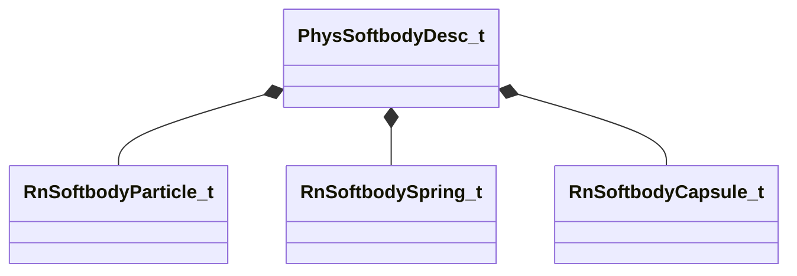

[Schemas](../../schemas.md) / [modellib](../modellib.md) / PhysSoftbodyDesc_t

# PhysSoftbodyDesc_t

**Kind:** class · **Size:** 144 bytes (`0x90`) · **Align:** 8 · **Module:** modellib

**Relationships:**

## Memory layout

6 fields (6 declared here, 0 inherited). Offsets are absolute from the object base.

| Offset | Field | Type | From | Annotations |
|--------|-------|------|------|-------------|
| `0x0` | `m_ParticleBoneHash` | CUtlVector< uint32 > |  |  |
| `0x18` | `m_Particles` | CUtlVector< [RnSoftbodyParticle_t](../physicslib/RnSoftbodyParticle_t.md) > |  |  |
| `0x30` | `m_Springs` | CUtlVector< [RnSoftbodySpring_t](../physicslib/RnSoftbodySpring_t.md) > |  |  |
| `0x48` | `m_Capsules` | CUtlVector< [RnSoftbodyCapsule_t](../physicslib/RnSoftbodyCapsule_t.md) > |  |  |
| `0x60` | `m_InitPose` | CUtlVector< CTransform > |  |  |
| `0x78` | `m_ParticleBoneName` | CUtlVector< CUtlString > |  |  |

KV3 class defaults

<pre>{
	&quot;m_ParticleBoneHash&quot;:
	[
	],
	&quot;m_Particles&quot;:
	[
	],
	&quot;m_Springs&quot;:
	[
	],
	&quot;m_Capsules&quot;:
	[
	],
	&quot;m_InitPose&quot;:
	[
	],
	&quot;m_ParticleBoneName&quot;:
	[
	]
}</pre>

