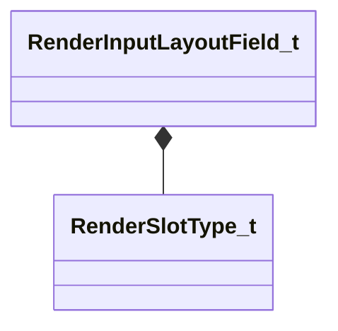

[Schemas](../../schemas.md) / [modellib](../modellib.md) / RenderInputLayoutField_t

# RenderInputLayoutField_t

**Kind:** class · **Size:** 76 bytes (`0x4c`) · **Align:** 255 · **Module:** modellib

**Relationships:**

## Memory layout

6 fields (6 declared here, 0 inherited). Offsets are absolute from the object base.

| Offset | Field | Type | From | Annotations |
|--------|-------|------|------|-------------|
| `0x0` | `m_pSemanticName` | char[32] |  |  |
| `0x20` | `m_nSemanticIndex` | int8 |  |  |
| `0x28` | `m_nOffset` | int16 |  |  |
| `0x2a` | `m_nSlot` | int8 |  |  |
| `0x2b` | `m_nSlotType` | [RenderSlotType_t](../modellib/RenderSlotType_t.md) |  |  |
| `0x2c` | `m_szShaderSemantic` | char[32] |  |  |
