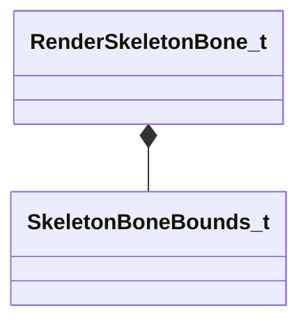

[Schemas](../../schemas.md) / [modellib](../modellib.md) / RenderSkeletonBone_t

# RenderSkeletonBone_t

> Source: **Build 25000182** · 2026-08-28 · `windows-x86_64` · schema `0.10.0`

**Kind:** class · **Size:** 96 bytes (`0x60`) · **Align:** 8 · **Module:** modellib

**Relationships:**

## Memory layout

5 fields (5 declared here, 0 inherited). Offsets are absolute from the object base.

| Offset | Field | Type | From | Annotations |
|--------|-------|------|------|-------------|
| `0x0` | `m_boneName` | CUtlString |  |  |
| `0x8` | `m_parentName` | CUtlString |  |  |
| `0x10` | `m_invBindPose` | matrix3x4_t |  |  |
| `0x40` | `m_bbox` | [SkeletonBoneBounds_t](../modellib/SkeletonBoneBounds_t.md) |  |  |
| `0x58` | `m_flSphereRadius` | float32 |  |  |

KV3 class defaults

<pre>{
	&quot;m_boneName&quot;: &quot;&quot;,
	&quot;m_parentName&quot;: &quot;&quot;,
	&quot;m_invBindPose&quot;:
	[
		1.000000,
		0.000000,
		0.000000,
		0.000000,
		0.000000,
		1.000000,
		0.000000,
		0.000000,
		0.000000,
		0.000000,
		1.000000,
		0.000000
	],
	&quot;m_bbox&quot;:
	{
		&quot;m_vecCenter&quot;:
		[
			0.000000,
			0.000000,
			0.000000
		],
		&quot;m_vecSize&quot;:
		[
			0.000000,
			0.000000,
			0.000000
		]
	},
	&quot;m_flSphereRadius&quot;: 0.000000
}</pre>

