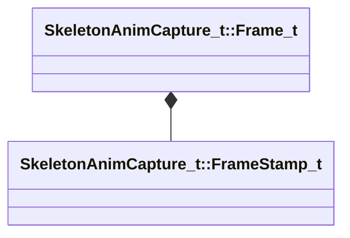

[Schemas](../../schemas.md) / [modellib](../modellib.md) / SkeletonAnimCapture_t::Frame_t

# SkeletonAnimCapture_t::Frame_t

> Source: **Build 25000182** · 2026-08-28 · `windows-x86_64` · schema `0.10.0`

**Kind:** class · **Size:** 192 bytes (`0xc0`) · **Align:** 16 · **Module:** modellib

**Relationships:**

## Memory layout

9 fields (9 declared here, 0 inherited). Offsets are absolute from the object base.

| Offset | Field | Type | From | Annotations |
|--------|-------|------|------|-------------|
| `0x0` | `m_flTime` | float32 |  |  |
| `0x4` | `m_Stamp` | [SkeletonAnimCapture_t::FrameStamp_t](../modellib/SkeletonAnimCapture_t.FrameStamp_t.md) |  |  |
| `0x20` | `m_Transform` | CTransform |  |  |
| `0x40` | `m_bTeleport` | bool |  |  |
| `0x48` | `m_CompositeBones` | CUtlVector< CTransform > |  |  |
| `0x60` | `m_SimStateBones` | CUtlVector< CTransform > |  |  |
| `0x78` | `m_FeModelAnims` | CUtlVector< CTransform > |  |  |
| `0x90` | `m_FeModelPos` | CUtlVector< VectorAligned > |  |  |
| `0xa8` | `m_FlexControllerWeights` | CUtlVector< float32 > |  |  |

KV3 class defaults

<pre>{
	&quot;m_flTime&quot;: 0.000000,
	&quot;m_Stamp&quot;:
	{
		&quot;m_flTime&quot;: 0.000000,
		&quot;m_flEntitySimTime&quot;: 0.000000,
		&quot;m_bTeleportTick&quot;: false,
		&quot;m_bPredicted&quot;: false,
		&quot;m_flCurTime&quot;: 0.000000,
		&quot;m_flRealTime&quot;: 0.000000,
		&quot;m_nFrameCount&quot;: 0,
		&quot;m_nTickCount&quot;: 0
	},
	&quot;m_Transform&quot;:
	[
		0.000000,
		0.000000,
		0.000000,
		0.000000,
		0.000000,
		0.000000,
		0.000000,
		0.000000
	],
	&quot;m_bTeleport&quot;: false,
	&quot;m_CompositeBones&quot;:
	[
	],
	&quot;m_SimStateBones&quot;:
	[
	],
	&quot;m_FeModelAnims&quot;:
	[
	],
	&quot;m_FeModelPos&quot;:
	[
	],
	&quot;m_FlexControllerWeights&quot;:
	[
	]
}</pre>

