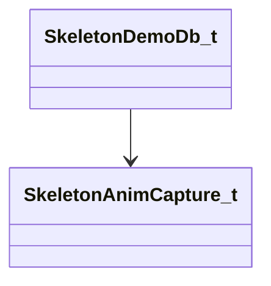

[Schemas](../../schemas.md) / [modellib](../modellib.md) / SkeletonDemoDb_t

# SkeletonDemoDb_t

**Kind:** class · **Size:** 56 bytes (`0x38`) · **Align:** 8 · **Module:** modellib

**Relationships:**

## Memory layout

3 fields (3 declared here, 0 inherited). Offsets are absolute from the object base.

| Offset | Field | Type | From | Annotations |
|--------|-------|------|------|-------------|
| `0x0` | `m_AnimCaptures` | CUtlVector< [SkeletonAnimCapture_t](../modellib/SkeletonAnimCapture_t.md)* > |  |  |
| `0x18` | `m_CameraTrack` | CUtlVector< [SkeletonAnimCapture_t](../modellib/SkeletonAnimCapture_t.md)::Camera_t > |  |  |
| `0x30` | `m_flRecordingTime` | float32 |  |  |

KV3 class defaults

<pre>{
	&quot;m_AnimCaptures&quot;:
	[
	],
	&quot;m_CameraTrack&quot;:
	[
	],
	&quot;m_flRecordingTime&quot;: 0.000000
}</pre>

