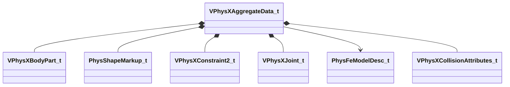

[Schemas](../../schemas.md) / [modellib](../modellib.md) / VPhysXAggregateData_t

# VPhysXAggregateData_t

> Source: **Build 25000182** · 2026-08-28 · `windows-x86_64` · schema `0.10.0`

**Kind:** class · **Size:** 336 bytes (`0x150`) · **Align:** 8 · **Module:** modellib

**Relationships:**

## Memory layout

17 fields (17 declared here, 0 inherited). Offsets are absolute from the object base.

| Offset | Field | Type | From | Annotations |
|--------|-------|------|------|-------------|
| `0x0` | `m_nFlags` | uint16 |  |  |
| `0x2` | `m_nRefCounter` | uint16 |  |  |
| `0x8` | `m_bonesHash` | CUtlVector< uint32 > |  |  |
| `0x20` | `m_boneNames` | CUtlVector< CUtlString > |  |  |
| `0x38` | `m_indexNames` | CUtlVector< uint16 > |  |  |
| `0x50` | `m_indexHash` | CUtlVector< uint16 > |  |  |
| `0x68` | `m_bindPose` | CUtlVector< matrix3x4a_t > |  |  |
| `0x80` | `m_parts` | CUtlVector< [VPhysXBodyPart_t](../modellib/VPhysXBodyPart_t.md) > |  |  |
| `0x98` | `m_shapeMarkups` | CUtlVector< [PhysShapeMarkup_t](../modellib/PhysShapeMarkup_t.md) > |  |  |
| `0xb0` | `m_constraints2` | CUtlVector< [VPhysXConstraint2_t](../modellib/VPhysXConstraint2_t.md) > |  |  |
| `0xc8` | `m_joints` | CUtlVector< [VPhysXJoint_t](../modellib/VPhysXJoint_t.md) > |  |  |
| `0xe0` | `m_pFeModel` | [PhysFeModelDesc_t](../physicslib/PhysFeModelDesc_t.md)* |  |  |
| `0xe8` | `m_boneParents` | CUtlVector< uint16 > |  |  |
| `0x100` | `m_surfacePropertyHashes` | CUtlVector< uint32 > |  |  |
| `0x118` | `m_collisionAttributes` | CUtlVector< [VPhysXCollisionAttributes_t](../modellib/VPhysXCollisionAttributes_t.md) > |  |  |
| `0x130` | `m_debugPartNames` | CUtlVector< CUtlString > |  |  |
| `0x148` | `m_embeddedKeyvalues` | CUtlString |  |  |

KV3 class defaults

<pre>{
	&quot;m_nFlags&quot;: 0,
	&quot;m_nRefCounter&quot;: 0,
	&quot;m_bonesHash&quot;:
	[
	],
	&quot;m_boneNames&quot;:
	[
	],
	&quot;m_indexNames&quot;:
	[
	],
	&quot;m_indexHash&quot;:
	[
	],
	&quot;m_bindPose&quot;:
	[
	],
	&quot;m_parts&quot;:
	[
	],
	&quot;m_shapeMarkups&quot;:
	[
	],
	&quot;m_constraints2&quot;:
	[
	],
	&quot;m_joints&quot;:
	[
	],
	&quot;m_pFeModel&quot;: null,
	&quot;m_boneParents&quot;:
	[
	],
	&quot;m_surfacePropertyHashes&quot;:
	[
	],
	&quot;m_collisionAttributes&quot;:
	[
	],
	&quot;m_debugPartNames&quot;:
	[
	],
	&quot;m_embeddedKeyvalues&quot;: &quot;&quot;
}</pre>

