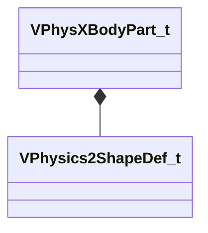

[Schemas](../../schemas.md) / [modellib](../modellib.md) / VPhysXBodyPart_t

# VPhysXBodyPart_t

**Kind:** class · **Size:** 168 bytes (`0xa8`) · **Align:** 8 · **Module:** modellib

**Relationships:**

## Memory layout

12 fields (12 declared here, 0 inherited). Offsets are absolute from the object base.

| Offset | Field | Type | From | Annotations |
|--------|-------|------|------|-------------|
| `0x0` | `m_nFlags` | uint32 |  |  |
| `0x4` | `m_flMass` | float32 |  |  |
| `0x8` | `m_rnShape` | [VPhysics2ShapeDef_t](../modellib/VPhysics2ShapeDef_t.md) |  |  |
| `0x80` | `m_nCollisionAttributeIndex` | uint16 |  |  |
| `0x82` | `m_nReserved` | uint16 |  |  |
| `0x84` | `m_flInertiaScale` | float32 |  |  |
| `0x88` | `m_flLinearDamping` | float32 |  |  |
| `0x8c` | `m_flAngularDamping` | float32 |  |  |
| `0x90` | `m_flLinearDrag` | float32 |  |  |
| `0x94` | `m_flAngularDrag` | float32 |  |  |
| `0x98` | `m_bOverrideMassCenter` | bool |  |  |
| `0x9c` | `m_vMassCenterOverride` | Vector |  |  |

KV3 class defaults

<pre>{
	&quot;m_nFlags&quot;: 0,
	&quot;m_flMass&quot;: 0.000000,
	&quot;m_rnShape&quot;:
	{
		&quot;m_spheres&quot;:
		[
		],
		&quot;m_capsules&quot;:
		[
		],
		&quot;m_hulls&quot;:
		[
		],
		&quot;m_meshes&quot;:
		[
		],
		&quot;m_CollisionAttributeIndices&quot;:
		[
		]
	},
	&quot;m_nCollisionAttributeIndex&quot;: 0,
	&quot;m_nReserved&quot;: 0,
	&quot;m_flInertiaScale&quot;: 0.000000,
	&quot;m_flLinearDamping&quot;: 0.000000,
	&quot;m_flAngularDamping&quot;: 0.000000,
	&quot;m_flLinearDrag&quot;: 1.000000,
	&quot;m_flAngularDrag&quot;: 1.000000,
	&quot;m_bOverrideMassCenter&quot;: false,
	&quot;m_vMassCenterOverride&quot;:
	[
		0.000000,
		0.000000,
		0.000000
	]
}</pre>

