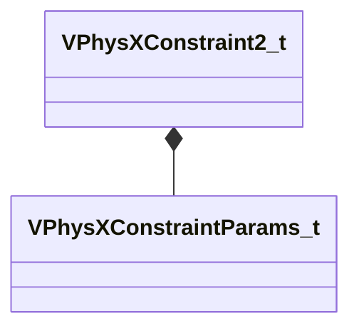

[Schemas](../../schemas.md) / [modellib](../modellib.md) / VPhysXConstraint2_t

# VPhysXConstraint2_t

> Source: **Build 25000182** · 2026-08-28 · `windows-x86_64` · schema `0.10.0`

**Kind:** class · **Size:** 256 bytes (`0x100`) · **Align:** 4 · **Module:** modellib

**Relationships:**

## Memory layout

4 fields (4 declared here, 0 inherited). Offsets are absolute from the object base.

| Offset | Field | Type | From | Annotations |
|--------|-------|------|------|-------------|
| `0x0` | `m_nFlags` | uint32 |  |  |
| `0x4` | `m_nParent` | uint16 |  |  |
| `0x6` | `m_nChild` | uint16 |  |  |
| `0x8` | `m_params` | [VPhysXConstraintParams_t](../modellib/VPhysXConstraintParams_t.md) |  |  |

KV3 class defaults

<pre>{
	&quot;m_nFlags&quot;: 0,
	&quot;m_nParent&quot;: 0,
	&quot;m_nChild&quot;: 0,
	&quot;m_params&quot;:
	{
		&quot;m_nType&quot;: 0,
		&quot;m_nTranslateMotion&quot;: 0,
		&quot;m_nRotateMotion&quot;: 0,
		&quot;m_nFlags&quot;: 0,
		&quot;m_anchor&quot;:
		[
			[
				0.000000,
				0.000000,
				0.000000
			],
			[
				0.000000,
				0.000000,
				0.000000
			]
		],
		&quot;m_axes&quot;:
		[
			[
				0.000000,
				0.000000,
				0.000000,
				0.000000
			],
			[
				0.000000,
				0.000000,
				0.000000,
				0.000000
			]
		],
		&quot;m_maxForce&quot;: 0.000000,
		&quot;m_maxTorque&quot;: 0.000000,
		&quot;m_linearLimitValue&quot;: 0.000000,
		&quot;m_linearLimitRestitution&quot;: 0.000000,
		&quot;m_linearLimitSpring&quot;: 0.000000,
		&quot;m_linearLimitDamping&quot;: 0.000000,
		&quot;m_twistLowLimitValue&quot;: 0.000000,
		&quot;m_twistLowLimitRestitution&quot;: 0.000000,
		&quot;m_twistLowLimitSpring&quot;: 0.000000,
		&quot;m_twistLowLimitDamping&quot;: 0.000000,
		&quot;m_twistHighLimitValue&quot;: 0.000000,
		&quot;m_twistHighLimitRestitution&quot;: 0.000000,
		&quot;m_twistHighLimitSpring&quot;: 0.000000,
		&quot;m_twistHighLimitDamping&quot;: 0.000000,
		&quot;m_swing1LimitValue&quot;: 0.000000,
		&quot;m_swing1LimitRestitution&quot;: 0.000000,
		&quot;m_swing1LimitSpring&quot;: 0.000000,
		&quot;m_swing1LimitDamping&quot;: 0.000000,
		&quot;m_swing2LimitValue&quot;: 0.000000,
		&quot;m_swing2LimitRestitution&quot;: 0.000000,
		&quot;m_swing2LimitSpring&quot;: 0.000000,
		&quot;m_swing2LimitDamping&quot;: 0.000000,
		&quot;m_goalPosition&quot;:
		[
			0.000000,
			0.000000,
			0.000000
		],
		&quot;m_goalOrientation&quot;:
		[
			0.000000,
			0.000000,
			0.000000,
			0.000000
		],
		&quot;m_goalAngularVelocity&quot;:
		[
			0.000000,
			0.000000,
			0.000000
		],
		&quot;m_driveSpringX&quot;: 0.000000,
		&quot;m_driveSpringY&quot;: 0.000000,
		&quot;m_driveSpringZ&quot;: 0.000000,
		&quot;m_driveDampingX&quot;: 0.000000,
		&quot;m_driveDampingY&quot;: 0.000000,
		&quot;m_driveDampingZ&quot;: 0.000000,
		&quot;m_driveSpringTwist&quot;: 0.000000,
		&quot;m_driveSpringSwing&quot;: 0.000000,
		&quot;m_driveSpringSlerp&quot;: 0.000000,
		&quot;m_driveDampingTwist&quot;: 0.000000,
		&quot;m_driveDampingSwing&quot;: 0.000000,
		&quot;m_driveDampingSlerp&quot;: 0.000000,
		&quot;m_solverIterationCount&quot;: 0,
		&quot;m_projectionLinearTolerance&quot;: 0.000000,
		&quot;m_projectionAngularTolerance&quot;: 0.000000
	}
}</pre>

