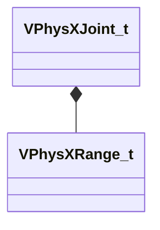

[Schemas](../../schemas.md) / [modellib](../modellib.md) / VPhysXJoint_t

# VPhysXJoint_t

> Source: **Build 25000182** · 2026-08-28 · `windows-x86_64` · schema `0.10.0`

**Kind:** class · **Size:** 208 bytes (`0xd0`) · **Align:** 16 · **Module:** modellib

**Relationships:**

## Memory layout

30 fields (30 declared here, 0 inherited). Offsets are absolute from the object base.

| Offset | Field | Type | From | Annotations |
|--------|-------|------|------|-------------|
| `0x0` | `m_nType` | uint16 |  |  |
| `0x2` | `m_nBody1` | uint16 |  |  |
| `0x4` | `m_nBody2` | uint16 |  |  |
| `0x6` | `m_nFlags` | uint16 |  |  |
| `0x10` | `m_Frame1` | CTransform |  |  |
| `0x30` | `m_Frame2` | CTransform |  |  |
| `0x50` | `m_bEnableCollision` | bool |  |  |
| `0x51` | `m_bIsLinearConstraintDisabled` | bool |  |  |
| `0x52` | `m_bIsAngularConstraintDisabled` | bool |  |  |
| `0x53` | `m_bEnableLinearLimit` | bool |  |  |
| `0x54` | `m_LinearLimit` | [VPhysXRange_t](../modellib/VPhysXRange_t.md) |  |  |
| `0x5c` | `m_bEnableLinearMotor` | bool |  |  |
| `0x60` | `m_vLinearTargetVelocity` | Vector |  |  |
| `0x6c` | `m_flMaxForce` | float32 |  |  |
| `0x70` | `m_bEnableSwingLimit` | bool |  |  |
| `0x74` | `m_SwingLimit` | [VPhysXRange_t](../modellib/VPhysXRange_t.md) |  |  |
| `0x7c` | `m_bEnableTwistLimit` | bool |  |  |
| `0x80` | `m_TwistLimit` | [VPhysXRange_t](../modellib/VPhysXRange_t.md) |  |  |
| `0x88` | `m_bEnableAngularMotor` | bool |  |  |
| `0x8c` | `m_vAngularTargetVelocity` | Vector |  |  |
| `0x98` | `m_flMaxTorque` | float32 |  |  |
| `0x9c` | `m_flLinearFrequency` | float32 |  |  |
| `0xa0` | `m_flLinearDampingRatio` | float32 |  |  |
| `0xa4` | `m_flAngularFrequency` | float32 |  |  |
| `0xa8` | `m_flAngularDampingRatio` | float32 |  |  |
| `0xac` | `m_flFriction` | float32 |  |  |
| `0xb0` | `m_flElasticity` | float32 |  |  |
| `0xb4` | `m_flElasticDamping` | float32 |  |  |
| `0xb8` | `m_flPlasticity` | float32 |  |  |
| `0xc0` | `m_Tag` | CUtlString |  |  |

KV3 class defaults

<pre>{
	&quot;m_nType&quot;: 0,
	&quot;m_nBody1&quot;: 0,
	&quot;m_nBody2&quot;: 0,
	&quot;m_nFlags&quot;: 0,
	&quot;m_Frame1&quot;:
	[
		0.000000,
		0.000000,
		0.000000,
		1.000000,
		0.000000,
		0.000000,
		0.000000,
		1.000000
	],
	&quot;m_Frame2&quot;:
	[
		0.000000,
		0.000000,
		0.000000,
		1.000000,
		0.000000,
		0.000000,
		0.000000,
		1.000000
	],
	&quot;m_bEnableCollision&quot;: false,
	&quot;m_bIsLinearConstraintDisabled&quot;: false,
	&quot;m_bIsAngularConstraintDisabled&quot;: false,
	&quot;m_bEnableLinearLimit&quot;: false,
	&quot;m_LinearLimit&quot;:
	{
		&quot;m_flMin&quot;: 0.000000,
		&quot;m_flMax&quot;: 0.000000
	},
	&quot;m_bEnableLinearMotor&quot;: false,
	&quot;m_vLinearTargetVelocity&quot;:
	[
		0.000000,
		0.000000,
		0.000000
	],
	&quot;m_flMaxForce&quot;: 0.000000,
	&quot;m_bEnableSwingLimit&quot;: false,
	&quot;m_SwingLimit&quot;:
	{
		&quot;m_flMin&quot;: 0.000000,
		&quot;m_flMax&quot;: 0.000000
	},
	&quot;m_bEnableTwistLimit&quot;: false,
	&quot;m_TwistLimit&quot;:
	{
		&quot;m_flMin&quot;: 0.000000,
		&quot;m_flMax&quot;: 0.000000
	},
	&quot;m_bEnableAngularMotor&quot;: false,
	&quot;m_vAngularTargetVelocity&quot;:
	[
		0.000000,
		0.000000,
		0.000000
	],
	&quot;m_flMaxTorque&quot;: 0.000000,
	&quot;m_flLinearFrequency&quot;: 0.000000,
	&quot;m_flLinearDampingRatio&quot;: 0.000000,
	&quot;m_flAngularFrequency&quot;: 0.000000,
	&quot;m_flAngularDampingRatio&quot;: 0.000000,
	&quot;m_flFriction&quot;: 0.000000,
	&quot;m_flElasticity&quot;: 0.000000,
	&quot;m_flElasticDamping&quot;: 0.000000,
	&quot;m_flPlasticity&quot;: 0.000000,
	&quot;m_Tag&quot;: &quot;&quot;
}</pre>

